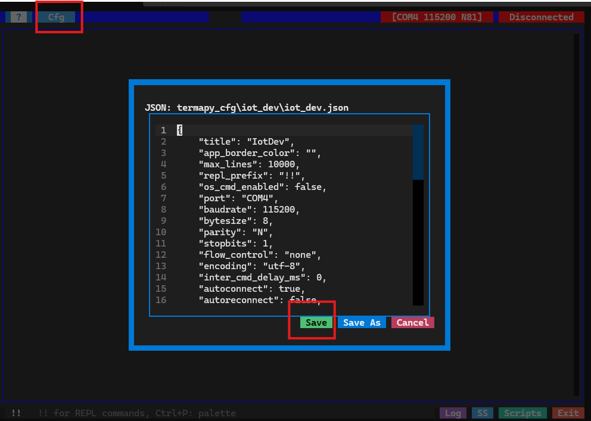
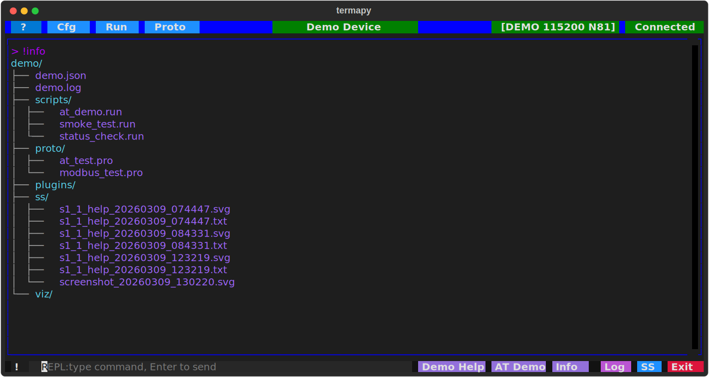

# termapy

     

*Pronounced "ter-map-ee"*

A full-featured serial terminal that runs anywhere Python does. ANSI color rendering, session logging, screenshots, scripting, binary protocol testing, and a plugin system — all in a terminal UI that installs in seconds.

Built for embedded systems development and manufacturing test, where you need a reliable serial terminal that works the same on Windows, macOS, and Linux without installing a GUI application.

## Why termapy?

- **Instant setup** -- one command to install and run, no GUI installer or system dependencies. If you have [uv](https://docs.astral.sh/uv/) it takes seconds; without it, minutes.
- **Portable** -- pure Python, runs in any terminal. Same tool on your dev machine, CI server, and factory floor.
- **Full color terminal** -- renders ANSI escape sequences, not just plain text. See what your device actually outputs.
- **Built-in test tools** -- send raw hex, run scripted send/expect sequences with pass/fail, decode protocol fields with pluggable visualizers.
- **Everything in one folder** -- each config gets its own subfolder with logs, screenshots, scripts, and plugins. Copy the folder to share a complete setup.
- **Developer-centric** -- the tooling is all files in folders, files are standard formats like JSON and TOML.

## Quick Start

If you have `uv`, one command to try it:

```sh
uvx --from git+https://github.com/hucker/termapy termapy
```

Press `Cfg` to edit your COM port parameters:



Press the connection button at the top and type commands at the bottom input box.


## Demo Mode

No hardware? Try termapy with a built-in simulated serial device:

```sh
termapy --demo
```

This creates a demo config at `termapy_cfg/demo/` that auto-connects to a simulated device. Bundled scripts and proto test files are included to exercise all features. You can also switch to demo mode at runtime with `!demo`, or set `"port": "DEMO"` in any config file.



**AT commands:**

| Command | Description |
| --- | --- |
| `AT` | Connection test (returns `OK`) |
| `AT+PROD-ID` | Product identifier (returns `BASSOMATIC-77`) |
| `AT+INFO` | Device info (version, uptime, free memory) |
| `AT+TEMP` | Read temperature sensor |
| `AT+LED on\|off` | Control LED |
| `AT+NAME?` | Query device name |
| `AT+NAME=val` | Set device name (max 32 chars) |
| `AT+BAUD?` | Query baud rate |
| `AT+BAUD=val` | Set baud rate (9600, 19200, 38400, 57600, 115200) |
| `AT+STATUS` | Device status (LED, uptime, connections) |
| `AT+RESET` | Reset device (simulates boot sequence) |
| `mem <addr> [len]` | Hex memory dump (deterministic, max 256 bytes) |
| `help` | List all commands |

**Modbus RTU:**

| Function | Description |
| --- | --- |
| `0x03` | Read holding registers (up to 125 registers) |
| `0x06` | Write single register (echo-back) |

CRC16 validation is enforced on all frames. Invalid CRC or unsupported function codes return Modbus exception responses.

## Install

Requires Python 3.11+, newer is better for performance reasons but tests have run on 3.11+. The recommended way to run `termapy` is with [uv](https://docs.astral.sh/uv/), which handles dependencies automatically:

```sh
uv run termapy
```

Or run directly from GitHub without installing anything locally:

```sh
uvx --from git+https://github.com/hucker/termapy termapy
```

You can also install with pip:

```sh
pip install termapy
termapy
```

To specify a config file:

```sh
termapy my_device.json
```

You can also override the config directory:

```sh
termapy --cfg-dir /path/to/configs
```

On first run with no config files, `termapy` prompts for a config name and opens an editor with defaults. If one config exists it loads automatically. If multiple exist, a picker dialog appears. Any missing fields are added from defaults and saved back.

Config files are organized in `termapy_cfg/<name>/<name>.json`, with logs, screenshots, scripts, and command history stored alongside each config in its subfolder:

```text
termapy_cfg/
├── plugins/                            # global plugins (all configs)
│   └── hello.py
├── iot_dev/
│   ├── iot_dev.json                    # config file
│   ├── iot_dev.log                     # session log
│   ├── .cmd_history.txt                # command history
│   ├── ss/                             # screenshots
│   │   ├── screenshot_20260306_141523.svg
│   │   └── screenshot_20260306_141530.txt
│   ├── scripts/                        # script files for !run
│   │   └── init_sequence.txt
│   ├── plugins/                        # per-config plugins
│   │   └── custom_init.py
│   └── viz/                            # per-config packet visualizers
│       └── modbus_view.py
└── sensor_b/
    ├── sensor_b.json
    ├── sensor_b.log
    ├── .cmd_history.txt
    ├── ss/
    ├── scripts/
    ├── plugins/
    └── viz/
```

## Portability

`termapy` has been developed and tested 100% on **Windows**. Basic usage has been verified on **macOS** — connecting to serial ports, ANSI terminal rendering, and screenshots all work — but macOS support should be considered **alpha** until there is more testing. Linux has not been tested yet.

## Features

- **ANSI terminal emulation** -- renders color escape sequences and handles clear-screen
- **Interactive title bar** -- clickable buttons for port selection, config switching, connect/disconnect with red/green status, and `#` toggle for line numbers
- **Auto-connect and auto-reconnect** -- reconnects on port drop with retry
- **Auto-login commands** -- send a sequence of commands on connect (separated by `\n` in config)
- **Hardware line control** -- toggle DTR/RTS and send Break when `flow_control` is `"manual"` (see example below)
- **Command history** -- press Up to recall recent commands (default 30, configurable via `command_history_items`), persisted per-config; Enter executes, F2 edits
- **Local echo** -- optionally echo sent commands with configurable Rich markup formatting
- **Custom buttons** -- add up to 4 configurable toolbar buttons that send serial commands, run REPL commands, or execute multi-command sequences
- **JSON config files** -- create, load, edit, and switch configs from within the app; each config gets its own subfolder
- **Color-coded sessions** -- set `app_border_color` per config to visually distinguish multiple serial connections
- **Session logging** -- timestamped plain-text log stored per-config, with optional date-stamped commands
- **Screenshots** -- save the terminal view as SVG (Ctrl+S) or plain text (Ctrl+T)
- **Scripting** -- create, edit, and run script files from the UI; supports serial commands, delays, REPL commands, and sequence counters with auto-increment; scripts are stored in the per-config `scripts/` folder
- **REPL commands** -- type `!help` for local commands: screenshots, clear screen, run shell commands, inline config editing
- **Binary protocol testing** -- send raw hex bytes, run scripted send/expect test sequences with pass/fail reporting, wildcard pattern matching, and hex display mode; supports both hex and quoted text in `.pro` script files; interactive debug screen with repeat, delay, and stop-on-error controls
- **Plugins** -- drop `.py` files into `plugins/` folders to add custom REPL commands; all built-in commands use the same plugin architecture
- **Pluggable packet visualizers** -- hex and text views are built-in; drop a `.py` file into `viz/` to add custom packet visualizers (e.g. Modbus field decoding, bit-level views) without modifying core code

## Keyboard Shortcuts

| Key       | Action                       |
| --------- | ---------------------------- |
| Ctrl+Q    | Quit                         |
| Ctrl+S    | Save SVG screenshot          |
| Ctrl+T    | Save text screenshot         |
| Ctrl+P    | Command palette              |
| Up        | Command history              |
| F2        | Edit selected history command |

## Title Bar Buttons

| Button | Action                                                              |
| ------ | ------------------------------------------------------------------- |
| `?`    | Open the help guide                                                 |
| `Cfg`  | Open the config picker                                              |
| `Run`  | Open the script picker                                              |
| Center | Click to edit the current config                                    |
| Port   | Click to select a serial port                                       |
| Status | Click to connect/disconnect (red = disconnected, green = connected) |

## REPL Commands

Type commands prefixed with `!` (configurable via `repl_prefix`) to run local actions instead of sending to the serial device.

| Command                   | Description                                                                      |
| ------------------------- | -------------------------------------------------------------------------------- |
| `!help [cmd] [--dev]`     | List commands, show extended help, or `--dev` for handler docstring               |
| `!connect`                | Connect to the serial port                                                       |
| `!disconnect`             | Disconnect from the serial port                                                  |
| `!port [name \| list]`    | Open a port by name, or list available ports                                     |
| `!cfg [key [value]]`      | Show config, show a key, or change a value (with confirmation)                   |
| `!cfg_auto <key> <value>` | Set a config key immediately (no confirmation)                                   |
| `!ss_svg [name]`          | Save SVG screenshot                                                              |
| `!ss_txt [name]`          | Save text screenshot                                                             |
| `!ss_dir [path]`          | Set or show the screenshot folder                                                |
| `!cls`                    | Clear the terminal screen                                                        |
| `!run <filename>`         | Run a script file (checks `scripts/` folder then cwd); or use the Scripts button |
| `!delay <duration>`       | Wait for a duration (e.g. `500ms`, `1.5s`)                                       |
| `!confirm {message}`      | Show Yes/Cancel dialog; Cancel stops a running script (see `at_demo.run`)        |
| `!stop`                   | Abort a running script                                                           |
| `!seq [reset]`            | Show or reset sequence counters                                                  |
| `!print <text>`           | Print a message to the terminal                                                  |
| `!rprint <text>`          | Print Rich markup text (e.g. `[bold red]Warning![/]`)                            |
| `!show <name>`            | Show a file (`$cfg` for current config)                                          |
| `!echo [on \| off]`       | Toggle REPL command echo                                                         |
| `!show_eol [on \| off]`   | Toggle visible `\r` `\n` markers for line-ending troubleshooting                 |
| `!os <cmd>`               | Run a shell command (10s timeout, requires `os_cmd_enabled`)                     |
| `!grep <pattern>`         | Search scrollback for regex matches (case-insensitive, skips own output)         |
| `!info {--display}`       | Show project summary; `--display` opens full report in system viewer             |
| `!proto send <hex>`       | Send raw hex bytes and/or quoted text, display response as hex (see below)       |
| `!proto run <file>`       | Run a binary protocol test script (.pro) with pass/fail                          |
| `!proto hex [on \| off]`  | Toggle hex display mode for serial I/O                                           |
| `!proto status`           | Show current protocol mode state                                                 |
| `!exit`                   | Exit termapy                                                                     |

Screenshots and logs are saved in the config's subfolder (`termapy_cfg/<name>/`).

### Sending and Receiving Binary Data

Use `!proto send` to send raw bytes and see the response. Mix hex bytes and quoted strings:

```text
!proto send 01 03 00 00 00 0A
  TX: 01 03 00 00 00 0A
  RX: 01 03 14 00 64 00 C8 01 2C ...
  (24 bytes, 12ms)

!proto send "AT+RST\r\n"
  TX: 41 54 2B 52 53 54 0D 0A
  RX: 4F 4B 0D 0A
  (4 bytes, 85ms)

!proto send FF 00 "hello" 0D 0A
  TX: FF 00 68 65 6C 6C 6F 0D 0A
  RX: 41 43 4B
  (3 bytes, 7ms)
```

No line ending is appended — you send exactly the bytes you specify. Responses are collected using timeout-based framing (configurable via `proto_frame_gap_ms`). For longer packets (>16 bytes), output switches to a hex dump with offsets and ASCII sidebar.

Toggle `!proto hex` to show all normal serial I/O as hex bytes instead of decoded text — useful for understanding line endings, looking at binary protocols and knowing what is happening on the wire.

## Config Reference

```json
{
    "config_version": 3,
    "port": "COM4",
    "baudrate": 115200,
    "bytesize": 8,
    "parity": "N",
    "stopbits": 1,
    "flow_control": "none",
    "encoding": "utf-8",
    "inter_cmd_delay_ms": 0,
    "line_ending": "\r",
    "autoconnect": false,
    "autoreconnect": false,
    "autoconnect_cmd": "",
    "echo_cmd": false,
    "echo_cmd_fmt": "[purple]> {cmd}[/]",
    "log_file": "",
    "show_timestamps": false,
    "show_eol": false,
    "max_grep_lines": 100,
    "command_history_items": 30,
    "title": "",
    "app_border_color": "",
    "max_lines": 10000,
    "repl_prefix": "!",
    "os_cmd_enabled": false,
    "exception_traceback": false,
    "custom_buttons": [
        {"enabled": false, "name": "Btn1", "command": "", "tooltip": "Custom button 1"},
        {"enabled": false, "name": "Btn2", "command": "", "tooltip": "Custom button 2"},
        {"enabled": false, "name": "Btn3", "command": "", "tooltip": "Custom button 3"},
        {"enabled": false, "name": "Btn4", "command": "", "tooltip": "Custom button 4"}
    ]
}
```

### Config Fields

| Field                   | Default                | Description                                                                                              |
| ----------------------- | ---------------------- | -------------------------------------------------------------------------------------------------------- |
| `config_version`        | `3`                    | Schema version — managed automatically by the migration system, do not edit                              |
| `port`                  | `"COM4"`               | Serial port name                                                                                         |
| `baudrate`              | `115200`               | Baud rate                                                                                                |
| `bytesize`              | `8`                    | Data bits (5, 6, 7, 8)                                                                                   |
| `parity`                | `"N"`                  | Parity: `"N"`, `"E"`, `"O"`, `"M"`, `"S"`                                                                |
| `stopbits`              | `1`                    | Stop bits (1, 1.5, 2)                                                                                    |
| `flow_control`          | `"none"`               | `"none"`, `"rtscts"` (hardware), `"xonxoff"` (software), or `"manual"` (shows DTR/RTS/Break buttons)     |
| `encoding`              | `"utf-8"`              | Character encoding for serial data. Common values: `"utf-8"`, `"latin-1"`, `"ascii"`, `"cp437"`          |
| `inter_cmd_delay_ms`    | `0`                    | Delay in milliseconds between commands in autoconnect sequences and multi-command input (`cmd1 \n cmd2`) |
| `line_ending`           | `"\r"`                 | Appended to each command. `"\r"` CR, `"\r\n"` CRLF, `"\n"` LF                                            |
| `autoconnect`           | `false`                | Connect to the port on startup                                                                           |
| `autoreconnect`         | `false`                | Retry every second if the port drops or fails to open                                                    |
| `autoconnect_cmd`       | `""`                   | Commands to send after connecting, separated by `\n`. Waits for idle between each                        |
| `echo_cmd`              | `false`                | Echo sent commands locally                                                                               |
| `echo_cmd_fmt`          | `"[purple]> {cmd}[/]"` | Rich markup format for echoed commands. `{cmd}` is replaced with the command text                        |
| `log_file`              | `""`                   | Session log path. If empty, uses `<name>.log` in the config's subfolder                                  |
| `show_timestamps`       | `false`                | Prefix each line in the terminal display with `[HH:MM:SS.mmm]`                                           |
| `show_eol`              | `false`                | Show dim `\r` and `\n` markers in serial output for line-ending debugging (see note below)               |
| `max_grep_lines`        | `100`                  | Maximum number of matching lines shown by `!grep`                                                        |
| `command_history_items` | `30`                   | Number of commands to keep in the per-config command history                                             |
| `proto_frame_gap_ms`    | `50`                   | Silence gap (ms) to detect end of a binary protocol frame                                                |
| `title`                 | `""`                   | Title bar center text. Defaults to the config filename                                                   |
| `app_border_color`      | `""`                   | Title bar and output border color. Any CSS color name or hex value                                       |
| `max_lines`             | `10000`                | Maximum lines in the scrollback buffer                                                                   |
| `repl_prefix`           | `"!"`                  | Prefix for local REPL commands (e.g. `!help`, `!cls`)                                                    |
| `os_cmd_enabled`        | `false`                | Enable the `!os` REPL command to run shell commands                                                      |
| `exception_traceback`   | `false`                | Include full stack trace in serial exception output (for debugging)                                      |
| `custom_buttons`        | `[]`                   | Array of custom button objects (see Custom Buttons below)                                                |

**Note on `show_eol`:** This is a debug mode for troubleshooting line-ending mismatches (`\r` vs `\n` vs `\r\n`). When enabled, dim `\r` and `\n` markers appear inline in serial output before the characters are consumed by line splitting. Sent commands also show the configured line ending. Since the markers use ANSI escape sequences, they may interfere with device ANSI color output — turn `show_eol` off when not actively debugging.

### Config Examples

Minimal config for a quick connection:

```json
{
    "port": "COM4",
    "baudrate": 115200,
    "autoconnect": true
}
```

Two devices on different ports, color-coded so you can tell them apart at a glance:

```json
{
    "port": "COM4",
    "baudrate": 115200,
    "title": "Sensor A",
    "app_border_color": "blue",
    "autoconnect": true,
    "autoreconnect": true,
    "autoconnect_cmd": "rev \n help dev"
}
```

```json
{
    "port": "COM7",
    "baudrate": 9600,
    "title": "Sensor B",
    "app_border_color": "green",
    "autoconnect": true
}
```

Manual hardware line control, with DTR/RTS toggle buttons and Break:

```json
{
    "port": "COM4",
    "baudrate": 115200,
    "flow_control": "manual",
    "title": "Hardware Debug"
}
```

With `flow_control` set to `"manual"`, three extra buttons appear in the toolbar: DTR and RTS (showing current state as DTR:0/DTR:1) and Break (sends a 250ms break signal). This is useful for devices that use DTR or RTS for reset, bootloader entry, or other hardware signaling.

### Custom Buttons

Add custom buttons to the toolbar. The default config includes 4 disabled placeholders — enable them and fill in the fields, or add more entries. Each button has `enabled`, `name`, `command`, and `tooltip` fields. Commands starting with `!` run as REPL commands; everything else is sent to the serial device. Use `\n` to chain multiple commands or use `!run` to run a script file.

```json
{
    "custom_buttons": [
        {"enabled": true, "name": "Reset", "command": "ATZ", "tooltip": "Reset device"},
        {"enabled": true, "name": "Init", "command": "ATZ\\nAT+BAUD=115200\\n!sleep 500ms\\nAT+INFO", "tooltip": "Full init sequence"},
        {"enabled": true, "name": "Status", "command": "!run status_check.run", "tooltip": "Run status script"}
    ]
}
```

Custom buttons appear in the toolbar between the hardware buttons and the system buttons (Log, SS, Scripts, Exit). They update dynamically when you switch or edit configs.

---

## Extending termapy

## Plugins

Extend `termapy` by dropping Python files into plugin folders. Every REPL command — built-in and custom — uses the same plugin interface.

**Plugin locations** (loaded in order, later can override earlier):

1. **Built-in** -- shipped with `termapy` in `src/termapy/builtins/`, always available
2. **Global** -- `termapy_cfg/plugins/*.py`, shared across all configs
3. **Per-config** -- `termapy_cfg/<name>/plugins/*.py`, specific to one config
4. **App hooks** -- commands that need Textual access (screenshots, connect, etc.)

Later plugins can override earlier ones by using the same `NAME`.

### Writing a Plugin

Create a `.py` file with four things:

```python
# hello.py — drop into termapy_cfg/plugins/ or termapy_cfg/<config>/plugins/
from termapy.plugins import PluginContext

NAME = "hello"
ARGS = "{name}"        # {braces} = optional, <angle> = required, "" = no args
HELP = "Say hello."

def handler(ctx: PluginContext, args: str):
    name = args.strip() or "world"
    ctx.write(f"Hello, {name}!")
```

No classes to subclass, no registration — the file is discovered automatically when `termapy` starts. The `PluginContext` import is optional but gives your IDE autocomplete for `ctx`.

### Namespacing with PACKAGE

To avoid name collisions, add an optional `PACKAGE` field. The command becomes `!package.name`:

```python
# flash.py
from termapy.plugins import PluginContext

PACKAGE = "acme"
NAME = "flash"
ARGS = "<firmware>"
HELP = "Flash firmware to the device."

def handler(ctx: PluginContext, args: str):
    ctx.write(f"Flashing {args}...")
    ctx.serial_write(b"FLASH\r\n")
    ctx.serial_wait_idle()
```

The user types `!acme.flash firmware.bin`, and `!help` groups it under the "acme" package.

### PluginContext API

The `ctx` object passed to every handler. This is the stable public API for external plugins:

| Method / Attribute          | Description                                           |
| --------------------------- | ----------------------------------------------------- |
| `ctx.write(text, color)`    | Print to the terminal (color is optional)             |
| `ctx.write_markup(text)`    | Print Rich markup text (e.g. `[bold red]Warning![/]`) |
| `ctx.cfg`                   | Current config dict (read-only access)                |
| `ctx.config_path`           | Path to the current `.json` config file               |
| `ctx.is_connected()`        | Check if the serial port is open                      |
| `ctx.serial_write(data)`    | Send bytes to the serial port                         |
| `ctx.serial_wait_idle()`    | Wait until serial output settles                      |
| `ctx.serial_read_raw()`     | Read raw bytes with timeout framing (returns `bytes`) |
| `ctx.ss_dir`                | Screenshot directory (`Path`)                         |
| `ctx.scripts_dir`           | Scripts directory (`Path`)                            |
| `ctx.confirm(message)`      | Show Yes/Cancel dialog, return `bool` (scripts only)  |
| `ctx.notify(text)`          | Show a toast notification                             |
| `ctx.clear_screen()`        | Clear the terminal output                             |
| `ctx.save_screenshot(path)` | Save an SVG screenshot to a file                      |
| `ctx.get_screen_text()`     | Get terminal content as plain text                    |

Plugins can use anything from the Python standard library or third-party packages. They interact with `termapy` only through `ctx`.

There is also `ctx.engine` which exposes internal engine state (sequence counters, echo, config save, etc.). This is used by built-in commands and may change between versions — external plugins should avoid it.

### Examples

See `examples/plugins/` for working examples:

- **hello.py** -- minimal greeting command
- **at_test.py** -- send AT commands over serial
- **timestamp.py** -- print the current date/time
- **ping.py** -- send a command and measure response time

## Packet Visualizers

The proto debug screen displays packet data using pluggable visualizers. Two are built-in (Hex, Text), and you can add your own by dropping a `.py` file into a `viz/` folder.

**Visualizer locations** (loaded in order, later overrides earlier by name):

1. **Built-in** -- shipped with `termapy` in `src/termapy/builtins/viz/`
2. **Per-config** -- `termapy_cfg/<name>/viz/*.py`, specific to one config

Each visualizer appears as a checkbox in the proto debug screen. Multiple can be active at once.

### Writing a Visualizer

Create a `.py` file with a name, and two formatting functions. Here's an example for a simple sensor protocol: 8-char serial number (ASCII), 16-bit counter (big-endian), three 8-bit sensor values, and a 16-bit CRC:

```python
# sensor_view.py — drop into termapy_cfg/<config>/viz/
import struct
from termapy.protocol import diff_bytes

NAME = "Sensor"
DESCRIPTION = "Sensor protocol — serial, counter, sensors, CRC"
SORT_ORDER = 30                           # optional, default 50

# Field layout: serial(8) + counter(2) + sensors(3) + crc(2) = 15 bytes
_SERIAL_LEN = 8
_FIELDS = [
    ("Serial",  _SERIAL_LEN),   # 8 bytes ASCII
    ("Counter", 2),              # uint16 big-endian
    ("Temp",    1),              # uint8
    ("Humid",   1),              # uint8
    ("Press",   1),              # uint8
    ("CRC",     2),              # uint16 big-endian
]

def format_header(data: bytes) -> str:
    """Column headers showing field names."""
    return "[bold]Serial    Counter  Temp  Humid  Press  CRC [/]"

def _decode(data: bytes) -> tuple[str, int, int, int, int, int]:
    """Unpack fields from raw bytes."""
    serial = data[0:8].decode("ascii", errors="replace")
    counter = int.from_bytes(data[8:10], "big")
    temp, humid, press = data[10], data[11], data[12]
    crc = int.from_bytes(data[13:15], "big")
    return serial, counter, temp, humid, press, crc

def format_bytes(data: bytes) -> str:
    """Decode raw bytes into human-readable field values."""
    if len(data) < 15:
        return " ".join(f"{b:02X}" for b in data)
    serial, counter, temp, humid, press, crc = _decode(data)
    return f"{serial}  {counter:5d}    {temp:3d}   {humid:3d}    {press:3d}   {crc:04X}"

def format_diff(actual: bytes, expected: bytes, mask: bytes) -> str:
    """Decode with per-field diff coloring."""
    statuses = diff_bytes(expected, actual, mask)
    if len(actual) < 15:
        return " ".join(_styled_hex(actual[i], statuses[i]) for i in range(len(statuses)))
    serial, counter, temp, humid, press, crc = _decode(actual)
    # Determine field-level pass/fail (any mismatch in field → red)
    fields = [
        (f"{serial}",    0, 8),
        (f"{counter:5d}",  8, 10),
        (f"{temp:3d}",    10, 11),
        (f"{humid:3d}",   11, 12),
        (f"{press:3d}",   12, 13),
        (f"{crc:04X}",    13, 15),
    ]
    parts = []
    for text, start, end in fields:
        field_statuses = statuses[start:end]
        if any(s in ("mismatch", "extra", "missing") for s in field_statuses):
            parts.append(f"[bold red]{text}[/]")
        else:
            parts.append(f"[bright_green]{text}[/]")
    return "  ".join(parts)

def _styled_hex(byte_val: int, status: str) -> str:
    style = {"match": "bright_green", "mismatch": "bold red",
             "wildcard": "dim", "extra": "bold red"}.get(status, "")
    return f"[{style}]{byte_val:02X}[/]"
```

This produces output like:

```text
           Sensor
 ┌────────────┬──────────────────────────────────────────────┐
 │            │  Serial    Counter  Temp  Humid  Press  CRC  │
 ├────────────┼──────────────────────────────────────────────┤
 │ TX         │  SN001234      42    31    72   101   A3B7   │
 │ Expected   │  SN001234      42    31    72   101   A3B7   │
 │ Actual     │  SN001234      42    32    72   101   A3B7   │
 └────────────┴──────────────────────────────────────────────┘
```

The Temp field (32 vs 31) would appear in red while matching fields show green. Users can enable the Hex visualizer simultaneously to see raw bytes alongside decoded values.

No classes, no Textual dependency — visualizers return plain strings or strings with Rich markup (`[red]...[/]` is just text). Multi-line output is supported via `\n` in the returned string.

### Visualizer API Reference

| Export                                | Required | Default | Description                                            |
| ------------------------------------- | -------- | ------- | ------------------------------------------------------ |
| `NAME`                                | yes      | —       | Checkbox label and table header                        |
| `format_bytes(data)`                  | yes      | —       | Format raw bytes for TX/Expected rows                  |
| `format_diff(actual, expected, mask)` | yes      | —       | Format actual bytes with diff coloring (Rich markup)   |
| `DESCRIPTION`                         | no       | `""`    | Tooltip text for the checkbox                          |
| `SORT_ORDER`                          | no       | `50`    | Checkbox ordering (lower = first, built-ins use 10/20) |
| `format_header(data)`                 | no       | —       | Header row with field names, displayed above data rows |

The `diff_bytes()` utility from `termapy.protocol` is available for per-byte comparison, returning statuses: `match`, `wildcard`, `mismatch`, `extra`, `missing`.

## Threading Model

Textual runs on a single async event loop — any blocking call on that loop freezes the UI. Termapy uses Textual's `@work(thread=True)` decorator to run blocking operations in background OS threads. Workers post UI updates back to the main thread via `call_from_thread()`.

| Worker              | Lifetime    | Purpose                                                 |
| ------------------- | ----------- | ------------------------------------------------------- |
| `read_serial()`     | Long-lived  | Reads serial data in a loop, posts lines to the RichLog |
| `_auto_reconnect()` | Short-lived | Retries serial connection every second until success    |
| `_run_lines()`      | Short-lived | Sends multiple commands with inter-command delay        |
| `_run_script()`     | Short-lived | Executes a `.run` script file line by line              |
| `_send_test()`      | Short-lived | Runs a single protocol test case (send/receive/match)   |
| `_run_cmds()`       | Short-lived | Sends setup/teardown commands for protocol tests        |

Only `read_serial()` is long-lived. The others start, do their blocking work, and exit. At most two workers run concurrently: the serial reader plus one command/script/test worker. The proto debug workers use `set_proto_active(True)` to suppress normal serial display while they control the port directly.

Thread-safe communication uses `call_from_thread()` for UI updates and `queue.Queue` for raw RX bytes. `threading.Event` objects (`stop_event`, `reader_stopped`, `_script_stop`) handle inter-thread signaling.

## Test Coverage

 *of testable library code — see note below*

307 tests across 9 test files. Run with `uv run pytest`.

| Module         | Coverage | Test file                            |
| -------------- | -------- | ------------------------------------ |
| `scripting.py` | 100%     | `test_scripting.py`                  |
| `migration.py` | 100%     | `test_migration.py`                  |
| `hex_view.py`  | 100%     | `test_protocol.py`                   |
| `text_view.py` | 97%      | `test_protocol.py`                   |
| `plugins.py`   | 99%      | `test_plugins.py`                    |
| `repl.py`      | 96%      | `test_engine.py`, `test_repl_cfg.py` |
| `protocol.py`  | 88%      | `test_protocol.py`                   |
| `config.py`    | 78%      | `test_app_config.py`                 |

### What's excluded from coverage and why

The modules below are **excluded from coverage metrics** because they cannot be meaningfully unit-tested without a running Textual application or a live import loader:

| Excluded module  | Lines | Why excluded                                                                                       | How tested                    |
| ---------------- | ----- | -------------------------------------------------------------------------------------------------- | ----------------------------- |
| `app.py`         | ~1500 | Textual UI layer — widgets, serial I/O, button handlers, async workers. Requires a running TUI app | Manual testing                |
| `proto_debug.py` | ~575  | Modal debug screen with Textual widgets. Requires a running TUI app                                | Manual testing                |
| `builtins/*.py`  | ~200  | Loaded dynamically via `importlib`; coverage cannot map them back to source files                  | `test_builtins.py` (indirect) |

This separation is deliberate: pure logic lives in testable modules (`protocol.py`, `config.py`, `repl.py`, `plugins.py`, `scripting.py`, `migration.py`) with high coverage, while UI code lives in `app.py` and `proto_debug.py` where it is tested manually.

## How Does Termapy Compare?

See [COMPARISON.md](COMPARISON.md) for an honest feature comparison against RealTerm, CoolTerm, Tera Term, Docklight, and HTerm.
