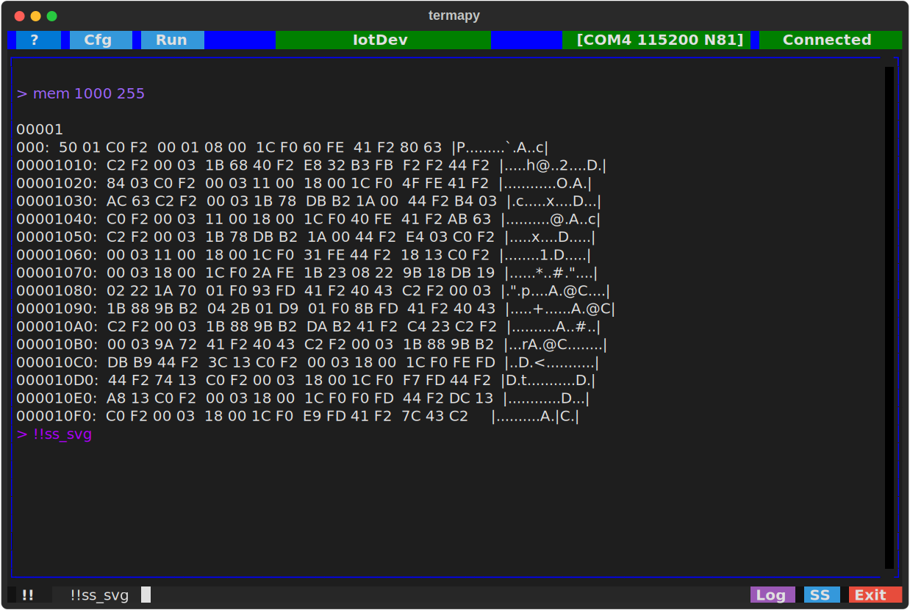

# termapy

     

*Pronounced "ter-map-ee"*

A serial terminal you can install in seconds and grow into for years. Connect to your device, send commands, see colored output — like PuTTY, but in your terminal, with scripting and protocol testing built in.

<!-- TODO: screenshot — full TUI with a device connected, showing colored output and the button bar -->


## Install and Run

One command if you have [uv](https://docs.astral.sh/uv/):

```sh
uvx --from git+https://github.com/hucker/termapy termapy
```

Or with pip:

```sh
pip install termapy
termapy
```

No hardware? Try the built-in simulated device:

```sh
termapy --demo
```

That's it. You're connected and typing commands.

## First 60 Seconds

1. **Connect** — click the port button in the title bar, pick your COM port, click the status button to connect (it turns green)
2. **Type** — enter commands in the input box at the bottom and press Enter
3. **Change settings** — click `Cfg` to edit port, baud rate, and other settings through the UI

<!-- TODO: screenshot — the config picker dialog showing New/Edit/Load buttons -->

Everything works through the UI — no config files to edit unless you want to.

## Why Not Just Use PuTTY?

PuTTY works. So does minicom, screen, and CoolTerm. Use them if they do what you need. Here's where termapy goes further:

- **Runs anywhere Python does** — same tool on Windows, macOS, Linux. No GUI installer, no system dependencies.
- **Session logging and screenshots** — every session is logged. Ctrl+S saves an SVG screenshot you can paste into a report or email.
- **Scripting** — record a sequence of commands in a text file and replay it with one click. Add delays, prompts, and REPL commands.
- **Binary protocol testing** — send raw hex, run scripted send/expect tests with pass/fail, decode Modbus and custom protocols with pluggable visualizers.
- **Plugin system** — add custom commands by dropping a Python file in a folder. No API to learn, no classes to subclass.
- **Everything in one folder** — each device config gets its own subfolder with logs, screenshots, scripts, and plugins. Copy the folder to share a complete setup.

See [COMPARISON.md](COMPARISON.md) for a detailed feature comparison against RealTerm, CoolTerm, Tera Term, Docklight, and HTerm.

## The Basics

### Keyboard Shortcuts

| Key     | Action                              |
| ------- | ----------------------------------- |
| Ctrl+Q  | Quit (also closes any open dialog)  |
| Ctrl+S  | Save SVG screenshot                 |
| Ctrl+T  | Save text screenshot                |
| Ctrl+P  | Command palette                     |
| Up/Down | Cycle through command history       |
| Escape  | Clear input / exit history browsing |
| Right   | Accept type-ahead suggestion        |

### Title Bar

<!-- TODO: screenshot — title bar close-up showing ?, #, Cfg, title, port, status buttons -->

| Button | Action                                                              |
| ------ | ------------------------------------------------------------------- |
| `?`    | Open the help guide                                                 |
| `#`    | Toggle line numbers (green when active)                             |
| `Cfg`  | Open the config picker                                              |
| `Run`  | Open the script picker                                              |
| Center | Click to edit the current config                                    |
| Port   | Click to select a serial port                                       |
| Status | Click to connect/disconnect (red = disconnected, green = connected) |

### REPL Commands

Type `/` to access built-in commands (the prefix is configurable). Type `/help` to list them all.

The most common ones:

| Command              | Description                        |
| -------------------- | ---------------------------------- |
| `/help [cmd]`        | List commands or show help for one |
| `/port.list`         | List available serial ports        |
| `/port.open {name}`  | Connect to a port                  |
| `/cfg [key [value]]` | Show or change config values       |
| `/ss.svg [name]`     | Save SVG screenshot                |
| `/cls`               | Clear the terminal                 |
| `/run <filename>`    | Run a script file                  |
| `/echo [on \| off]`  | Toggle command echo                |
| `/grep <pattern>`    | Search scrollback                  |
| `/exit`              | Exit termapy                       |

<details>
<summary>Full command list</summary>

| Command                   | Description                                                                      |
| ------------------------- | -------------------------------------------------------------------------------- |
| `/help [cmd]`             | List commands or show extended help for one                                      |
| `/help.dev <cmd>`         | Show a command handler's Python docstring                                        |
| `/port [name]`            | Open a port by name, or show subcommands                                         |
| `/port.list`              | List available serial ports                                                      |
| `/port.open {name}`       | Connect to the serial port (optional port override)                              |
| `/port.close`             | Disconnect from the serial port                                                  |
| `/cfg [key [value]]`      | Show config, show a key, or change a value (with confirmation)                   |
| `/cfg.auto <key> <value>` | Set a config key immediately (no confirmation)                                   |
| `/ss.svg [name]`          | Save SVG screenshot                                                              |
| `/ss.txt [name]`          | Save text screenshot                                                             |
| `/ss.dir`                 | Show the screenshot folder                                                       |
| `/cls`                    | Clear the terminal screen                                                        |
| `/run <filename>`         | Run a script file (checks `scripts/` folder then cwd); or use the Scripts button |
| `/delay <duration>`       | Wait for a duration (e.g. `500ms`, `1.5s`)                                       |
| `/confirm {message}`      | Show Yes/Cancel dialog; Cancel stops a running script (see `at_demo.run`)        |
| `/stop`                   | Abort a running script                                                           |
| `/seq [reset]`            | Show or reset sequence counters                                                  |
| `/print <text>`           | Print a message to the terminal                                                  |
| `/print.r <text>`         | Print Rich markup text (e.g. `[bold red]Warning![/]`)                            |
| `/show <name>`            | Show a file (`$cfg` for current config)                                          |
| `/echo [on \| off]`       | Toggle REPL command echo                                                         |
| `/echo.quiet <on \| off>` | Set echo on/off silently (for scripts and auto_connect_cmd)                      |
| `/edit <file>`            | Edit a project file (`$cfg`, `$log`, `$info`, or `scripts/`/`proto/` path)       |
| `/show_eol [on \| off]`   | Toggle visible `\r` `\n` markers for line-ending troubleshooting                 |
| `/os <cmd>`               | Run a shell command (10s timeout, requires `os_cmd_enabled`)                     |
| `/grep <pattern>`         | Search scrollback for regex matches (case-insensitive, skips own output)         |
| `/info {--display}`       | Show project summary; `--display` opens full report in system viewer             |
| `/proto.send <hex>`       | Send raw hex bytes and/or quoted text, display response as hex (see below)       |
| `/proto.run <file>`       | Run a binary protocol test script (.pro) with pass/fail                          |
| `/proto.hex [on \| off]`  | Toggle hex display mode for serial I/O                                           |
| `/proto.crc.list {pat}`   | List available CRC algorithms (optional glob filter)                             |
| `/proto.crc.help <name>`  | Show CRC algorithm parameters and description                                    |
| `/proto.crc.calc <n> {d}` | Compute CRC over hex bytes, text, or file; omit data to verify check string      |
| `/proto.status`           | Show current protocol mode state                                                 |
| `/exit`                   | Exit termapy                                                                     |

</details>

Screenshots and logs are saved in the config's subfolder (`termapy_cfg/<name>/`).

## Project Files

On first run, termapy prompts for a config name and creates one with defaults. If one config exists it loads automatically; if multiple exist, a picker appears. You can edit settings through the UI (`Cfg` button) or the REPL (`/cfg baud_rate 9600`).

Everything termapy creates — configs, scripts, test files, plugins, logs — lives in one folder. Run `termapy --demo` and you'll see this structure:

```text
termapy_cfg/
├── plugins/                            # global plugins (all configs)
└── demo/
    ├── demo.cfg                        # config file
    ├── demo.log                        # session log
    ├── .cmd_history.txt                # command history
    ├── ss/                             # screenshots
    ├── scripts/                        # script files for /run
    │   ├── at_demo.run
    │   ├── smoke_test.run
    │   └── status_check.run
    ├── plugins/                        # per-config plugins
    │   └── probe.py
    ├── proto/                          # protocol test scripts
    │   ├── at_test.pro
    │   └── modbus_test.pro
    └── viz/                            # per-config packet visualizers
        └── at_view.py
```

Your own configs follow the same layout — create one with `Cfg` → `New` and termapy builds the folder structure automatically.

### Version Control

Because everything is in one folder, you can commit it to git alongside your firmware source. Point `--cfg-dir` at a folder in your repo:

```sh
termapy --cfg-dir ./termapy_cfg
```

Clone on another machine, run the same command — all configs, scripts, and test files are ready to go.

Since COM port names differ between machines, use `$(env.NAME)` placeholders in your config so the same file works everywhere. Set a `COMPORT` environment variable on each machine, and reference it with a fallback:

```json
{
    "port": "$(env.COMPORT|COM4)",
    "baud_rate": 115200,
    "auto_connect": true
}
```

On a machine with `COMPORT=COM7`, termapy connects to COM7. On a machine without `COMPORT` set, it falls back to COM4. The config file on disk keeps the raw `$(env.COMPORT|COM4)` template — it's expanded in memory at load time, so your checked-in config stays portable.

Environment variables work in any string config value, not just `port`:

```json
{
    "port": "$(env.COMPORT|COM4)",
    "title": "$(env.DEVICE_NAME|Dev Board)",
    "log_file": "$(env.LOG_DIR|logs)/session.log"
}
```

You can also manage environment variables at runtime with REPL commands:

| Command                  | Description                                        |
| ------------------------ | -------------------------------------------------- |
| `/env.list {pattern}`    | List variables (all, by name, or glob like `COM*`) |
| `/env.set <name> <val>`  | Set a session-scoped variable (in-memory only)     |
| `/env.reload`            | Re-snapshot variables from the OS environment      |

Variables set with `/env.set` are available immediately for `$(env.NAME)` expansion in REPL commands but do not modify the OS environment or the config file.

Add a `.gitignore` for session files you don't need to track:

```gitignore
# termapy_cfg — keep configs and scripts, ignore session files
termapy_cfg/*/*.log
termapy_cfg/*/.cmd_history.txt
termapy_cfg/*/ss/
```

To specify a config file directly:

```sh
termapy my_device.cfg
```

To override the config directory:

```sh
termapy --cfg-dir /path/to/configs
```

### Config Examples

Minimal config — just set the port and go:

```json
{
    "port": "COM4",
    "baud_rate": 115200,
    "auto_connect": true
}
```

Two devices, color-coded so you can tell them apart:

```json
{
    "port": "COM4",
    "baud_rate": 115200,
    "title": "Sensor A",
    "app_border_color": "blue",
    "auto_connect": true,
    "auto_reconnect": true,
    "auto_connect_cmd": "rev \n help dev"
}
```

```json
{
    "port": "COM7",
    "baud_rate": 9600,
    "title": "Sensor B",
    "app_border_color": "green",
    "auto_connect": true
}
```

### Custom Buttons

Add toolbar buttons that send commands, run scripts, or chain multiple actions. Use `\n` to separate multiple commands:

```json
{
    "custom_buttons": [
        {"enabled": true, "name": "Reset", "command": "ATZ", "tooltip": "Reset device"},
        {"enabled": true, "name": "Init", "command": "ATZ\\nAT+BAUD=115200\\n/sleep 500ms\\nAT+INFO", "tooltip": "Full init sequence"},
        {"enabled": true, "name": "Status", "command": "/run status_check.run", "tooltip": "Run status script"}
    ]
}
```

### Hardware Line Control

Set `flow_control` to `"manual"` to get DTR, RTS, and Break buttons in the toolbar — useful for devices that use these lines for reset or bootloader entry:

```json
{
    "port": "COM4",
    "baud_rate": 115200,
    "flow_control": "manual",
    "title": "Hardware Debug"
}
```

<details>
<summary>Full config reference</summary>

```json
{
    "config_version": 5,
    "port": "COM4",
    "baud_rate": 115200,
    "byte_size": 8,
    "parity": "N",
    "stop_bits": 1,
    "flow_control": "none",
    "encoding": "utf-8",
    "inter_cmd_delay_ms": 0,
    "line_ending": "\r",
    "auto_connect": false,
    "auto_reconnect": false,
    "auto_connect_cmd": "",
    "echo_cmd": false,
    "echo_cmd_fmt": "[purple]> {cmd}[/]",
    "log_file": "",
    "show_timestamps": false,
    "show_eol": false,
    "max_grep_lines": 100,
    "title": "",
    "app_border_color": "",
    "max_lines": 10000,
    "repl_prefix": "/",
    "read_only": false,
    "os_cmd_enabled": false,
    "exception_traceback": false,
    "custom_buttons": []
}
```

| Field                 | Default                | Description                                                                                              |
| --------------------- | ---------------------- | -------------------------------------------------------------------------------------------------------- |
| `config_version`      | `5`                    | Schema version — managed automatically by the migration system, do not edit                              |
| `port`                | `"COM4"`               | Serial port name (supports `$(env.NAME\|fallback)` expansion)                                            |
| `baud_rate`           | `115200`               | Baud rate                                                                                                |
| `byte_size`           | `8`                    | Data bits (5, 6, 7, 8)                                                                                   |
| `parity`              | `"N"`                  | Parity: `"N"`, `"E"`, `"O"`, `"M"`, `"S"`                                                                |
| `stop_bits`           | `1`                    | Stop bits (1, 1.5, 2)                                                                                    |
| `flow_control`        | `"none"`               | `"none"`, `"rtscts"` (hardware), `"xonxoff"` (software), or `"manual"` (shows DTR/RTS/Break buttons)     |
| `encoding`            | `"utf-8"`              | Character encoding for serial data. Common values: `"utf-8"`, `"latin-1"`, `"ascii"`, `"cp437"`          |
| `inter_cmd_delay_ms`  | `0`                    | Delay in milliseconds between commands in autoconnect sequences and multi-command input (`cmd1 \n cmd2`) |
| `line_ending`         | `"\r"`                 | Appended to each command. `"\r"` CR, `"\r\n"` CRLF, `"\n"` LF                                            |
| `auto_connect`        | `false`                | Connect to the port on startup                                                                           |
| `auto_reconnect`      | `false`                | Retry every second if the port drops or fails to open                                                    |
| `auto_connect_cmd`    | `""`                   | Commands to send after connecting, separated by `\n`. Waits for idle between each                        |
| `echo_cmd`            | `false`                | Echo sent commands locally                                                                               |
| `echo_cmd_fmt`        | `"[purple]> {cmd}[/]"` | Rich markup format for echoed commands. `{cmd}` is replaced with the command text                        |
| `log_file`            | `""`                   | Session log path. If empty, uses `<name>.log` in the config's subfolder                                  |
| `show_timestamps`     | `false`                | Prefix each line in the terminal display with `[HH:MM:SS.mmm]`                                           |
| `show_eol`            | `false`                | Show dim `\r` and `\n` markers in serial output for line-ending debugging (see note below)               |
| `max_grep_lines`      | `100`                  | Maximum number of matching lines shown by `/grep`                                                        |
| `proto_frame_gap_ms`  | `50`                   | Silence gap (ms) to detect end of a binary protocol frame                                                |
| `title`               | `""`                   | Title bar center text. Defaults to the config filename                                                   |
| `app_border_color`    | `""`                   | Title bar and output border color. Any CSS color name or hex value                                       |
| `max_lines`           | `10000`                | Maximum lines in the scrollback buffer                                                                   |
| `repl_prefix`         | `"/"`                  | Prefix for local REPL commands (e.g. `/help`, `/cls`)                                                    |
| `read_only`           | `false`                | Disable the Edit button in config/script/proto pickers (REPL `/cfg` still works)                         |
| `os_cmd_enabled`      | `false`                | Enable the `/os` REPL command to run shell commands                                                      |
| `exception_traceback` | `false`                | Include full stack trace in serial exception output (for debugging)                                      |
| `custom_buttons`      | `[]`                   | Array of custom button objects (see Custom Buttons above)                                                |

**Note on `show_eol`:** This is a debug mode for troubleshooting line-ending mismatches (`\r` vs `\n` vs `\r\n`). When enabled, dim `\r` and `\n` markers appear inline in serial output before the characters are consumed by line splitting. Sent commands also show the configured line ending. Since the markers use ANSI escape sequences, they may interfere with device ANSI color output — turn `show_eol` off when not actively debugging.

</details>

---

## Scripting

Create text files with one command per line and run them with `/run` or the Scripts button. Lines starting with `/` are REPL commands; everything else is sent to the device.

```text
# Quick status check
AT+STATUS
/delay 300ms
AT+TEMP
/delay 300ms
```

Scripts support delays (`/delay 500ms`), screen clearing (`/cls`), confirmation prompts (`/confirm Reset device?`), screenshots, and sequence counters with auto-increment for batch testing. See the demo scripts (`at_demo.run`, `smoke_test.run`) for examples.

## Binary Protocol Testing

Send raw hex bytes and see the response:

```sh
/proto.send 01 03 00 00 00 01 84 0A
  TX: 01 03 00 00 00 01 84 0A
  RX: 01 03 02 00 07 F9 86
  (7 bytes, 12ms)
```

Mix hex and quoted text:

```text
/proto.send "AT+RST\r\n"
/proto.send FF 00 "hello" 0D 0A
```

No line ending is appended — you send exactly the bytes you specify. Toggle `/proto.hex` to show all normal serial I/O as hex bytes.

### Proto Test Scripts

Write `.pro` files (TOML format) for repeatable send/expect testing with pass/fail:

```toml
name = "Modbus Register Test"
frame_gap = "20ms"

[[test]]
name = "Read 1 register"
send = "01 03 00 00 00 01 84 0A"
expect = "01 03 02 00 07 F9 86"

[[test]]
name = "Write register 5 = 1234"
send = "01 06 00 05 04 D2 1B 56"
expect = "01 06 00 05 04 D2 1B 56"
```

Run with `/proto.run <file>` or from the proto debug screen, which adds repeat count, delay between runs, stop-on-error, scrolling results, and visualizer column data.

<!-- TODO: screenshot — proto debug screen showing test results with pass/fail coloring and visualizer columns -->

### CRC Algorithms

62 named CRC algorithms from the [reveng catalogue](https://reveng.sourceforge.io/crc-catalogue/all.htm) are built in. Browse with `/proto.crc.list`, inspect with `/proto.crc.help <name>`, compute with `/proto.crc.calc`.

---

## Extending Termapy

### Plugins

Add custom REPL commands by dropping a `.py` file in a plugin folder. No classes to subclass, no registration:

```python
# hello.py — drop into termapy_cfg/plugins/ or termapy_cfg/<config>/plugins/
from termapy.plugins import Command, PluginContext

def _handler(ctx: PluginContext, args: str):
    name = args.strip() or "world"
    ctx.write(f"Hello, {name}!")

# ── COMMAND (must be at end of file) ──────────────────────────────────────────
COMMAND = Command(
    name="hello",
    args="{name}",        # {braces} = optional, <angle> = required, "" = no args
    help="Say hello.",
    handler=_handler,
)
```

**Plugin locations** (loaded in order, later overrides earlier):

1. **Built-in** — shipped with termapy, always available
2. **Global** — `termapy_cfg/plugins/*.py`, shared across all configs
3. **Per-config** — `termapy_cfg/<name>/plugins/*.py`, specific to one config
4. **App hooks** — commands that need Textual access (screenshots, connect, etc.)

<details>
<summary>Subcommands</summary>

Use `sub_commands` for related operations. Users invoke them with dot notation (`/tool.run`):

```python
from termapy.plugins import Command

def _run(ctx, args):
    ctx.write(f"Running {args}...")

def _status(ctx, args):
    ctx.write("All good.")

# ── COMMAND (must be at end of file) ──────────────────────────────────────────
COMMAND = Command(
    name="tool",
    help="A tool with subcommands.",
    sub_commands={
        "run":    Command(args="<file>", help="Run a file.", handler=_run),
        "status": Command(help="Show status.", handler=_status),
    },
)
```

The user types `/tool.run myfile` or `/tool.status`.

</details>

<details>
<summary>PluginContext API</summary>

The `ctx` object passed to every handler:

| Method / Attribute          | Description                                                        |
| --------------------------- | ------------------------------------------------------------------ |
| `ctx.write(text, color)`    | Print to the terminal (color is optional)                          |
| `ctx.write_markup(text)`    | Print Rich markup text (e.g. `[bold red]Warning![/]`)              |
| `ctx.cfg`                   | Current config dict (read-only access)                             |
| `ctx.config_path`           | Path to the current `.cfg` config file                             |
| `ctx.is_connected()`        | Check if the serial port is open                                   |
| `ctx.serial_write(data)`    | Send bytes to the serial port                                      |
| `ctx.serial_wait_idle()`    | Wait until serial output settles                                   |
| `ctx.serial_read_raw()`     | Read raw bytes with timeout framing (returns `bytes`)              |
| `ctx.serial_io()`           | Context manager for exclusive serial I/O (`with ctx.serial_io():`) |
| `ctx.ss_dir`                | Screenshot directory (`Path`)                                      |
| `ctx.scripts_dir`           | Scripts directory (`Path`)                                         |
| `ctx.confirm(message)`      | Show Yes/Cancel dialog, return `bool` (scripts only)               |
| `ctx.notify(text)`          | Show a toast notification                                          |
| `ctx.clear_screen()`        | Clear the terminal output                                          |
| `ctx.save_screenshot(path)` | Save an SVG screenshot to a file                                   |
| `ctx.get_screen_text()`     | Get terminal content as plain text                                 |

There is also `ctx.engine` which exposes internal engine state (sequence counters, echo, config save, etc.). This is used by built-in commands and may change between versions — external plugins should avoid it.

</details>

<details>
<summary>Example plugins</summary>

See `examples/plugins/` for working examples:

- **hello.py** — minimal greeting command
- **at_test.py** — send AT commands over serial
- **timestamp.py** — print the current date/time
- **ping.py** — send a command and measure response time

A more complete example ships with `--demo`: the `probe.py` plugin demonstrates the drain → write → read → parse cycle for device interaction. Run `/help probe` or `/help.dev probe` to see its documentation.

</details>

### Packet Visualizers

The proto debug screen displays packet data using pluggable visualizers. Three are built-in (Hex, Text, Modbus), and you can add your own by dropping a `.py` file into `viz/`.

<details>
<summary>Writing a visualizer</summary>

```python
# sensor_view.py — drop into termapy_cfg/<config>/viz/
from termapy.protocol import apply_format, parse_format_spec
from termapy.protocol import diff_columns as proto_diff_columns

NAME = "Sensor"
DESCRIPTION = "Sensor protocol — serial, counter, sensors, CRC"
SORT_ORDER = 30

_SPEC = "Serial:S1-8 Counter:D9-10 Temp:D11 Humid:D12 Press:D13 CRC:crc16x_be"

def format_columns(data: bytes) -> tuple[list[str], list[str]]:
    """Return (headers, values) for display."""
    if not data:
        return ["Sensor"], [""]
    return apply_format(data, parse_format_spec(_SPEC))

def diff_columns(
    actual: bytes, expected: bytes, mask: bytes
) -> tuple[list[str], list[str], list[str], list[str]]:
    """Return (headers, expected_values, actual_values, statuses)."""
    if not expected and not actual:
        return ["Sensor"], [""], [""], ["match"]
    return proto_diff_columns(actual, expected, mask, parse_format_spec(_SPEC))
```

**Format spec language** — maps packet bytes to named columns:

| Code   | Meaning          | Example          | Output       |
| ------ | ---------------- | ---------------- | ------------ |
| `H`    | Hex (unsigned)   | `H1`, `H3-4`    | `0A`, `01FF` |
| `D`    | Decimal unsigned | `D1`, `D3-4`    | `10`, `256`  |
| `+D`   | Decimal signed   | `+D1`           | `-1`, `+127` |
| `S`    | ASCII string     | `S5-12`         | `Hello...`   |
| `F`    | IEEE 754 float   | `F1-4`          | `3.14`       |
| `B`    | Single bit       | `B1.0`          | `0` or `1`   |
| `crc*` | CRC verify       | `crc16m_le`     | green/red    |

Byte indexing is 1-based. Endianness by byte order: `D3-4` = big-endian, `D4-3` = little-endian, `H7-*` = wildcard to end.

CRC columns use `_le`/`_be` suffix: `CRC:crc16-modbus_le`, `CRC:crc16-xmodem_be`, `CRC:crc8-maxim`.

**Custom CRC plugins** for non-standard checksums are `.py` files in `builtins/crc/` or `termapy_cfg/<name>/crc/`:

```python
NAME = "sum8"
WIDTH = 1

def compute(data: bytes) -> int:
    return sum(data) & 0xFF
```

</details>

<details>
<summary>Visualizer API reference</summary>

| Export                                 | Required | Default | Description                                                |
| -------------------------------------- | -------- | ------- | ---------------------------------------------------------- |
| `NAME`                                 | yes      | —       | Checkbox label and table header                            |
| `format_columns(data)`                 | yes      | —       | Return `(headers, values)` lists for TX/Expected rows      |
| `diff_columns(actual, expected, mask)` | yes      | —       | Return `(headers, exp_vals, act_vals, statuses)` for diffs |
| `format_spec(data)`                    | no       | `""`    | Return the raw format spec string for display              |
| `DESCRIPTION`                          | no       | `""`    | Tooltip text for the checkbox                              |
| `SORT_ORDER`                           | no       | `50`    | Checkbox ordering (lower = first, built-ins use 10/20)     |

**Utilities from `termapy.protocol`:**

| Function                                        | Description                                                             |
| ----------------------------------------------- | ----------------------------------------------------------------------- |
| `parse_format_spec(spec)`                       | Parse a format spec string into `list[ColumnSpec]`                      |
| `apply_format(data, columns)`                   | Apply column specs to data, return `(headers, values)`                  |
| `diff_columns(actual, expected, mask, columns)` | Compare with per-column status: `match`, `mismatch`, `extra`, `missing` |
| `diff_bytes(expected, actual, mask)`            | Per-byte comparison returning status list                               |
| `get_crc_registry()`                            | Get loaded CRC algorithms dict                                          |

</details>

---

## Demo Mode

No hardware? `termapy --demo` connects to a simulated `BASSOMATIC-77` device with AT commands and Modbus RTU:

<!-- TODO: screenshot — demo mode showing AT command output with the device responding -->

```sh
AT                              # connection test → OK
AT+INFO                         # device info
AT+LED on                       # turn LED on
AT+STATUS                       # check LED state, uptime
mem 0x1000 32                   # hex memory dump
```

For Modbus binary commands, use `/proto.send` with hex bytes (CRC included):

```sh
/proto.send 01 03 00 00 00 01 84 0A       # read 1 register from addr 0
/proto.send 01 06 00 05 04 D2 1B 56       # write register 5 = 1234
/proto.send 01 03 00 05 00 01 94 0B       # read back register 5
```

The demo includes bundled scripts (`at_demo.run`, `smoke_test.run`), proto test files (`at_test.pro`, `modbus_test.pro`), a plugin (`/probe`), and a visualizer (`AT`) to exercise all features.

<details>
<summary>Full demo command list</summary>

| Command            | Description                                       |
| ------------------ | ------------------------------------------------- |
| `AT`               | Connection test (returns `OK`)                    |
| `AT+PROD-ID`       | Product identifier (returns `BASSOMATIC-77`)      |
| `AT+INFO`          | Device info (version, uptime, free memory)        |
| `AT+TEMP`          | Read temperature sensor                           |
| `AT+LED on\|off`   | Control LED                                       |
| `AT+NAME?`         | Query device name                                 |
| `AT+NAME=val`      | Set device name (max 32 chars)                    |
| `AT+BAUD?`         | Query baud rate                                   |
| `AT+BAUD=val`      | Set baud rate (9600, 19200, 38400, 57600, 115200) |
| `AT+STATUS`        | Device status (LED, uptime, connections)          |
| `AT+RESET`         | Reset device (simulates boot sequence)            |
| `mem <addr> [len]` | Hex memory dump (deterministic, max 256 bytes)    |
| `help`             | List all commands                                 |

Modbus RTU: function 0x03 (read holding registers) and 0x06 (write single register), CRC16 enforced.

</details>

## Portability

Developed and tested on **Windows**. Basic usage verified on **macOS** (serial, ANSI rendering, screenshots). macOS support is **alpha** until further testing. Linux has not been tested.

## Architecture

<details>
<summary>Threading model</summary>

Textual runs on a single async event loop. Termapy uses `@work(thread=True)` for blocking operations, posting UI updates via `call_from_thread()`.

| Worker              | Lifetime    | Purpose                                                 |
| ------------------- | ----------- | ------------------------------------------------------- |
| `read_serial()`     | Long-lived  | Reads serial data in a loop, posts lines to the RichLog |
| `_auto_reconnect()` | Short-lived | Retries serial connection every second until success    |
| `_run_lines()`      | Short-lived | Sends multiple commands with inter-command delay        |
| `_run_script()`     | Short-lived | Executes a `.run` script file line by line              |
| `_send_test()`      | Short-lived | Runs a single protocol test case (send/receive/match)   |
| `_run_cmds()`       | Short-lived | Sends setup/teardown commands for protocol tests        |

Only `read_serial()` is long-lived. At most two workers run concurrently: the serial reader plus one command/script/test worker.

</details>

## Test Coverage

 *of testable library code — see note below*

487 tests across 9 test files. Run with `uv run pytest`.

<details>
<summary>Coverage details</summary>

| Module         | Coverage | Test file                            |
| -------------- | -------- | ------------------------------------ |
| `scripting.py` | 100%     | `test_scripting.py`                  |
| `migration.py` | 100%     | `test_migration.py`                  |
| `hex_view.py`  | 100%     | `test_protocol.py`                   |
| `text_view.py` | 97%      | `test_protocol.py`                   |
| `plugins.py`   | 99%      | `test_plugins.py`                    |
| `repl.py`      | 96%      | `test_engine.py`, `test_repl_cfg.py` |
| `protocol.py`  | 88%      | `test_protocol.py`                   |
| `config.py`    | 78%      | `test_app_config.py`                 |

**Excluded from coverage:** `app.py` (~1500 lines, Textual UI), `proto_debug.py` (~1080 lines, modal debug screen), `builtins/*.py` (~200 lines, dynamic import). Pure logic lives in testable modules with high coverage; UI code is tested manually.

</details>
