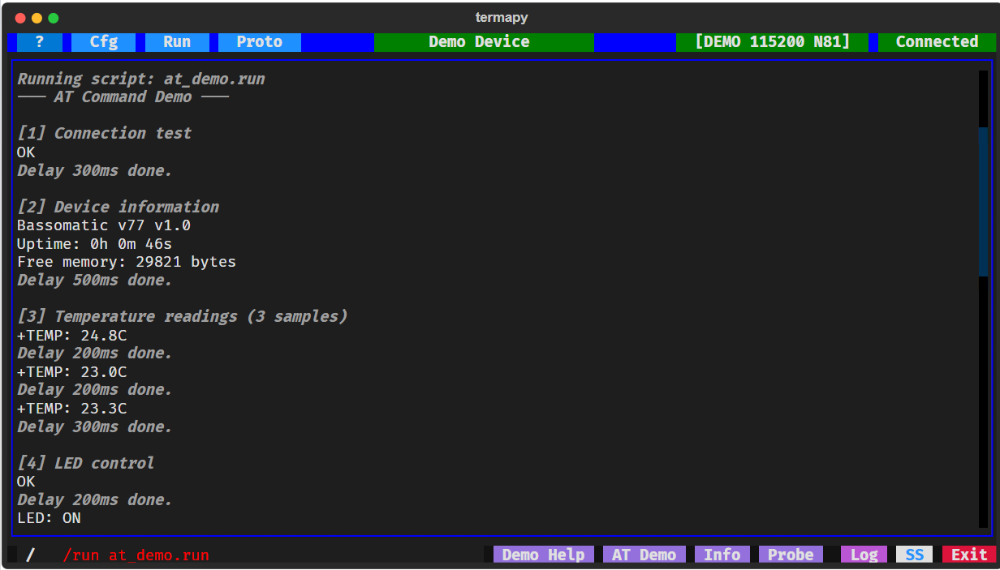
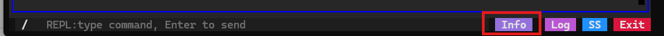
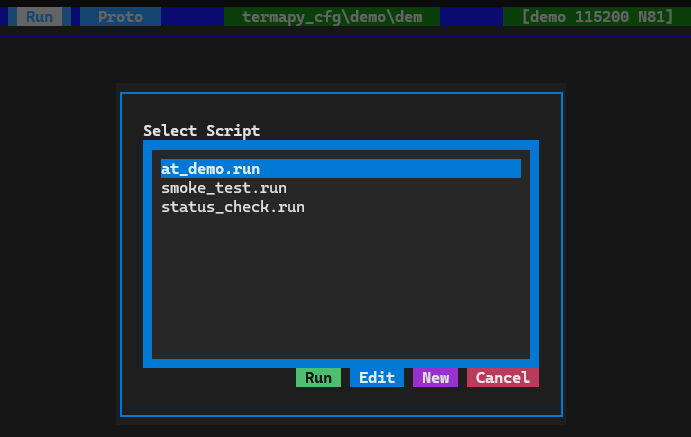
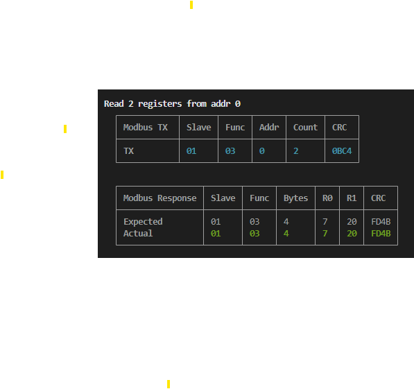

# termapy

**Project Status:** [](https://github.com/hucker/termapy/actions/workflows/tests.yml) [](https://codecov.io/gh/hucker/termapy)  [](https://hucker.github.io/termapy/)

**Powered by:** [](https://textual.textualize.io/) [](https://pyserial.readthedocs.io/) [](https://github.com/hucker/zensical)

**Built with:**  [](https://docs.astral.sh/uv/) [](https://pytest.org/) [](https://coverage.readthedocs.io/)

*Pronounced "ter-map-ee"*

A serial interface terminal like PuTTY or Tera Term — but it runs in your terminal, installs in seconds, and comes with scripting, protocol testing, and a plugin system built in.



## Install and Connect

Install with [uv](https://docs.astral.sh/uv/):

```sh
uv tool install --python 3.14 git+https://github.com/hucker/termapy@v0.39.1
termapy --demo
```

Or try it without installing:

```sh
uvx --from git+https://github.com/hucker/termapy@v0.39.1 termapy --demo
```

That starts a simulated device — no hardware needed. You're typing commands in seconds.

For a real device, just point at your config:

```sh
termapy my_device              # finds termapy_cfg/my_device/my_device.cfg
termapy my_device.cfg          # same, explicit extension
termapy termapy_cfg/my_device  # same, explicit path to folder
```

For a plain-text terminal (no TUI), use CLI mode:

```sh
termapy --cli my_device                  # interactive CLI
termapy --cli smoke_test.run             # run a .run script and exit
termapy --cli my_device --run test.run   # explicit config + script
```

There's a lot more — scripting, binary protocol testing, 62 CRC algorithms, custom buttons, plugins, packet visualizers — expand any section below.

---

<details>
<summary><strong>First 60 Seconds</strong> — connect, type, change settings</summary>

1. **Connect** — click the port button in the title bar, pick your COM port, click the status button to connect (it turns green)
2. **Type** — enter commands in the input box at the bottom and press Enter
3. **Change settings** — click `Cfg` to edit port, baud rate, and other settings through the UI

Everything works through the UI — no config files to edit unless you want to.

</details>

<details>

<summary><strong>Why Not Just Use PuTTY?</strong> — what termapy adds</summary>

PuTTY works. So does minicom, screen, and CoolTerm. Use them if they do what you need. Here's where termapy goes further:

- **Runs anywhere Python does** — same tool on Windows, macOS, Linux. No GUI installer, no system dependencies.
- **Session logging and screenshots** — every session is logged. Ctrl+S saves an SVG screenshot you can paste into a report or email.
- **Scripting** — record a sequence of commands in a text file and replay it with one click. Add delays, prompts, and REPL commands.
- **Data capture** — capture serial text (timed) or binary data (by byte/record count) to files. Binary captures use the same format spec language as protocol testing to decode mixed-type records into CSV/TSV.
- **Binary protocol testing** — send raw hex, run scripted send/expect tests with pass/fail, decode Modbus and custom protocols with pluggable visualizers.
- **Plugin system** — add custom commands with a simple Python API. Drop a file in a folder, define a handler, done. Includes examples to get started.
- **Everything in one folder** — each device config gets its own subfolder with logs, screenshots, scripts, and plugins. Check it into git so the whole team has the same config.

See [COMPARISON.md](COMPARISON.md) for a detailed feature comparison against RealTerm, CoolTerm, Tera Term, Docklight, and HTerm.

</details>

<details>
<summary><strong>The Basics</strong> — keyboard shortcuts, title bar, REPL commands</summary>

### Keyboard Shortcuts

| Key     | Action                              |
| ------- | ----------------------------------- |
| Ctrl+Q  | Quit (also closes any open dialog)  |
| Ctrl+S  | Save SVG screenshot                 |
| Ctrl+T  | Save text screenshot                |
| Ctrl+P  | Command palette                     |
| Up/Down | Cycle through command history       |
| Escape  | Clear input / exit history browsing |
| Right   | Accept type-ahead suggestion        |

### Title Bar

| Button | Action                                                              |
| ------ | ------------------------------------------------------------------- |
| `?`    | Open the help guide                                                 |
| `#`    | Toggle line numbers (green when active)                             |
| `Cfg`  | Open the config picker                                              |
| `Run`  | Open the script picker                                              |
| Center | Click to edit the current config                                    |
| Port   | Click to select a serial port                                       |
| Status | Click to connect/disconnect (red = disconnected, green = connected) |

### REPL Commands

Type `/` to access built-in commands (the prefix is configurable). Type `/help` to list them all.

The most common ones:

| Command              | Description                        |
| -------------------- | ---------------------------------- |
| `/help [cmd]`        | List commands or show help for one |
| `/port.list`         | List available serial ports        |
| `/port.open {name}`  | Connect to a port                  |
| `/port.info`         | Show port status and parameters    |
| `/cfg [key [value]]` | Show or change in-memory config    |
| `/ss.svg [name]`     | Save SVG screenshot                |
| `/cls`               | Clear the terminal                 |
| `/run <filename>`    | Run a script file                  |
| `/echo [on \| off]`  | Toggle command echo                |
| `/grep <pattern>`    | Search scrollback                  |
| `/exit`              | Exit termapy                       |

<details>
<summary>Full command list</summary>

| Command                          | Description                                                                      |
| -------------------------------- | -------------------------------------------------------------------------------- |
| `/help [cmd]`                    | List commands or show extended help for one                                      |
| `/help.dev <cmd>`                | Show a command handler's Python docstring                                        |
| `/port [name]`                   | Open a port by name, or show subcommands                                         |
| `/port.list`                     | List available serial ports                                                      |
| `/port.open {name}`              | Connect to the serial port (optional port override)                              |
| `/port.close`                    | Disconnect from the serial port                                                  |
| `/port.info`                     | Show port status, serial parameters, and hardware lines                          |
| `/port.baud_rate {value}`        | Show or set baud rate (hardware only)                                            |
| `/port.byte_size {value}`        | Show or set data bits (hardware only)                                            |
| `/port.parity {value}`           | Show or set parity (hardware only)                                               |
| `/port.stop_bits {value}`        | Show or set stop bits (hardware only)                                            |
| `/port.flow_control {m}`         | Show or set flow control: none, rtscts, xonxoff, manual                          |
| `/port.dtr {0\|1}`               | Show or set DTR line                                                             |
| `/port.rts {0\|1}`               | Show or set RTS line                                                             |
| `/port.cts`                      | Show CTS state (read-only)                                                       |
| `/port.dsr`                      | Show DSR state (read-only)                                                       |
| `/port.ri`                       | Show RI state (read-only)                                                        |
| `/port.cd`                       | Show CD state (read-only)                                                        |
| `/port.break {ms}`               | Send break signal (default 250ms)                                                |
| `/cfg [key [value]]`             | Show config, show a key, or change in-memory value (with confirmation)           |
| `/cfg.auto <key> <value>`        | Set an in-memory config key immediately (no confirmation)                        |
| `/cfg.configs`                   | List all config files                                                            |
| `/cfg.load <name>`               | Switch to a different config by name                                             |
| `/ss.svg [name]`                 | Save SVG screenshot                                                              |
| `/ss.txt [name]`                 | Save text screenshot                                                             |
| `/ss.dir`                        | Show the screenshot folder                                                       |
| `/cls`                           | Clear the terminal screen                                                        |
| `/run <filename> {-v}`           | Run a script file (-v/--verbose for per-line timing); nests up to 5 levels deep  |
| `/run.list`                      | List .run files in the run/ directory                                            |
| `/run.load <filename>`           | Run a script file (same as /run)                                                 |
| `/delay <duration>`              | Wait for a duration (e.g. `500ms`, `1.5s`)                                       |
| `/confirm {message}`             | Show Yes/Cancel dialog; Cancel stops a running script (see `at_demo.run`)        |
| `/stop`                          | Abort a running script                                                           |
| `/seq`                           | Show sequence counters                                                           |
| `/seq.reset`                     | Reset all sequence counters to zero                                              |
| `/print <text>`                  | Print a message to the terminal                                                  |
| `/print.r <text>`                | Print Rich markup text (e.g. `[bold red]Warning![/]`)                            |
| `/show <name>`                   | Show a file                                                                      |
| `/show.cfg`                      | Show the current config file                                                     |
| `/echo [on \| off]`              | Toggle REPL command echo                                                         |
| `/echo.quiet <on \| off>`        | Set echo on/off silently (for scripts and on_connect_cmd)                        |
| `/edit <file>`                   | Edit a project file (`run/`/`proto/` path)                                       |
| `/edit.cfg`                      | Edit the current config file                                                     |
| `/edit.log`                      | Open the session log in the system viewer                                        |
| `/edit.info`                     | Open the info report in the system viewer                                        |
| `/show_line_endings [on \| off]` | Toggle visible `\r` `\n` markers for line-ending troubleshooting                 |
| `/os <cmd>`                      | Run a shell command (10s timeout, requires `os_cmd_enabled`)                     |
| `/grep <pattern>`                | Search scrollback for regex matches (case-insensitive, skips own output)         |
| `/cfg.info {--display}`          | Show project summary; `--display` opens full report in system viewer             |
| `/cfg.files`                     | Show project directory tree                                                      |
| `/proto.send <hex>`              | Send raw hex bytes and/or quoted text, display response as hex (see below)       |
| `/proto.run <file>`              | Run a binary protocol test script (.pro) with pass/fail                          |
| `/proto.list`                    | List .pro files in the proto/ directory                                          |
| `/proto.load <file>`             | Run a protocol test script (same as /proto.run)                                  |
| `/proto.hex [on \| off]`         | Toggle hex display mode for serial I/O                                           |
| `/proto.crc.list {pat}`          | List available CRC algorithms (optional glob filter)                             |
| `/proto.crc.help <name>`         | Show CRC algorithm parameters and description                                    |
| `/proto.crc.calc <n> {d}`        | Compute CRC over hex bytes, text, or file; omit data to verify check string      |
| `/proto.status`                  | Show current protocol mode state                                                 |
| `/var {name}`                    | List user variables, or show one by name                                         |
| `/var.set <NAME> <value>`        | Set a user variable                                                              |
| `/var.clear`                     | Clear all user variables                                                         |
| `/env.list {pattern}`            | List environment variables (all, by name, or glob)                               |
| `/env.set <name> <value>`        | Set a session-scoped environment variable                                        |
| `/env.reload`                    | Re-snapshot variables from the OS environment                                    |
| `/cap.text <f> ...`              | Capture serial text to file for a timed duration                                 |
| `/cap.bin <f> ...`               | Capture raw binary bytes to a file                                               |
| `/cap.struct <f> ...`            | Capture binary data, decode with format spec to CSV                              |
| `/cap.hex <f> ...`               | Capture hex text lines, decode with format spec to CSV                           |
| `/cap.stop`                      | Stop an active capture                                                           |
| `/raw <text>`                    | Send text to serial with no variable expansion or transforms                     |
| `/exit`                          | Exit termapy                                                                     |

</details>

Screenshots and logs are saved in the config's subfolder (`termapy_cfg/<name>/`).

</details>

<details>
<summary><strong>Project Files</strong> — config layout, version control, env vars, examples</summary>

On first run, termapy prompts for a config name and creates one with defaults. If one config exists it loads automatically; if multiple exist, a picker appears. You can edit the config file through the UI (`Cfg` button), or change in-memory settings for the current session with `/cfg baud_rate 9600`.

Everything termapy creates — configs, scripts, test files, plugins, logs — lives in one folder. Run `termapy --demo` and you'll see this structure:

```text
termapy_cfg/
├── plugin/                             # global plugins (all configs)
└── demo/
    ├── demo.cfg                        # config file
    ├── demo.log                        # session log
    ├── .cmd_history.txt                # command history
    ├── ss/                             # screenshots
    ├── run/                            # script files for /run
    │   ├── at_demo.run
    │   ├── smoke_test.run
    │   └── status_check.run
    ├── plugin/                         # per-config plugins
    │   └── probe.py
    ├── cap/                            # data capture output files
    └── proto/                          # protocol test scripts
        ├── at_test.pro
        ├── bitfield_inline.pro
        └── modbus_inline.pro
```

Your own configs follow the same layout — create one with `Cfg` → `New` and termapy builds the folder structure automatically.

### Version Control

Because everything is in one folder, you can commit it to git alongside your firmware source. Point `--cfg-dir` at a folder in your repo:

```sh
termapy --cfg-dir ./termapy_cfg
```

Clone on another machine, run the same command — all configs, scripts, and test files are ready to go.

Since COM port names differ between machines, use `$(env.NAME)` placeholders in your config so the same file works everywhere. Set a `COMPORT` environment variable on each machine, and reference it with a fallback:

```json
{
    "port": "$(env.COMPORT|COM4)",
    "baud_rate": 115200,
    "auto_connect": true
}
```

On a machine with `COMPORT=COM7`, termapy connects to COM7. On a machine without `COMPORT` set, it falls back to COM4. The config file on disk keeps the raw `$(env.COMPORT|COM4)` template — it's expanded in memory at load time, so your checked-in config stays portable.

Environment variables work in any string config value, not just `port`:

```json
{
    "port": "$(env.COMPORT|COM4)",
    "title": "$(env.DEVICE_NAME|Dev Board)",
    "log_file": "$(env.LOG_DIR|logs)/session.log"
}
```

You can also manage environment variables at runtime with REPL commands:

| Command                 | Description                                        |
| ----------------------- | -------------------------------------------------- |
| `/env.list {pattern}`   | List variables (all, by name, or glob like `COM*`) |
| `/env.set <name> <val>` | Set a session-scoped variable (in-memory only)     |
| `/env.reload`           | Re-snapshot variables from the OS environment      |

Variables set with `/env.set` are available immediately for `$(env.NAME)` expansion in REPL commands but do not modify the OS environment or the config file.

#### User Variables (`$(NAME)`)

User variables let you define values once and reuse them across commands and scripts. This is especially useful when a test references the same address, register, or port in multiple places — change it once at the top instead of everywhere.

Assign a variable by typing `$(name) = value` (no `/` prefix needed):

```text
$(slave) = 01
$(reg) = 0064
$(count) = 05
```

Use variables in any command — REPL or serial:

```text
/proto.send $(slave) 03 00 $(reg) 00 $(count)
/print Reading $(count) registers from $(slave) at $(reg)
AT+ADDR=$(slave)
```

A typical workflow is a setup script that configures a test, then a test script that uses the variables:

```text
# setup_modbus.run — run this first to configure the test
$(SLAVE) = 01
$(BASE_REG) = 0064
$(NUM_REGS) = 05
/print Configured: slave=$(SLAVE) base=$(BASE_REG) count=$(NUM_REGS)
```

```text
# test_registers.run — uses variables from setup
/proto.send $(SLAVE) 03 00 $(BASE_REG) 00 $(NUM_REGS)
/delay 500ms
/proto.send $(SLAVE) 06 00 $(BASE_REG) 04 D2
```

Run `/run setup_modbus.run` then `/run test_registers.run` — the variables persist across interactive `/run` calls.

| Command              | Description                            |
| -------------------- | -------------------------------------- |
| `$(NAME) = value`    | Set a variable (no `/` prefix needed)  |
| `/var`               | List all defined variables             |
| `/var NAME`          | Show one variable's value (or $(NAME)) |
| `/var.set NAME val`  | Set a variable (explicit command form) |
| `/var.clear`         | Clear all variables                    |

**Scope:** Variables persist for the interactive session. They are automatically cleared when a script is launched from the Scripts button or Run menu, but *not* when `/run` is typed interactively or called within a script. This lets you run a setup script to define variables, then run a test script that uses them. Use `/var.clear` to reset manually.

**Naming:** Variable names are case-sensitive (`$(PORT)` and `$(port)` are different variables). Names must start with a letter or underscore and contain only letters, digits, and underscores.

**Built-in time variables:**

| Variable | Set when | Updates? |
| --- | --- | --- |
| `$(LAUNCH_DATETIME)` | App starts | Never - frozen |
| `$(SESSION_DATETIME)` | Script launched (Scripts button / Run menu) | Per script launch |
| `$(DATETIME)` | Every expansion | Always current clock |

Each group also has `_DATE` and `_TIME` variants (e.g. `$(LAUNCH_DATE)`, `$(SESSION_TIME)`).

**vs. environment variables:** `$(env.NAME)` pulls from the OS environment and works in config files. `$(NAME)` is for user-defined session variables in commands and scripts. Both use the `$(...)` syntax — `env.` is required to access environment variables explicitly.

**Escaping:** Use `\$` to prevent expansion of a single reference, or `/raw` to skip expansion for an entire line.

Add a `.gitignore` for session files you don't need to track:

```gitignore
# termapy_cfg — keep configs and scripts, ignore session files
termapy_cfg/*/*.log
termapy_cfg/*/.cmd_history.txt
termapy_cfg/*/ss/
```

To specify a config file directly:

```sh
termapy my_device.cfg
```

To override the config directory:

```sh
termapy --cfg-dir /path/to/configs
```

### Config Validation

Termapy validates config files on load and when saving from the editor. Invalid serial settings (baud rate, parity, data bits, stop bits, flow control, encoding) and unknown keys (typos) produce yellow warnings in the log window. Non-standard baud rates are flagged but allowed — some hardware uses custom rates.

To validate a config from the command line without launching the UI:

```sh
termapy --check my_device.cfg
```

This prints a JSON result to stdout and exits:

```json
{"status": "ok"}
```

```json
{"status": "warn", "warnings": ["baud_rate: 115201 is not a standard rate (110, 300, ...)"]}
```

The `--check` flag is read-only — it never modifies the config file.

### Config Examples

When you create a new config, termapy writes a complete `.cfg` file with all defaults (~30 lines). Here are some of the settings you can change:

```json
{
    "port": "COM4",
    "baud_rate": 115200,
    "auto_connect": true,
    "auto_reconnect": true,
    "title": "Sensor A",
    "border_color": "blue",
    "on_connect_cmd": "rev \n help dev"
}
```

### Custom Buttons

The demo project's "Info" button runs the `/cfg.info` command via a custom button:

```json
{"enabled": true, "name": "Info", "command": "/cfg.info", "tooltip": "Project info"}
```



Add toolbar buttons that send commands, run scripts, or chain multiple actions. Use `\n` to separate multiple commands:

```json
{
    "custom_buttons": [
        {"enabled": true, "name": "Reset", "command": "ATZ", "tooltip": "Reset device"},
        {"enabled": true, "name": "Init", "command": "ATZ\\nAT+BAUD=115200\\n/sleep 500ms\\nAT+INFO", "tooltip": "Full init sequence"},
        {"enabled": true, "name": "Status", "command": "/run status_check.run", "tooltip": "Run status script"}
    ]
}
```

### Hardware Line Control

Set `flow_control` to `"manual"` to get DTR, RTS, and Break buttons in the toolbar — useful for devices that use these lines for reset or bootloader entry:

```json
{
    "port": "COM4",
    "baud_rate": 115200,
    "flow_control": "manual",
    "title": "Hardware Debug"
}
```

<details>
<summary>Full config reference</summary>

```json
{
    "config_version": 5,
    "port": "COM4",
    "baud_rate": 115200,
    "byte_size": 8,
    "parity": "N",
    "stop_bits": 1,
    "flow_control": "none",
    "encoding": "utf-8",
    "cmd_delay_ms": 0,
    "line_ending": "\r",
    "send_bare_enter": false,
    "auto_connect": false,
    "auto_reconnect": false,
    "on_connect_cmd": "",
    "echo_input": false,
    "echo_input_fmt": "[purple]> {cmd}[/]",
    "log_file": "",
    "show_timestamps": false,
    "show_line_endings": false,
    "max_grep_lines": 100,
    "title": "",
    "border_color": "",
    "max_lines": 10000,
    "cmd_prefix": "/",
    "config_read_only": false,
    "os_cmd_enabled": false,
    "show_traceback": false,
    "custom_buttons": []
}
```

| Field                | Default                | Description                                                                                              |
| -------------------- | ---------------------- | -------------------------------------------------------------------------------------------------------- |
| `config_version`     | `5`                    | Schema version — managed automatically by the migration system, do not edit                              |
| `port`               | `""`                   | Serial port name -- auto-detected when only one port available (supports `$(env.NAME\|fallback)`)        |
| `baud_rate`          | `115200`               | Baud rate                                                                                                |
| `byte_size`          | `8`                    | Data bits (5, 6, 7, 8)                                                                                   |
| `parity`             | `"N"`                  | Parity: `"N"`, `"E"`, `"O"`, `"M"`, `"S"`                                                                |
| `stop_bits`          | `1`                    | Stop bits (1, 1.5, 2)                                                                                    |
| `flow_control`       | `"none"`               | `"none"`, `"rtscts"` (hardware), `"xonxoff"` (software), or `"manual"` (shows DTR/RTS/Break buttons)     |
| `encoding`           | `"utf-8"`              | Character encoding for serial data. Common values: `"utf-8"`, `"latin-1"`, `"ascii"`, `"cp437"`          |
| `cmd_delay_ms`       | `0`                    | Delay in milliseconds between commands in autoconnect sequences and multi-command input (`cmd1 \n cmd2`) |
| `line_ending`        | `"\r"`                 | Appended to each command. `"\r"` CR, `"\r\n"` CRLF, `"\n"` LF                                            |
| `send_bare_enter`    | `false`                | Send the line ending when Enter is pressed with no input (for "press enter to continue" prompts)         |
| `auto_connect`       | `false`                | Connect to the port on startup                                                                           |
| `auto_reconnect`     | `false`                | Retry every second if the port drops or fails to open                                                    |
| `on_connect_cmd`     | `""`                   | Commands to send after connecting, separated by `\n`. Waits for idle between each                        |
| `echo_input`         | `false`                | Echo sent commands locally                                                                               |
| `echo_input_fmt`     | `"[purple]> {cmd}[/]"` | Rich markup format for echoed commands. `{cmd}` is replaced with the command text                        |
| `log_file`           | `""`                   | Session log path. If empty, uses `<name>.log` in the config's subfolder                                  |
| `show_timestamps`    | `false`                | Prefix each line in the terminal display with `[HH:MM:SS.mmm]`                                           |
| `show_line_endings`  | `false`                | Show dim `\r` and `\n` markers in serial output for line-ending debugging (see note below)               |
| `max_grep_lines`     | `100`                  | Maximum number of matching lines shown by `/grep`                                                        |
| `proto_frame_gap_ms` | `50`                   | Silence gap (ms) to detect end of a binary protocol frame                                                |
| `title`              | `""`                   | Title bar center text. Defaults to the config filename                                                   |
| `border_color`       | `""`                   | Title bar and output border color. Any CSS color name or hex value                                       |
| `max_lines`          | `10000`                | Maximum lines in the scrollback buffer                                                                   |
| `cmd_prefix`         | `"/"`                  | Prefix for local REPL commands (e.g. `/help`, `/cls`)                                                    |
| `config_read_only`   | `false`                | Disable the Edit button in config/script/proto pickers (`/cfg` still changes in-memory values)           |
| `os_cmd_enabled`     | `false`                | Enable the `/os` REPL command to run shell commands                                                      |
| `show_traceback`     | `false`                | Include full stack trace in serial exception output (for debugging)                                      |
| `custom_buttons`     | `[]`                   | Array of custom button objects (see Custom Buttons above)                                                |

**Note on `show_line_endings`:** This is a debug mode for troubleshooting line-ending mismatches (`\r` vs `\n` vs `\r\n`). When enabled, dim `\r` and `\n` markers appear inline in serial output before the characters are consumed by line splitting. Sent commands also show the configured line ending. Since the markers use ANSI escape sequences, they may interfere with device ANSI color output — turn `show_line_endings` off when not actively debugging.

</details>

</details>

<details>
<summary><strong>Scripting</strong> — automate command sequences with text files</summary>



Create text files with one command per line and run them from the Run button or with the `/run` or the Scripts button. IN the file ines starting with `/` are REPL commands, lines starting with `#` are comments and everything else is sent to the device.

```text
# Quick status check
AT+STATUS
/delay 300ms
AT+TEMP
/delay 300ms
```

Scripts support delays (`/delay 500ms`), screen clearing (`/cls`), confirmation prompts (`/confirm Reset device?`), screenshots, and sequence counters with auto-increment for batch testing. See the demo scripts (`at_demo.run`, `smoke_test.run`) for examples.

</details>

<details>
<summary><strong>Data Capture</strong> — timed text capture, structured binary capture to CSV</summary>

Capture serial data to files without interrupting normal terminal display.

**Text capture** — timed, writes decoded text lines:

```sh
/cap.text log.txt timeout=3s cmd=AT+INFO              # capture 3 seconds of text
/cap.text session.txt timeout=10s mode=append          # append, just listen (no command)
```

**Binary capture** — raw bytes to file:

```sh
/cap.bin raw.bin bytes=256 cmd=read_all
```

**Structured capture** — binary data decoded via format spec to CSV:

```sh
# Single-type column — 50 big-endian unsigned 16-bit values
/cap.struct data.csv fmt=Val:U1-2 records=50 cmd=AT+BINDUMP u16 50

# Mixed-type record — string + u8 + u16 + u32 + float (little-endian)
/cap.struct mixed.csv fmt=Label:S1-10 Counter:U11 Val16:U13-12 Val32:U17-14 Temp:F21-18 records=20 cmd=AT+BINDUMP 20

# Tab-separated output with echo to terminal
/cap.struct log.tsv fmt=A:U1-2 B:F3-6 records=100 sep=tab echo=on cmd=read
```

The `fmt=` parameter uses the same format spec language as `/proto` — type codes `H` (hex), `U` (unsigned), `I` (signed), `S` (string), `F` (float), `B` (bit) with 1-based byte ranges. Byte range order determines endianness: `U1-2` = big-endian, `U2-1` = little-endian. Named columns (`Temp:U1-2`) produce a CSV header row; unnamed columns (`U1-2`) omit it.

| Format spec | C type     | Meaning                        |
|-------------|------------|--------------------------------|
| `U1`        | `uint8_t`  | 1 unsigned byte                |
| `U1-2`      | `uint16_t` | 2-byte unsigned, big-endian    |
| `U2-1`      | `uint16_t` | 2-byte unsigned, little-endian |
| `U1-4`      | `uint32_t` | 4-byte unsigned, big-endian    |
| `U1-8`      | `uint64_t` | 8-byte unsigned, big-endian    |
| `I1`        | `int8_t`   | 1 signed byte                  |
| `I1-2`      | `int16_t`  | 2-byte signed, big-endian      |
| `I1-4`      | `int32_t`  | 4-byte signed, big-endian      |
| `I1-8`      | `int64_t`  | 8-byte signed, big-endian      |
| `F1-4`      | `float`    | 4-byte IEEE 754 float          |
| `F1-8`      | `double`   | 8-byte IEEE 754 double         |
| `S1-10`     | `char[10]` | 10-byte ASCII string           |
| `H1-4`      |            | 4 bytes as hex (e.g. `0A1BFF03`) |

Auto-numbered filenames: use `$(n000)` for a 3-digit rotating sequence (000–999), tracked across sessions in a counter file.

```sh
/cap.text log_$(n000).txt timeout=3s cmd=AT+INFO          # log_000.txt, log_001.txt, ...
/cap.struct data_$(n00).csv fmt=V:U1-2 records=100 cmd=read
```

A progress bar and Stop button overlay the toolbar during capture. The `Cap` button opens the cap/ folder.

</details>

<details>
<summary><strong>Binary Protocol Testing</strong> — hex send/receive, .pro test scripts, CRC</summary>

Send raw hex bytes and see the response:

```sh
/proto.send 01 03 00 00 00 01 84 0A
  TX: 01 03 00 00 00 01 84 0A
  RX: 01 03 02 00 07 F9 86
  (7 bytes, 12ms)
```

Mix hex and quoted text:

```text
/proto.send "AT+RST\r\n"
/proto.send FF 00 "hello" 0D 0A
```

No line ending is appended — you send exactly the bytes you specify. Toggle `/proto.hex` to show all normal serial I/O as hex bytes.

### Proto Test Scripts

Write `.pro` files (TOML format) for repeatable send/expect testing with pass/fail:

```toml
name = "Modbus Register Test"
frame_gap = "20ms"

[[test]]
name = "Read 1 register"
send = "01 03 00 00 00 01 84 0A"
expect = "01 03 02 00 07 F9 86"

[[test]]
name = "Write register 5 = 1234"
send = "01 06 00 05 04 D2 1B 56"
expect = "01 06 00 05 04 D2 1B 56"
```

Run with `/proto.run <file>` or from the proto debug screen, which adds repeat count, delay between runs, stop-on-error, scrolling results, and visualizer column data.

<!-- TODO: screenshot — proto debug screen showing test results with pass/fail coloring and visualizer columns -->

### Inline Format Specs

Add `send_fmt` and `expect_fmt` to any test step to decode raw bytes into named columns. The proto debug screen displays the decoded values side by side with pass/fail highlighting — turning opaque hex into readable fields.

```toml
[[test]]
name = "Read 2 registers"
send = "01 03 00 00 00 02 C4 0B"
send_fmt = "Title:Modbus_TX Slave:H1 Func:H2 Addr:U3-4 Count:U5-6 CRC:crc16-modbus_le"
expect = "01 03 04 00 07 00 14 4B FD"
expect_fmt = "Title:Modbus_Response Slave:H1 Func:H2 Bytes:U3 R0:U4-5 R1:U6-7 CRC:crc16-modbus_le"
```

Each column is `Name:TypeBytes` where the type controls how bytes are displayed:

| Type   | Description               | Example               | Display            |
| ------ | ------------------------- | --------------------- | ------------------ |
| `H`    | Hex (uppercase)           | `H1` / `H3-4`         | `0A` / `0A 2B`     |
| `h`    | Hex (lowercase)           | `h1`                  | `0a`               |
| `U`    | Unsigned int (big-endian) | `U3-4`                | `7`                |
| `I`    | Signed int (big-endian)   | `I3-4`                | `-1`               |
| `S`    | ASCII string              | `S3-10`               | `HELLO`            |
| `B`    | Bit field (integer)       | `B4-5.0-2`            | `3`                |
| `b`    | Bit field (binary string) | `b4-5.0-15`           | `0000101000101011` |
| `F`    | IEEE 754 float            | `F3-6`                | `3.14`             |
| `_`    | Padding (skip bytes)      | `_3-4`                | *(hidden)*         |
| `crc*` | CRC auto-check            | `CRC:crc16-modbus_le` | `OK` / `FAIL`      |

Byte indices are 1-based. Ranges use `-` (e.g. `U3-4` = bytes 3–4). **Byte order is controlled by the index direction** — this is how you handle big-endian vs little-endian protocols:

- `U3-4` — big-endian (byte 3 is MSB, byte 4 is LSB)
- `U4-3` — little-endian (byte 4 is LSB, byte 3 is MSB)
- `U5-8` — 32-bit big-endian (4 bytes, MSB first)
- `U8-5` — 32-bit little-endian (4 bytes, LSB first)

This works for all multi-byte types (`U`, `I`, `H`, `F`, `B`). CRC columns auto-compute and verify the checksum over the preceding bytes. Append `_le` or `_be` to the CRC algorithm name for the byte order of the checksum itself:

- `CRC:crc16-modbus_le` — CRC-16/Modbus stored little-endian (low byte first, as Modbus RTU requires)
- `CRC:crc16-modbus_be` — same algorithm but stored big-endian (high byte first)

The demo project includes two `.pro` files that exercise inline format specs: `modbus_inline.pro` (register reads/writes with Modbus decoding) and `bitfield_inline.pro` (bit field extraction and binary display). Run them from the Proto button in `--demo` mode.

Here is the test that generates the Modbus response shown below:

```toml
[[test]]
name = "Read 5 registers from addr 100"
send = "01 03 00 64 00 05 C4 16"
send_fmt = "Title:Modbus_TX Slave:H1 Func:H2 Addr:U3-4 Count:U5-6 CRC:crc16-modbus_le"
expect = "01 03 0A 05 1B 05 28 05 35 05 42 05 4F 8C 46"
expect_fmt = "Title:Modbus_Response Slave:H1 Func:H2 Bytes:U3 R0:U4-5 R1:U6-7 R2:U8-9 R3:U10-11 R4:U12-13 CRC:crc16-modbus_le"
```




Finally here is the serial log output of a protocol test:

```text
================================================================================
[2026-03-12 22:28:14] Script: Demo AT Command Test | Tests: 4 | Repeat: 1
================================================================================
  [PASS]  AT basic
         TX:  41 54 0D
         EXP: 4F 4B 0D 0A
         RX:  4F 4B 0D 0A
         Time: 77ms
         [Hex] TX spec: Hex:h1-*
         [Hex] TX: Hex=41 54 0D
         [Hex] RX spec: Hex:h1-*
         [Hex] RX: Hex=4F 4B 0D 0A
  [PASS]  LED on
         TX:  41 54 2B 4C 45 44 20 6F 6E 0D
         EXP: 4F 4B 0D 0A
         RX:  4F 4B 0D 0A
         Time: 128ms
         [Hex] TX spec: Hex:h1-*
         [Hex] TX: Hex=41 54 2B 4C 45 44 20 6F 6E 0D
         [Hex] RX spec: Hex:h1-*
         [Hex] RX: Hex=4F 4B 0D 0A
  [PASS]  LED off
         TX:  41 54 2B 4C 45 44 20 6F 66 66 0D
         EXP: 4F 4B 0D 0A
         RX:  4F 4B 0D 0A
         Time: 99ms
         [Hex] TX spec: Hex:h1-*
         [Hex] TX: Hex=41 54 2B 4C 45 44 20 6F 66 66 0D
         [Hex] RX spec: Hex:h1-*
         [Hex] RX: Hex=4F 4B 0D 0A
  [PASS]  Unknown command
         TX:  49 4E 56 41 4C 49 44 0D
         EXP: 45 52 52 4F 52 3A 20 55 6E 6B 6E 6F 77 6E 20 63 6F 6D 6D 61 6E 64 20 27 49 4E 56 41 4C 49 44 27 0D 0A
         RX:  45 52 52 4F 52 3A 20 55 6E 6B 6E 6F 77 6E 20 63 6F 6D 6D 61 6E 64 20 27 49 4E 56 41 4C 49 44 27 0D 0A
         Time: 72ms
         [Hex] TX spec: Hex:h1-*
         [Hex] TX: Hex=49 4E 56 41 4C 49 44 0D
         [Hex] RX spec: Hex:h1-*
         [Hex] RX: Hex=45 52 52 4F 52 3A 20 55 6E 6B 6E 6F 77 6E 20 63 6F 6D 6D 61 6E 64 20 27 49 4E 56 41 4C 49 44 27 0D 0A
Summary: 4/4 PASS (4 tests)
```

### CRC Algorithms

62 named CRC algorithms from the [reveng catalogue](https://reveng.sourceforge.io/crc-catalogue/all.htm) are built in. Browse with `/proto.crc.list`, inspect with `/proto.crc.help <name>`, compute with `/proto.crc.calc`.

</details>

<details>
<summary><strong>Demo Mode</strong> — simulated device for trying everything without hardware</summary>

`termapy --demo` launches a completely simulated COM port — no hardware needed. The simulated device (`BASSOMATIC-77`) responds to AT commands, NMEA/GPS sentences, and binary Modbus RTU frames, so you can exercise every termapy feature: serial I/O, scripting, protocol testing, and plugins.

> **Note:** The demo command sets (AT, NMEA, Modbus) are not validated protocol implementations. They simulate familiar interfaces so you can explore termapy's features without hardware.

<!-- TODO: screenshot — demo mode showing AT command output with the device responding -->

#### ASCII Commands

The device supports a full AT command set — type commands and get responses just like a real device:

| Command            | Description                                       |
| ------------------ | ------------------------------------------------- |
| `AT`               | Connection test (returns `OK`)                    |
| `AT+PROD-ID`       | Product identifier (returns `BASSOMATIC-77`)      |
| `AT+INFO`          | Device info (version, uptime, free memory)        |
| `AT+TEMP`          | Read temperature sensor                           |
| `AT+LED on\|off`   | Control LED                                       |
| `AT+NAME?`         | Query device name                                 |
| `AT+NAME=val`      | Set device name (max 32 chars)                    |
| `AT+BAUD?`         | Query baud rate                                   |
| `AT+BAUD=val`      | Set baud rate (9600, 19200, 38400, 57600, 115200) |
| `AT+STATUS`        | Device status (LED, uptime, connections)          |
| `AT+RESET`         | Reset device (simulates boot sequence)            |
| `mem <addr> [len]` | Hex memory dump (deterministic, max 256 bytes)    |
| `help`             | List all commands                                 |

#### GPS / NMEA Commands

The device responds to standard NMEA queries and PMTK configuration commands. Position is fixed at the 50-yard line of Lumen Field, Seattle.

| Command         | Description                                   |
| --------------- | --------------------------------------------- |
| `$GPGGA`        | Position fix (lat, lon, altitude, satellites) |
| `$GPRMC`        | Recommended minimum nav (pos, speed, date)    |
| `$GPGSA`        | DOP and active satellites                     |
| `$GPGSV`        | Satellites in view (elevation, azimuth, SNR)  |
| `$PMTK220,1000` | Set update rate (acknowledged, no effect)     |
| `$PMTK314,...`  | Configure sentence output (acknowledged)      |

#### Binary Protocol Testing

The device also speaks Modbus RTU (binary), so you can try protocol test files and visualizers. Use `/proto.send` with hex bytes (CRC included):

```sh
/proto.send 01 03 00 00 00 01 84 0A       # read 1 register from addr 0
/proto.send 01 06 00 05 04 D2 1B 56       # write register 5 = 1234
/proto.send 01 03 00 05 00 01 94 0B       # read back register 5
```

Modbus RTU supports function 0x03 (read holding registers) and 0x06 (write single register) with CRC16 enforced.

#### Bundled Scripts, Tests, and Plugins

The demo comes with everything wired up so you can try each feature:

- **Scripts** — `at_demo.run`, `smoke_test.run`, `status_check.run` — run via the Scripts button or `/run`
- **Proto test files** — `at_test.pro`, `bitfield_inline.pro`, `modbus_inline.pro` — run via the Proto button for pass/fail results
- **Plugins** — `/probe` sends a command sequence and reports results; `/cmd` adds a custom shortcut

</details>

<details>
<summary><strong>CLI Mode</strong> — plain-text terminal, no TUI</summary>

`termapy --cli` runs a plain-text serial terminal in your existing terminal window - no Textual UI, no mouse, just keyboard input and text output. All built-in plugins, scripting, and serial I/O work the same as the TUI.

```sh
termapy --cli my_device              # interactive terminal
termapy --cli --demo                 # demo device, no hardware needed
termapy --cli smoke_test.run         # run a .run script and exit
termapy --cli my_device --no-color   # strip ANSI color codes
```

Passing a `.run` file to `--cli` automatically infers the config from the file's location and runs it. Passing a config name or path opens an interactive session.

**Features:**

- Rich colored output (toggle with `/color on|off` or `--no-color`)
- Command history shared with TUI (up/down arrows, persisted across sessions)
- Tab completion for REPL commands
- Script execution with `/run` (same scripts work in both TUI and CLI)
- `/delay` with progress bar for waits over 3 seconds (Ctrl+C to cancel)
- All `/port`, `/cfg`, `/var`, `/env`, `/proto.crc`, `/edit` commands work

**TUI-only features** (not available in CLI mode):

- `/ss.svg`, `/ss.txt` - screenshots (prints "not supported" message)
- `/grep` - scrollback search (no scrollback buffer in CLI)
- `/edit.cfg` - opens in system editor instead of built-in config editor
- Mouse interaction, modal dialogs, custom buttons

**Exit:** `/exit`, `/quit`, or Ctrl+C.

</details>

<details>
<summary><strong>Extending Termapy</strong> — plugins, subcommands, visualizers</summary>

### Plugins

Add custom REPL commands by dropping a `.py` file in a plugin folder. No classes to subclass, no registration:

```python
# hello.py — drop into termapy_cfg/plugin/ or termapy_cfg/<config>/plugin/
from termapy.plugins import Command, PluginContext

def _handler(ctx: PluginContext, args: str):
    name = args.strip() or "world"
    ctx.write(f"Hello, {name}!")

# ── COMMAND (must be at end of file) ──────────────────────────────────────────
COMMAND = Command(
    name="hello",
    args="{name}",        # {braces} = optional, <angle> = required, "" = no args
    help="Say hello.",
    handler=_handler,
)
```

**Plugin locations** (loaded in order, later overrides earlier):

1. **Built-in** — shipped with termapy, always available
2. **Global** — `termapy_cfg/plugin/*.py`, shared across all configs
3. **Per-config** — `termapy_cfg/<name>/plugin/*.py`, specific to one config
4. **App hooks** — frontend-specific commands (`/ss`, `/delay`, `/run`, etc.)

<details>
<summary>Subcommands</summary>

Use `sub_commands` for related operations. Users invoke them with dot notation (`/tool.run`):

```python
from termapy.plugins import Command

def _run(ctx, args):
    ctx.write(f"Running {args}...")

def _status(ctx, args):
    ctx.write("All good.")

# ── COMMAND (must be at end of file) ──────────────────────────────────────────
COMMAND = Command(
    name="tool",
    help="A tool with subcommands.",
    sub_commands={
        "run":    Command(args="<file>", help="Run a file.", handler=_run),
        "status": Command(help="Show status.", handler=_status),
    },
)
```

The user types `/tool.run myfile` or `/tool.status`.

</details>

<details>
<summary>PluginContext API</summary>

The `ctx` object passed to every handler:

| Method / Attribute          | Description                                                        |
| --------------------------- | ------------------------------------------------------------------ |
| `ctx.write(text, color)`    | Print to the terminal (color is optional)                          |
| `ctx.write_markup(text)`    | Print Rich markup text (e.g. `[bold red]Warning![/]`)              |
| `ctx.cfg`                   | Current config dict (read-only access)                             |
| `ctx.config_path`           | Path to the current `.cfg` config file                             |
| `ctx.port()`                | The raw pyserial object, or `None` when disconnected               |
| `ctx.is_connected()`        | Check if the serial port is open                                   |
| `ctx.log(prefix, text)`     | Write to session log: `">"` TX, `"<"` RX, `"#"` status             |
| `ctx.serial_write(data)`    | Send bytes to the serial port (auto-logged as TX to session log)   |
| `ctx.serial_wait_idle()`    | Wait until serial output settles                                   |
| `ctx.serial_read_raw()`     | Read raw bytes with timeout framing (returns `bytes`)              |
| `ctx.serial_io()`           | Context manager for exclusive serial I/O (`with ctx.serial_io():`) |
| `ctx.ss_dir`                | Screenshot directory (`Path`)                                      |
| `ctx.scripts_dir`           | Scripts directory (`Path`)                                         |
| `ctx.confirm(message)`      | Show Yes/Cancel dialog, return `bool` (scripts only)               |
| `ctx.notify(text)`          | Show a toast notification                                          |
| `ctx.clear_screen()`        | Clear the terminal output                                          |
| `ctx.save_screenshot(path)` | Save an SVG screenshot to a file                                   |
| `ctx.get_screen_text()`     | Get terminal content as plain text                                 |
| `ctx.open_file(path)`       | Open a file or folder in the system viewer/editor                  |

There is also `ctx.engine` which exposes internal engine state (sequence counters, echo, config save, etc.). This is used by built-in commands and may change between versions — external plugins should avoid it.

</details>

<details>
<summary>Example plugins</summary>

See `examples/plugins/` for working examples:

- **hello.py** — minimal greeting command
- **at_test.py** — send AT commands over serial
- **timestamp.py** — print the current date/time
- **ping.py** — send a command and measure response time

A more complete example ships with `--demo`: the `probe.py` plugin demonstrates the drain → write → read → parse cycle for device interaction. Run `/help probe` or `/help.dev probe` to see its documentation.

</details>

### Binary Format Specs

Embedded protocols send raw bytes. Format specs decode them into human-readable fields - so you see "Temp: 200" and "CRC: OK" instead of `00 C8 ... XX XX`. Used in protocol testing (`.pro` files), data capture (`/cap.struct`, `/cap.hex`), and the proto debug screen.

A format spec is a one-line definition of your packet layout. Each field has a name, a type, and a byte range:

```text
"ID:H1 Temp:U2-3 Signed:I4-5 Status:H6"
```

Given the bytes `01 00 C8 FF FE 0A`, this decodes to:

```text
  ID     = 01      (byte 1 as hex)
  Temp   = 200     (bytes 2-3 as unsigned int, big-endian)
  Signed = -2      (bytes 4-5 as signed int, big-endian)
  Status = 0A      (byte 6 as hex)
```

In protocol tests, termapy decodes both expected and actual bytes using your spec, then shows per-column pass/fail:

```text
Expected: 01 00 C8 FF FE 0A  ->  ID:01  Temp:200   Signed:-2   Status:0A
Actual:   01 00 C9 FF FE 0A  ->  ID:01  Temp:201   Signed:-2   Status:0A
                                  match  MISMATCH   match       match
```

<details>
<summary>Supported types</summary>

| Code   | Meaning          | Example             | Output        |
| ------ | ---------------- | ------------------- | ------------- |
| `H`    | Hex bytes        | `H1`, `H3-4`        | `0A`, `01FF`  |
| `U`    | Unsigned integer | `U1`, `U3-4`        | `10`, `256`   |
| `I`    | Signed integer   | `I1`, `I3-4`        | `-1`, `+127`  |
| `S`    | ASCII string     | `S5-12`             | `Hello...`    |
| `F`    | IEEE 754 float   | `F1-4`              | `3.14`        |
| `B`    | Bit field        | `B1.3`, `B1-2.7-9`  | `1`, `5`      |
| `_`    | Padding (hidden) | `_:_3-4`            | *(skipped)*   |
| `crc*` | CRC verify       | `CRC:crc16m_le`     | pass/fail     |

Integers support 1, 2, 3, 4, and 8 byte widths. Floats are 4-byte (F32) or 8-byte (F64).

</details>

<details>
<summary>Endianness</summary>

Byte order in the spec IS the endianness - no flags needed:

- `U2-3` = bytes 2 then 3 = big-endian: `00 C8` = 200
- `U3-2` = bytes 3 then 2 = little-endian: `C8 00` = 51200
- `I4-5` = big-endian signed: `FF FE` = -2
- `I5-4` = little-endian signed: `FE FF` = -257

You read the spec the same way you read the protocol datasheet. Modbus devices are big-endian (`U2-3`), x86-based devices are little-endian (`U3-2`).

</details>

<details>
<summary>Real-world examples</summary>

**Modbus RTU response** (read 2 holding registers):

```text
"Slave:H1 Func:H2 Len:U3 Reg0:U4-5 Reg1:U6-7 CRC:crc16-modbus_le"
```

Decodes: `01 03 04 00 C8 01 F4 XX XX` -> Slave:01 Func:03 Len:4 Reg0:200 Reg1:500 CRC:pass

**GPS binary packet** (mixed types):

```text
"Sync:H1-2 MsgID:U3 Lat:F4-7 Lon:F8-11 Alt:F12-15 Sats:U16 _:_17 CRC:crc8-maxim"
```

**Sensor with bit flags** (status byte with packed bits):

```text
"Temp:U1-2 Humid:U3 MotorOn:B4.0 AlarmHi:B4.1 AlarmLo:B4.2 Mode:B4.5-7"
```

Decodes byte 4 into individual bit fields: MotorOn=1, AlarmHi=0, AlarmLo=0, Mode=3

**Simple checksum** (not CRC - custom sum):

```text
"Header:H1 Payload:H2-9 Sum:H10"
```

For non-standard checksums, add a CRC plugin (3 lines of Python):

```python
NAME = "sum8"
WIDTH = 1

def compute(data: bytes) -> int:
    return sum(data) & 0xFF
```

Drop into `builtins/crc/` or `termapy_cfg/<name>/crc/`.

</details>

<details>
<summary>CRC support</summary>

62 built-in algorithms covering CRC-8, CRC-16, CRC-32 families (Modbus, XMODEM, CCITT, USB, and more).

In format specs, CRC columns verify data integrity automatically:

- `CRC:crc16-modbus_le` - little-endian Modbus CRC-16
- `CRC:crc16-xmodem_be` - big-endian XMODEM CRC-16
- `CRC:crc8-maxim` - 1-byte CRC (no endianness needed)

From the REPL:

- `/proto.crc.list` - show all 62 algorithms
- `/proto.crc.help crc16-modbus` - show parameters
- `/proto.crc.calc crc16-modbus 01 03 00 00 00 0A` - compute CRC

</details>

</details>

<details>
<summary><strong>Portability</strong></summary>

Developed and tested on **Windows**. Basic usage verified on **macOS** (serial, ANSI rendering, screenshots). macOS support is **alpha** until further testing. Linux has not been tested.

</details>

<details>
<summary><strong>Architecture</strong> — threading model</summary>

Textual runs on a single async event loop. Termapy uses `@work(thread=True)` for blocking operations, posting UI updates via `call_from_thread()`.

| Worker              | Lifetime    | Purpose                                                 |
| ------------------- | ----------- | ------------------------------------------------------- |
| `read_serial()`     | Long-lived  | Reads serial data in a loop, posts lines to the RichLog |
| `_auto_reconnect()` | Short-lived | Retries serial connection every second until success    |
| `_run_lines()`      | Short-lived | Sends multiple commands with inter-command delay        |
| `_run_script()`     | Short-lived | Executes a `.run` script file line by line              |
| `_send_test()`      | Short-lived | Runs a single protocol test case (send/receive/match)   |
| `_run_cmds()`       | Short-lived | Sends setup/teardown commands for protocol tests        |

Only `read_serial()` is long-lived. At most two workers run concurrently: the serial reader plus one command/script/test worker.

</details>

<details>
<summary><strong>Test Coverage</strong> — 916 tests, 60% overall</summary>

916 tests across 20 test files. Run with `uv run pytest`.

**Core logic** (serial engine, capture, REPL, protocol, config):

| Module             | Coverage | Test file                            |
| ------------------ | -------- | ------------------------------------ |
| `scripting.py`     | 97%      | `test_scripting.py`                  |
| `migration.py`     | 98%      | `test_migration.py`                  |
| `plugins.py`       | 94%      | `test_plugins.py`                    |
| `capture.py`       | 92%      | `test_capture.py`                    |
| `serial_engine.py` | 93%      | `test_serial_engine.py`              |
| `serial_port.py`   | 92%      | `test_serial_port.py`                |
| `protocol.py`      | 89%      | `test_protocol.py`                   |
| `config.py`        | 87%      | `test_app_config.py`                 |
| `port_control.py`  | 80%      | `test_port_control.py`               |
| `repl.py`          | 72%      | `test_engine.py`, `test_repl_cfg.py` |
| `demo.py`          | 73%      | `test_demo.py`                       |

**Built-in plugins** — 15 of 18 plugins tested via mock `PluginContext` in `test_builtins.py`.

**UI code** — `app.py` (~3000 lines), `proto_debug.py` (~1160 lines), `dialogs.py` (~1200 lines) are Textual UI and tested manually. The 65% overall figure reflects these large untested UI files. Core logic coverage is higher — the focus has been on extracting business logic into testable modules and keeping UI as thin delegation.

</details>
