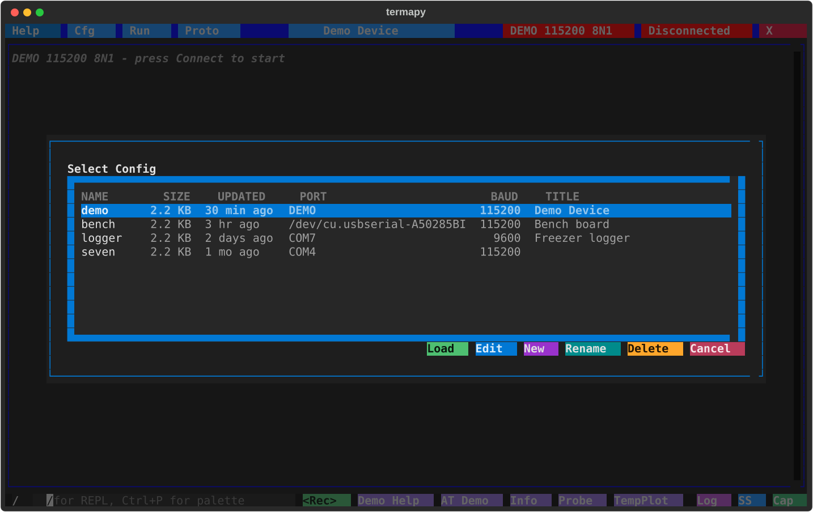
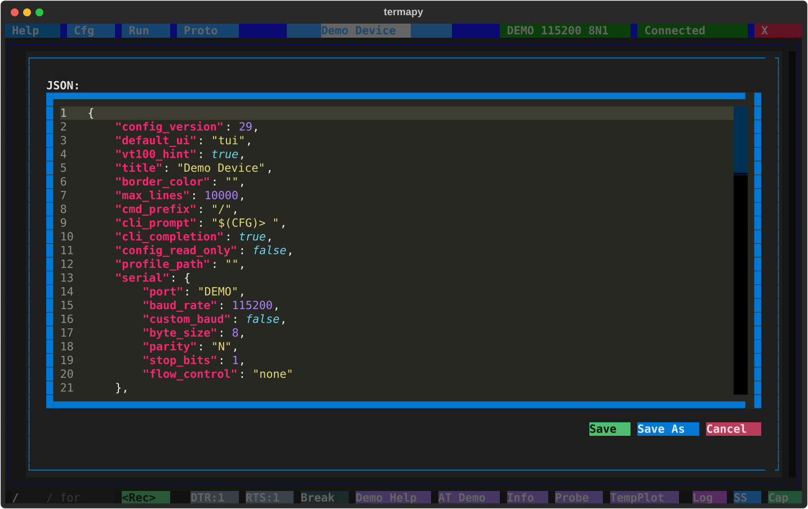

# Configuration


## Config directory

Termapy looks for configs in the first directory that matches:

| Priority | Source | Behavior |
| --- | --- | --- |
| 1 | `--cfg-dir <path>` | CLI flag -- must exist |
| 2 | `TERMAPY_CFG_DIR` env var | Must exist |
| 3 | `./termapy_cfg` in current directory | Used if present, never auto-created |
| 4 | OS default | Auto-created on first run |

The OS default location is `%APPDATA%\termapy` on Windows,
`~/Library/Application Support/termapy` on macOS, and
`~/.config/termapy` on Linux (respects `XDG_CONFIG_HOME`).

## Creating a new config

When you create a new config (first run, or **Cfg → New**), termapy shows
a quick-setup dialog where you pick a name, a serial port, and a baud
rate.  Hit **Connect** to save and connect, or **Advanced** to drop into
the full JSON editor for fine-grained control.


## JSON config file

Each configuration is stored as a JSON file at `<config_dir>/<name>/<name>.cfg`.
On first run, `termapy` creates a default config for you. You can edit it
from within the app by clicking the center title bar button or using `/cfg`.

Here is an example config for a device called `iot_device`:

<!-- validate-config-keys -->
```json
{
    "config_version": 29,
    "title": "IoT Device",
    "border_color": "blue",
    "max_lines": 10000,
    "default_ui": "tui",
    "vt100_hint": true,
    "cmd_prefix": "/",
    "cli_prompt": "$(CFG)> ",
    "cli_completion": true,
    "config_read_only": false,
    "profile_path": "",
    "validate_typed_args": false,
    "serial": {
        "port": "COM4",
        "baud_rate": 115200,
        "custom_baud": false,
        "byte_size": 8,
        "parity": "N",
        "stop_bits": 1,
        "flow_control": "none"
    },
    "encoding": "utf-8",
    "cmd_delay_ms": 0,
    "protocol": "text",
    "ndjson_field_routing": {
        "response_id": "id",
        "error_field": "error",
        "event_field": "event"
    },
    "default_response_timeout_ms": 1000,
    "auto_connect": true,
    "auto_reconnect": true,
    "on_connect_cmd": "status\nhelp",
    "tui_on_connect_cmd": "",
    "cli_on_connect_cmd": "",
    "mcp_on_connect_cmd": "",
    "eol": "\r",
    "eol_rx": "auto",
    "send_bare_enter": false,
    "echo": false,
    "echo_fmt": "[purple]$(CFG)> {cmd}[/]",
    "log_file": "",
    "show_traceback": false,
    "proto_frame_gap_ms": 50,
    "proto_results_template": "{name}_results.json",
    "timestamps": false,
    "eol_markers": false,
    "line_no": false,
    "hex": false,
    "request_mode": false,
    "request_err_pattern": "(?i)^(ERROR|ERR|FAULT)\\b",
    "strip_device_echo": false,
    "max_grep_lines": 100,
    "file_xfer_root": "",
    "cfg_enabled": true,
    "run_enabled": true,
    "proto_enabled": true,
    "record_enabled": true,
    "custom_buttons": [
        {
            "enabled": true,
            "name": "Reset",
            "command": "ATZ",
            "tooltip": "Reset device"
        },
        {
            "enabled": true,
            "name": "Init",
            "command": "ATZ\\nAT+BAUD=115200",
            "tooltip": "Reset and set baud"
        }
    ]
}
```

This file would be saved at `termapy_cfg/iot_device/iot_device.cfg`.

## Config field reference

<!-- config-reference:start (Field + Default columns and alignment are synced from DEFAULT_CFG by scripts/update_doc_configs.py; edit only the Description column) -->
| Field                         | Default                       | Description |
| ----------------------------- | ----------------------------- | --- |
| `serial.port`                 | `""`                          | Port spec. Accepts a literal device (`"COM4"`, `"/dev/ttyUSB0"`), a USB serial number (`"A1B2C3D4"`), a `\|`-separated fallback chain (`"A1B2C3D4\|COM3"`), a reserved name (`"DEMO"`), or a pyserial URL (`"rfc2217://host:2217"`). See [ports.md](ports.md) for the grammar. Auto-detected when only one port is connected. |
| `serial.baud_rate`            | `115200`                      | Serial baud rate -- non-standard rates require `custom_baud` |
| `serial.custom_baud`          | `false`                       | Allow non-standard baud rates (>= 300). Modern drivers support arbitrary rates |
| `serial.byte_size`            | `8`                           | Data bits per byte (5, 6, 7, or 8) |
| `serial.parity`               | `N`                           | Parity: None, Even, Odd, Mark, or Space |
| `serial.stop_bits`            | `1`                           | Stop bits (1, 1.5, or 2) |
| `serial.flow_control`         | `none`                        | `none`, `rtscts`, `xonxoff`, or `manual` (shows DTR/RTS/Break buttons) |
| `encoding`                    | `utf-8`                       | Character encoding (utf-8, latin-1, ascii, cp437) |
| `cmd_delay_ms`                | `0`                           | Milliseconds between commands in autoconnect and multi-command input |
| `protocol`                    | `text`                        | Wire format the device speaks: `"text"` (line-oriented) or `"ndjson"` (one JSON per line) |
| `ndjson_field_routing`        | `{...}`                       | NDJSON: which JSON fields the MCP bridge routes on (response_id/error_field/event_field) |
| `default_response_timeout_ms` | `1000`                        | Fallback wait (ms) for a profile command lacking its own `response.timeout_ms` |
| `eol`                         | `\r`                          | Appended to each sent command: `\r`, `\r\n`, or `\n` |
| `eol_rx`                      | `auto`                        | Receive newline: split output into lines. `auto`/`cr`/`lf`/`crlf` (set: /term.eol.rx) |
| `send_bare_enter`             | `false`                       | Send line ending on empty Enter (for "press enter to continue" prompts) |
| `auto_connect`                | `false`                       | Connect automatically when the app starts |
| `auto_reconnect`              | `false`                       | Retry connection every 2.5s if the port drops or fails to open |
| `on_connect_cmd`              | `""`                          | Commands to send after connecting (all frontends), separated by `\n` |
| `tui_on_connect_cmd`          | `""`                          | Extra commands to send after connecting in TUI mode (after `on_connect_cmd`) |
| `cli_on_connect_cmd`          | `""`                          | Extra commands to send after connecting in CLI mode (after `on_connect_cmd`) |
| `mcp_on_connect_cmd`          | `""`                          | Extra commands to send after connecting in MCP mode. Common: `echo off` / `color off` to silence device at the source (MCP already strips ANSI; `/term.color on` re-enables) |
| `profile_path`                | `""`                          | Explicit v2 device profile.  MCP-only: `--mcp` loads it on connect.  Empty = convention |
| `echo`                        | `false`                       | Echo device commands sent to the wire (bare + `/term.send`). Runtime: `/term.echo {on\|off\|toggle}` |
| `echo_fmt`                    | `[purple]$(CFG)> {cmd}[/]`    | Rich markup format for echoed commands |
| `log_file`                    | `""`                          | Session log path (defaults to `<name>.log` in config subfolder) |
| `timestamps`                  | `false`                       | Prefix lines with `[HH:MM:SS.mmm]` |
| `eol_markers`                 | `false`                       | Show dim `\r` `\n` markers in serial output for debugging |
| `line_no`                     | `false`                       | Show line numbers in serial output |
| `hex`                         | `false`                       | Display serial I/O as hex bytes instead of text |
| `request_mode`                | `false`                       | Turn bare device commands into synchronous request/response (see `/term.request`) |
| `request_err_pattern`         | `(?i)^(ERROR\|ERR\|FAULT)\\b` | Regex detecting device-side errors in `request_mode` responses. Empty disables. Override per-session via `/term.request on err=<regex>` |
| `strip_device_echo`           | `false`                       | Drop a half-duplex device's echoed command from `request_mode` responses (opt in per device) |
| `validate_typed_args`         | `false`                       | Opt-in: validate bare-command `typed_args` against the active profile's type registry. Off = raw access; on = mirrors MCP (bad values fail before the wire). |
| `max_grep_lines`              | `100`                         | Maximum lines shown by `/grep` |
| `file_xfer_root`              | `""`                          | Root directory for file transfer (empty = `cap/`). See [File Transfer](file-transfer.md). |
| `proto_frame_gap_ms`          | `50`                          | Silence gap (ms) to detect end of a binary frame |
| `proto_results_template`      | `{name}_results.json`         | Filename template for protocol test JSON results |
| `title`                       | `""`                          | Title bar text (defaults to config filename) |
| `border_color`                | `""`                          | Title bar color (CSS name or hex like `#ff6600`) |
| `max_lines`                   | `10000`                       | Scrollback buffer size |
| `default_ui`                  | `tui`                         | Default UI mode: `tui`, `cli`, or `vt100` |
| `vt100_hint`                  | `true`                        | Show a VS Code key-capture tip in `--vt100` mode (set `false` to hide) |
| `cmd_prefix`                  | `/`                           | Prefix for local REPL commands |
| `cli_prompt`                  | `$(CFG)> `                    | Prompt string in CLI mode (supports variables) |
| `cli_completion`              | `true`                        | Enable CLI tab completion, auto-suggest, and help toolbar |
| `config_read_only`            | `false`                       | Disable Edit button in pickers (`/cfg` still changes in-memory values) |
| `cfg_enabled`                 | `true`                        | Show the Cfg button in the title bar |
| `run_enabled`                 | `true`                        | Show the Run button in the title bar |
| `proto_enabled`               | `true`                        | Show the Proto button in the title bar |
| `record_enabled`              | `true`                        | Show the Record button next to the REPL prompt (toggles `/run.record`) |
| `show_traceback`              | `false`                       | Show full stack trace on serial errors |
| `custom_buttons`              | `[]`                          | Custom button objects (see [Custom Buttons](custom-buttons.md)) |
<!-- config-reference:end -->

## Connection behavior

`auto_connect` and `auto_reconnect` are independent settings.
`auto_connect` opens the port when a config loads (app startup or config
switch). `auto_reconnect` retries the connection when the port drops or
a manual connect attempt fails -- it does not control startup behavior.
While reconnecting, the title bar turns amber and shows a spinner.

## Config management

Click the **Cfg** button in the title bar, click the config name, or use the
command palette to open the config picker. Configs are listed newest
first with size, last-updated age, port, baud, and title.



The picker's actions:

- **New:** create a new config from defaults. If one serial port is detected it is used automatically; if multiple ports are found a picker is shown before opening the editor.
- **Edit:** open the highlighted config in the JSON editor
- **Load:** switch to the highlighted config. If the configured port is not available, a port picker is shown.
- **Rename:** rename the highlighted config. The `termapy_cfg/<name>/` folder and the `<name>.cfg` inside it move together (with the command history); renaming the active config reloads it.
- **Delete:** delete the highlighted config file (asks for confirmation)
- **Cancel:** close the picker

The JSON editor provides:

- **Save:** write changes to the current config file
- **Save As:** save as a new config (creates a new subfolder)
- **Cancel:** discard changes



Invalid JSON is caught before saving, with the error shown inline.

---
