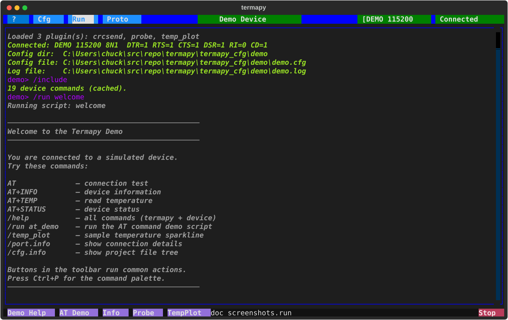
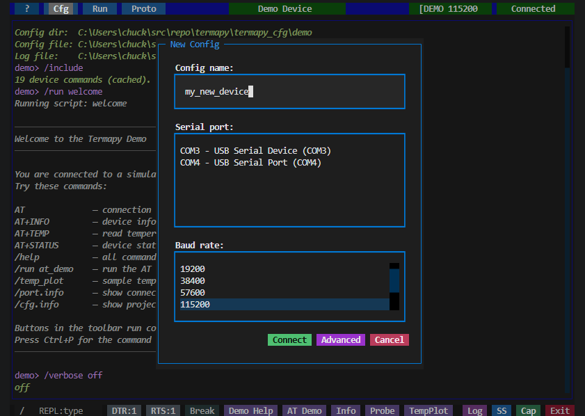

# Configuration



## Config directory

Termapy looks for configs in the first directory that matches:

| Priority | Source | Behavior |
| --- | --- | --- |
| 1 | `--cfg-dir <path>` | CLI flag -- must exist |
| 2 | `TERMAPY_CFG_DIR` env var | Must exist |
| 3 | `./termapy_cfg` in current directory | Used if present, never auto-created |
| 4 | OS default | Auto-created on first run |

The OS default location is `%APPDATA%\termapy` on Windows,
`~/Library/Application Support/termapy` on macOS, and
`~/.config/termapy` on Linux (respects `XDG_CONFIG_HOME`).

## Creating a new config

When you create a new config (first run, or **Cfg → New**), termapy shows
a quick-setup dialog where you pick a name, a serial port, and a baud
rate.  Hit **Connect** to save and connect, or **Advanced** to drop into
the full JSON editor for fine-grained control.



## JSON config file

Each configuration is stored as a JSON file at `<config_dir>/<name>/<name>.cfg`.
On first run, `termapy` creates a default config for you. You can edit it
from within the app by clicking the center title bar button or using `/cfg`.

Here is an example config for a device called `iot_device`:

<!-- validate-config-keys -->
```json
{
    "config_version": 16,
    "title": "IoT Device",
    "border_color": "blue",
    "max_lines": 10000,
    "default_ui": "tui",
    "cmd_prefix": "/",
    "cli_prompt": "$(CFG)> ",
    "cli_echo_input": false,
    "cli_completion": true,
    "config_read_only": false,
    "os_cmd_enabled": false,
    "device_json_cmd": "",
    "auto_include_on_connect": true,
    "profile_path": "",
    "validate_typed_args": false,
    "port": "COM4",
    "baud_rate": 115200,
    "custom_baud": false,
    "byte_size": 8,
    "parity": "N",
    "stop_bits": 1,
    "flow_control": "none",
    "encoding": "utf-8",
    "cmd_delay_ms": 0,
    "auto_connect": true,
    "auto_reconnect": true,
    "on_connect_cmd": "status\nhelp",
    "tui_on_connect_cmd": "",
    "cli_on_connect_cmd": "",
    "mcp_on_connect_cmd": "",
    "line_ending": "\r",
    "send_bare_enter": false,
    "echo_input": true,
    "echo_input_fmt": "[purple]$(CFG)> {cmd}[/]",
    "log_file": "",
    "show_traceback": false,
    "proto_frame_gap_ms": 50,
    "proto_results_template": "{name}_results.json",
    "show_timestamps": false,
    "show_line_endings": false,
    "show_line_numbers": false,
    "hex_mode": false,
    "request_mode": false,
    "request_err_pattern": "(?i)^(ERROR|ERR|FAULT)\\b",
    "max_grep_lines": 100,
    "file_xfer_root": "",
    "cfg_enabled": true,
    "run_enabled": true,
    "proto_enabled": true,
    "custom_buttons": [
        {
            "enabled": true,
            "name": "Reset",
            "command": "ATZ",
            "tooltip": "Reset device"
        },
        {
            "enabled": true,
            "name": "Init",
            "command": "ATZ\\nAT+BAUD=115200",
            "tooltip": "Reset and set baud"
        }
    ]
}
```

This file would be saved at `termapy_cfg/iot_device/iot_device.cfg`.

## Config field reference

| Field                    | Default               | Description                                                                                 |
| ------------------------ | --------------------- | ------------------------------------------------------------------------------------------- |
| `port`                   | `""`                  | Port spec. Accepts a literal device (`"COM4"`, `"/dev/ttyUSB0"`), a USB serial number (`"A1B2C3D4"`), a `\|`-separated fallback chain (`"A1B2C3D4\|COM3"`), a reserved name (`"DEMO"`), or a pyserial URL (`"rfc2217://host:2217"`). See [ports.md](ports.md) for the grammar. Auto-detected when only one port is connected. |
| `baud_rate`              | `115200`              | Serial baud rate -- non-standard rates require `custom_baud`                                |
| `custom_baud`            | `false`               | Allow non-standard baud rates (>= 300). Modern drivers support arbitrary rates              |
| `byte_size`              | `8`                   | Data bits per byte (5, 6, 7, or 8)                                                          |
| `parity`                 | `N`                   | Parity: None, Even, Odd, Mark, or Space                                                     |
| `stop_bits`              | `1`                   | Stop bits (1, 1.5, or 2)                                                                    |
| `flow_control`           | `none`                | `none`, `rtscts`, `xonxoff`, or `manual` (shows DTR/RTS/Break buttons)                      |
| `encoding`               | `utf-8`               | Character encoding (utf-8, latin-1, ascii, cp437)                                           |
| `cmd_delay_ms`           | `0`                   | Milliseconds between commands in autoconnect and multi-command input                        |
| `line_ending`            | `\r`                  | Appended to each sent command: `\r`, `\r\n`, or `\n`                                        |
| `send_bare_enter`        | `false`               | Send line ending on empty Enter (for "press enter to continue" prompts)                     |
| `auto_connect`           | `false`               | Connect automatically when the app starts                                                   |
| `auto_reconnect`         | `false`               | Retry connection every 2.5s if the port drops or fails to open                              |
| `on_connect_cmd`         | ` `                   | Commands to send after connecting (all frontends), separated by `\n`                        |
| `tui_on_connect_cmd`     | ` `                   | Extra commands to send after connecting in TUI mode (after `on_connect_cmd`)                |
| `cli_on_connect_cmd`     | ` `                   | Extra commands to send after connecting in CLI mode (after `on_connect_cmd`)                |
| `mcp_on_connect_cmd`     | ` `                   | Extra commands to send after connecting in MCP mode. Common: `echo off` to silence device   |
| `auto_include_on_connect`| `true`                | If `device_json_cmd` is set, auto-run `/include` after a successful connect (MCP mode)      |
| `profile_path`           | ` `                   | Explicit v2 device profile.  MCP-only: `--mcp` loads it on connect.  Empty = convention     |
| `echo_input`             | `false`               | Show sent commands in the terminal output                                                   |
| `echo_input_fmt`         | `[purple]> {cmd}[/]`  | Rich markup format for echoed commands                                                      |
| `log_file`               | ` `                   | Session log path (defaults to `<name>.log` in config subfolder)                             |
| `show_timestamps`        | `false`               | Prefix lines with `[HH:MM:SS.mmm]`                                                          |
| `show_line_endings`      | `false`               | Show dim `\r` `\n` markers in serial output for debugging                                   |
| `show_line_numbers`      | `false`               | Show line numbers in serial output                                                          |
| `hex_mode`               | `false`               | Display serial I/O as hex bytes instead of text                                             |
| `request_mode`           | `false`               | Turn bare device commands into synchronous request/response (see `/term.request`)           |
| `request_err_pattern`    | `(?i)^(ERROR\|ERR\|FAULT)\b` | Regex detecting device-side errors in `request_mode` responses. Empty disables. Override per-session via `/term.request on err=<regex>` |
| `max_grep_lines`         | `100`                 | Maximum lines shown by `/grep`                                                              |
| `file_xfer_root`         | ` `                   | Root directory for file transfer (empty = `cap/`). See [File Transfer](file-transfer.md).   |
| `proto_frame_gap_ms`     | `50`                  | Silence gap (ms) to detect end of a binary frame                                            |
| `proto_results_template` | `{name}_results.json` | Filename template for protocol test JSON results                                            |
| `title`                  | ` `                   | Title bar text (defaults to config filename)                                                |
| `border_color`           | ` `                   | Title bar color (CSS name or hex like `#ff6600`)                                            |
| `max_lines`              | `10000`               | Scrollback buffer size                                                                      |
| `default_ui`             | `tui`                 | Default UI mode: `tui` or `cli`                                                             |
| `cmd_prefix`             | `/`                   | Prefix for local REPL commands                                                              |
| `cli_prompt`             | `$(CFG)>`             | Prompt string in CLI mode (supports variables)                                              |
| `cli_echo_input`         | `false`               | Echo sent commands in CLI mode                                                              |
| `cli_completion`         | `true`                | Enable CLI tab completion, auto-suggest, and help toolbar                                   |
| `config_read_only`       | `false`               | Disable Edit button in pickers (`/cfg` still changes in-memory values)                      |
| `os_cmd_enabled`         | `false`               | Allow `/os` to run shell commands                                                           |
| `cfg_enabled`            | `true`                | Show the Cfg button in the title bar                                                        |
| `run_enabled`            | `true`                | Show the Run button in the title bar                                                        |
| `proto_enabled`          | `true`                | Show the Proto button in the title bar                                                      |
| `show_traceback`         | `false`               | Show full stack trace on serial errors                                                      |
| `custom_buttons`         | `[]`                  | Custom button objects (see [Custom Buttons](custom-buttons.md))                             |

## Connection behavior

`auto_connect` and `auto_reconnect` are independent settings.
`auto_connect` opens the port when a config loads (app startup or config
switch). `auto_reconnect` retries the connection when the port drops or
a manual connect attempt fails -- it does not control startup behavior.
While reconnecting, the title bar turns amber and shows a spinner.

## Config management

Click the **Cfg** button in the title bar, click the config name, or use the
command palette to open the config picker. The picker has four actions:

- **New:** create a new config from defaults. If one serial port is detected it is used automatically; if multiple ports are found a picker is shown before opening the editor.
- **Edit:** open the highlighted config in the JSON editor
- **Load:** switch to the highlighted config. If the configured port is not available, a port picker is shown.
- **Cancel:** close the picker

The JSON editor provides:

- **Save:** write changes to the current config file
- **Save As:** save as a new config (creates a new subfolder)
- **Cancel:** discard changes

Invalid JSON is caught before saving, with the error shown inline.

---
