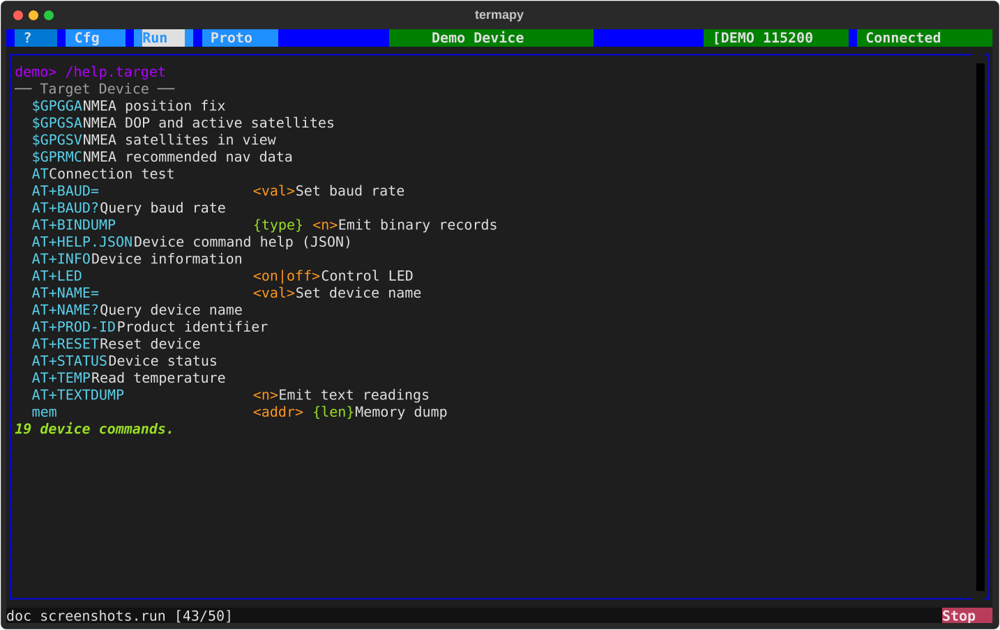

# Device help integration

If your target device can return a JSON description of its commands,
termapy will include them and make them available in autocomplete
and `/help` -- so the device feels integrated into the terminal.

## How it works

1. You add a command to your firmware that returns a JSON object
2. You set `device_json_cmd` in your termapy config to the command name
3. On connect, termapy sends the command, parses the JSON, and
   registers the device commands for suggestions and help

The included commands are not REPL commands -- you type them as
normal device commands. They just get autocomplete and show up in
`/help` under the **Target Device** section.

This also means your device doesn't need its own help command or
help display logic. The JSON response is a lightweight data dump --
termapy handles the formatting, searching, and display. One small
JSON handler replaces a full help system on the device side.

## JSON format

Your device command must return a JSON object with a `commands` key:

```json
{"commands": {"AT+INFO": {"help": "Device information", "args": ""}, "AT+LED": {"help": "Control LED", "args": "<on|off>"}}}
```

Each command entry has:

- `help` (required) -- one-line description
- `args` (optional) -- argument spec, defaults to empty
- `long_help` (optional) -- multi-line prose shown in the DESCRIPTION
  section of `/help <command>`. Plain text, no markup.
- `flags` (optional) -- flag map, same shape as a plugin's `Command.flags`.
  Keys are canonical flag names (e.g. `--table`) with a description
  string value, or aliases (key = alias, value = canonical flag name).

A richer entry looks like this:

```json
{
    "AT+LED": {
        "help": "Control LED",
        "args": "<on|off> {--blink}",
        "long_help": "Drive the on-board status LED.\n\nExamples:\n  AT+LED on          - solid on\n  AT+LED on --blink  - blink at 2 Hz",
        "flags": {
            "--blink": "Blink at 2 Hz instead of solid on.",
            "-b": "--blink"
        }
    }
}
```

`/help AT+LED` then renders NAME, SYNOPSIS, DESCRIPTION, and FLAGS in
the same layout as a built-in plugin. `/search` also indexes these
fields, so `/search blink` finds the device command by its flag
description.

Only `help` is required -- entries with just `help` + `args` still
work and render a short one-line form, so existing firmware that
ships an older schema isn't affected.

The JSON can be a single line or pretty-printed. Termapy scans the
response for the first `{` and parses from there, so preamble text
(echo, status messages) before the JSON is fine.

## Schema versioning

The top-level JSON may optionally carry a `version` string.  This is
the **device's** schema version -- not termapy's -- so firmware can
signal when the command set changes and termapy should refresh its
cache.  Any string works (semver, date, build hash).

```json
{
    "version": "1.4.0",
    "commands": { "...": {} }
}
```

On every include from the device, termapy compares the fetched
`version` to the cached one:

- **Strictly newer** (PEP 440 compare, or string inequality for
  unparseable values) -> overwrite the cache.
- **Equal, older, or missing on the new side** -> keep the cache.
- **No cache on disk** -> always use the fetch (first-time case).

`/include.reload` bypasses the gate and always overwrites, so users
who want to force a refresh still have a lever.  The version is
preserved through `/include.dump` so a dumped JSON is a valid
drop-in for another device.

## Config

Set `device_json_cmd` in your `.cfg` file:

```json
{
    "device_json_cmd": "AT+HELP.JSON",
    "port": "$(env.MAIN_PORT|COM4)"
}
```

When this is set, `/include` runs automatically on connect. The
result is cached to `.target_menu.json` in your config folder so
subsequent connects load instantly without querying the device.

## Commands

| Command             | Description                                     |
| ------------------- | ----------------------------------------------- |
| `/include`          | Include from cache or device (auto on connect)  |
| `/include.reload`   | Force re-include from device, update cache      |
| `/include.list`     | List included commands                          |
| `/include.dump`     | Pretty-print the included JSON                  |
| `/include.clear`    | Remove included commands and delete cache       |
| `/help.target`      | Show only the target device commands            |

## Implementing on your device

The simplest implementation: add a command that prints a JSON string
to the serial port. For an AT command set, something like:

```c
if (strcmp(cmd, "AT+HELP.JSON") == 0) {
    printf("{\"commands\":{");
    printf("\"AT+INFO\":{\"help\":\"Device info\",\"args\":\"\"},");
    printf("\"AT+TEMP\":{\"help\":\"Read temperature\",\"args\":\"\"},");
    printf("\"AT+LED\":{\"help\":\"Control LED\",\"args\":\"<on|off>\"}");
    printf("}}\r\n");
}
```

Or build it from your command table at runtime so it stays in sync.

The JSON format has a top-level `commands` key to allow future
expansion (device options, protocol settings, etc.) without breaking
existing implementations.

## Demo



The demo device includes `AT+HELP.JSON`. Run the demo and type
`/help.target` to see it in action, or `/include.dump` to see the
raw JSON.

---
