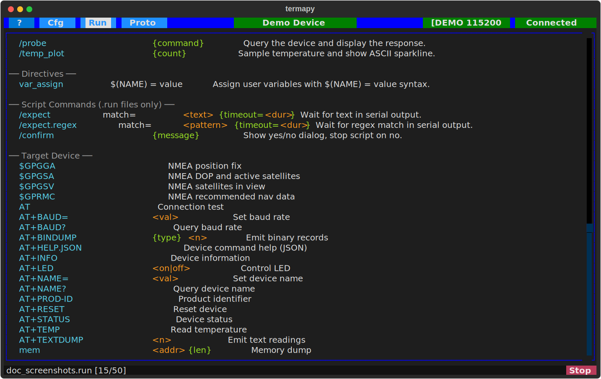

# Getting Started

This guide covers connecting to your own serial device. If you haven't
tried the demo yet, start with [Installation](installation.md).

## Quick Setup


On first run or when clicking **New** in the config picker, the Quick Setup
dialog lets you pick a port, baud rate, and config name in one step.
Click **Connect** to start immediately, or **Advanced** to open the full
JSON config editor with your choices pre-filled.

## Launching with a config

```text
termapy                          # auto-detect config
termapy my_device                # find termapy_cfg/my_device/my_device.cfg
termapy my_device.cfg            # load a specific config file
termapy termapy_cfg/my_device    # load config from a folder
termapy --cfg-dir /path/to/cfgs  # use a custom config directory
termapy --check my_device.cfg    # validate config (no UI)
termapy --cli my_device          # plain-text CLI mode
termapy --cli smoke_test.run     # run a .run script in CLI mode
```

**Config resolution** — termapy finds your config automatically. Pass a bare
name like `my_device` and it looks in `termapy_cfg/my_device/my_device.cfg`.
Pass a folder and it looks for `<foldername>.cfg` inside. Pass a `.cfg` file
directly and it uses that.

**Script files** — passing a `.run` or `.pro` file infers the config from
the file's location (walks up the directory tree to find a `.cfg` file).
In CLI mode, `.run` files are executed automatically. In TUI mode, the
config loads and you can run the script manually.

**--cfg-dir** — override the config directory location. See
[Configuration](config.md) for the full config directory precedence chain.

**--check** — validate a config file and print JSON results to stdout
without launching the UI. Checks baud rate, parity, data bits, stop bits,
flow control, encoding, and flags unknown keys. Read-only — never modifies
the file.

**No arguments** — termapy looks for config files:

- If one config exists, it loads automatically.
- If multiple configs exist, a picker dialog appears.
- If no configs exist, the Quick Setup dialog appears.

## User Interface Modes

Termapy has two interface modes that you can switch between at any time:

**TUI mode** (default) — a full-screen terminal UI built with Textual.
Includes a title bar, toolbar buttons, scrollable output, command input
with ghost-text suggestions, and modal dialogs for config, port selection,
scripts, and more.

**CLI mode** — a plain-text terminal with no UI framework. Reads from
stdin and writes to stdout. Useful for headless environments, SSH sessions,
piping output, or when you prefer a minimal interface. Start with
`termapy --cli` or set `"default_ui": "cli"` in your config.

### Switching modes

Use the `/tui` and `/cli` REPL commands to switch modes during a session.
The serial connection and config carry over — only the interface changes.

You can also set the default mode in your config:

```json
"default_ui": "tui"
```

Set to `"cli"` to always start in CLI mode without the `--cli` flag.

## Folder Layout

All data for each config (logs, screenshots, scripts, command history,
plugins) is stored alongside its JSON file in a subfolder:

```text
termapy_cfg/
├── iot_device/
│   ├── iot_device.cfg         # config file
│   ├── iot_device.log         # session log
│   ├── .cmd_history.txt       # command history
│   ├── ss/                    # screenshots
│   ├── run/                   # script files
│   ├── proto/                 # protocol test scripts (.pro)
│   ├── cap/                   # data capture output files
│   ├── viz/                   # per-config packet visualizers
│   └── plugin/                # per-config plugins
└── plugin/                    # global plugins (all configs)
```

## Title Bar

The title bar buttons (left to right):

- **?** — opens this help guide.
- **Cfg** — opens the config picker (New / Edit / Load / Cancel).
- **Run** — opens the script picker.
- **Proto** — opens the protocol test picker.
- **Title** — shows the config name (or custom title). Click to edit the config.
- **Port** — shows the port name and baud rate. Click to pick a different serial port.
- **Status** — shows connection status: green **Connected** or red **Disconnected**. Click to toggle the connection.

The title bar color can be set per config with `border_color` to visually distinguish multiple sessions.

## Terminal Output

The main area displays serial data with full ANSI color support. Incoming escape sequences are rendered as colored text, and clear-screen sequences are handled automatically.

The scrollback buffer holds up to `max_lines` lines (default 10,000).

**Clickable paths** — file paths shown in the output (config files, log files,
screenshots, captures) are clickable in terminals that support hyperlinks
(Windows Terminal, iTerm2, VS Code terminal, most modern terminals). Click a
path to open it in your default application.

## Command Input



The bottom bar contains a text input for sending commands to the serial device.

- Type a command and press **Enter** to send it over serial.
- **Up/Down** arrows cycle through previous commands (last 30 are kept per config).
- **Escape** clears the input and exits history browsing.
- As you type, ghost-text suggestions appear from REPL commands and device history — press **Right** to accept.
- Prefix a command with `/` to run a local REPL command instead of sending it to the device.

Type `/help` to see all available REPL commands.

---
