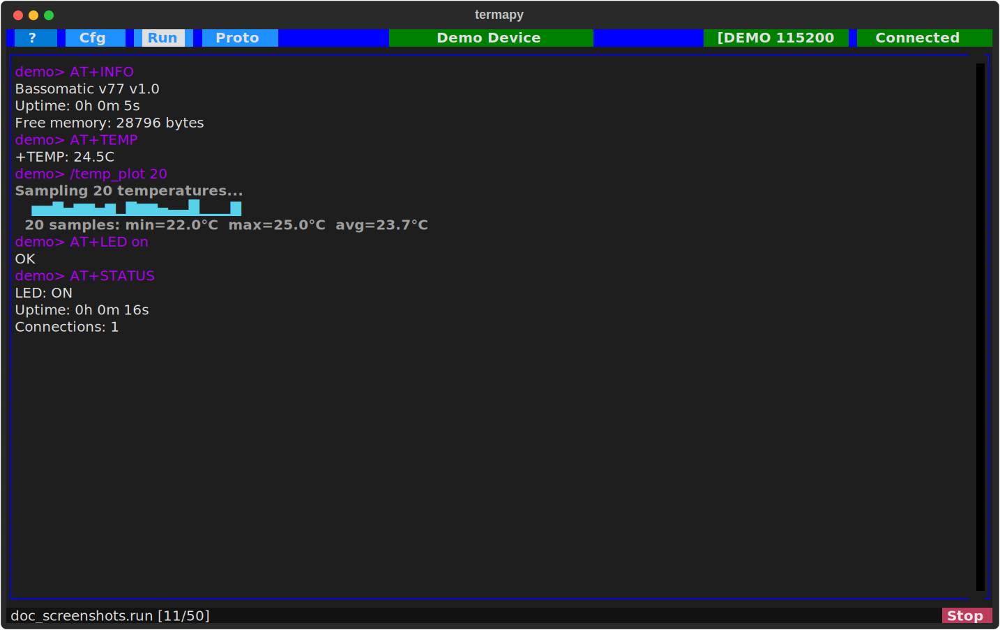
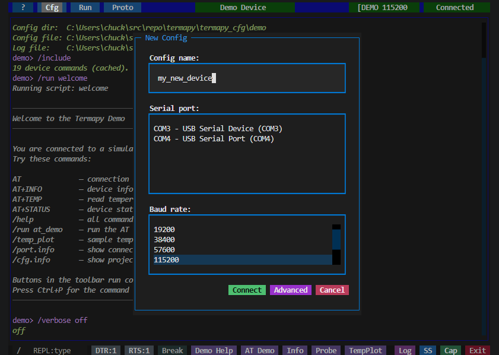

# Installation

## Install

```sh
pip install termapy
```

Or with [uv](https://docs.astral.sh/uv/):

```sh
uv tool install termapy
```

## Run the demo

No hardware needed:

```sh
termapy --demo
```



Type commands. The device responds. That's it.

Try `AT+INFO`, `AT+TEMP`, or `/help`. Hover over any button for a tooltip.
Click **?** for the full help guide.

## Connect your device

Click **Cfg** in the toolbar, then **New**. Pick your port and baud rate.
Click **Connect**.



You're connected. Type commands and see responses.

## When you need more

- [Getting Started](getting-started.md) — config files, CLI mode, folder layout
- [Demo Mode](demo.md) — all demo device commands
- [Serial Tools](serial-tools.md) — hex send, CRC, protocol testing
- [Scripting](scripting.md) — automate command sequences
- [Writing Plugins](writing-plugins.md) — extend with Python

## Web mode (experimental)

Serve the TUI in a web browser using textual-serve:

```sh
termapy --web --demo
```

Opens on `http://localhost:8000`. Use `--web-port` to change the port.

Limitations: `/tui` and `/cli` mode switching are not available.
`/help.open` may not work in the browser.

## Uninstall

```sh
uv tool uninstall termapy
```
