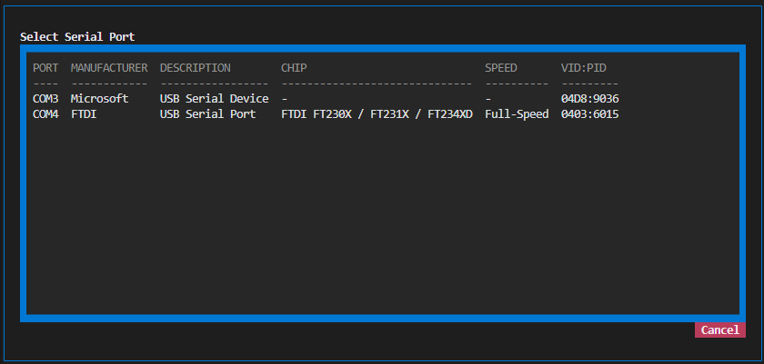
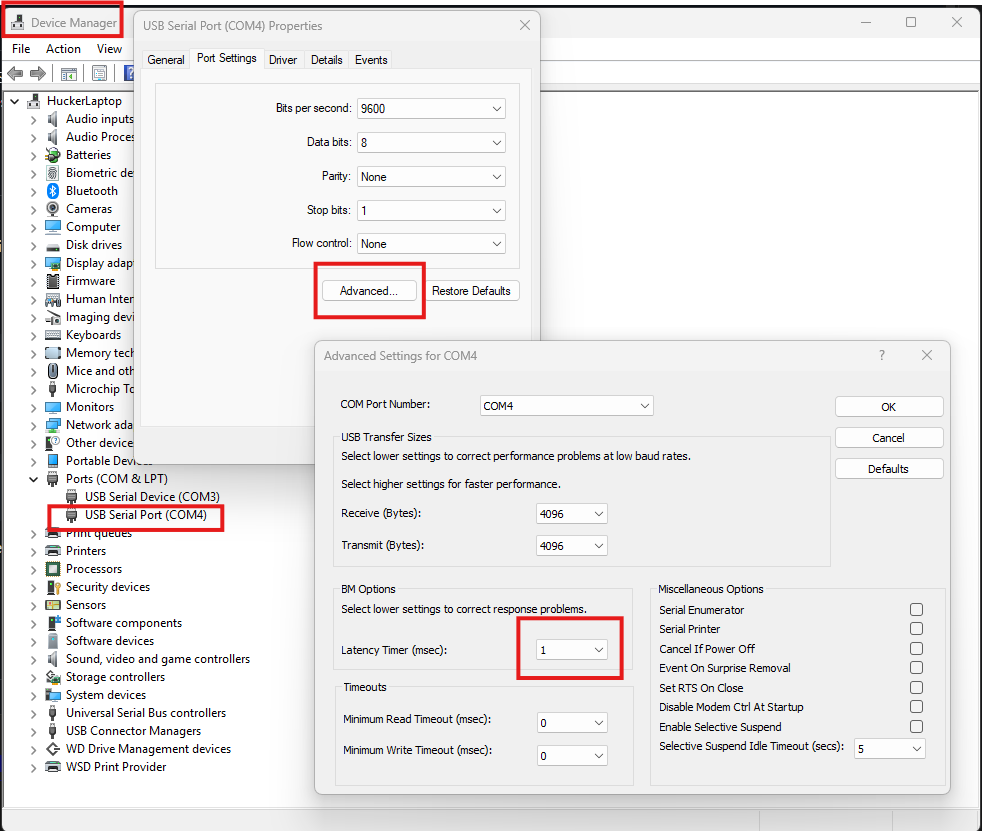

# Serial ports

**Most of the time, connecting to a serial device takes about 10 seconds
of thinking:**

1. Plug in the cable.
2. Click the port name in the title bar (top-right), pick your port from
   the list. It's usually obvious which one is yours: your FTDI cable
   says `FTDI`, your Arduino says `Arduino`.
3. If your device needs something other than **115200 8N1 no-flow-control**,
   click **Cfg** and change it. Most modern devices don't.
4. Click **Connect**.

That's it. You're talking to your device. The rest of this page is for
the times something weird happens: a cable that doesn't work, a
latency problem, a chip you don't recognize, a "permission denied"
error. Skim the rest so you know it's here, then come back when you're
stuck.



## When you hit a wall

The port picker, `/port.info`, `/port.chip`, and `termapy --info` all
surface the same underlying data: what USB chip is in the cable, what
USB speed class it runs at, who made it, and what its raw USB identifier
is.  Use whichever entry point is convenient:

| Where           | Command                    | What you get                                  |
| --------------- | -------------------------- | --------------------------------------------- |
| Title bar click | (no command)               | Port picker dialog with a table of every port |
| Inside termapy  | `/port.info`               | Full details for the currently-connected port |
| Inside termapy  | `/port.chip <name>` or `*` | Chip details for any named port, or all ports |
| Inside termapy  | `/port.chip.<field>`       | One field (e.g. `/port.chip.driver COM4`)     |
| Shell           | `termapy --info`           | Same as `/port.chip *`, no TUI, pipe-friendly |
| Shell           | `termapy --info=COM4`      | Same as `/port.chip COM4`, no TUI             |

## When you have multiple cables and don't know which is which

Open the port picker (click the port name in the title bar) or run
`/port.chip *`.  The list shows manufacturer, description, chip model,
USB speed class, and VID:PID for every connected port.  The manufacturer
column is usually enough to disambiguate: `FTDI` for FTDI cables,
`Microsoft` for a generic Microsoft CDC device, `Teensy` for a Teensy,
and so on.

## When your serial link feels laggy (Linux + FTDI)

FTDI chips buffer incoming bytes for up to **16 ms** before pushing them
upstream, because of a chip-level policy called the *latency timer*.
The default value is 16 ms; the effective range is 1-255 ms.  For
interactive terminal use this is usually fine.  For anything measuring
reaction time, round-trip latency, or real-time control, it's the
single biggest thing you can fix.

On Linux, read and set it via sysfs:

```sh
cat /sys/bus/usb-serial/devices/ttyUSB0/latency_timer      # read
echo 1 | sudo tee /sys/bus/usb-serial/devices/ttyUSB0/latency_timer  # set to 1 ms
```

To make it permanent across plug-unplug cycles, add a udev rule:

```
# /etc/udev/rules.d/99-ftdi-latency.rules
ACTION=="add", SUBSYSTEM=="usb-serial", DRIVERS=="ftdi_sio", ATTR{latency_timer}="1"
```

On Windows: Device Manager → Ports (COM & LPT) → right-click the FTDI
device → Properties → Port Settings → Advanced → set "Latency Timer
(msec)" to 1.  The change is persistent across reboots.



`/port.chip.latency_timer` shows the current value on Linux (Windows
doesn't expose it via the same path).

## When you're evaluating whether to buy a faster cable

USB-serial chips come in two speed classes:

- **USB Full-Speed** (12 Mbit/s) has a 1 ms minimum USB transaction
  floor. Most cheap cables: FTDI FT232R, FT230X, Silicon Labs CP2102,
  WCH CH340, Prolific PL2303.  Fine for terminal use, max practical
  baud rate around 3 Mbaud.
- **USB High-Speed** (480 Mbit/s) has a 125 µs minimum USB transaction
  floor, 8x faster.  Specifically the FTDI "H" series: FT232H, FT2232H,
  FT4232H, FT4232HP.  Fine for high-speed debug output, max baud rate
  up to 12 Mbaud.

The speed difference only matters if you're pushing more than ~1 Mbit/s
of serial data, or if you need sub-millisecond round-trip latency for
real-time control.  For a shell or debug console, both classes feel
identical.

## When a chip shows "unknown"

Termapy has a lookup table of known USB-serial chips by VID:PID.  If
your chip isn't in the table, `/port.chip` reports `model: unknown` and
`usb_speed: unknown (chip not in lookup table)`.  The VID:PID is still
printed so you can identify the chip manually against the USB-IF
database (`https://the-sz.com/products/usbid/`).

The table is a plain Python dict in
`src/termapy/port_control.py` (`USB_SERIAL_CHIPS`).  Adding a new chip
is a one-line change.

## When you hit "In use" and can't connect

`/port.info` and `/port.chip.in_use` report whether another process has
the port open.  Termapy's own connection counts as "in use," so if you
see `yes` while termapy is connected, that's expected.

If you see `yes` when termapy is *not* connected, something else on
your system has the handle:

- On Linux: `lsof /dev/ttyUSB0` tells you which process.
- On Windows: Task Manager → Details tab → enable the "Handles" column,
  or use Process Explorer from Sysinternals.

Common culprits: a previous termapy session that didn't clean up,
another terminal app (PuTTY, Tera Term, Arduino IDE, the Arduino Serial
Monitor), a vendor-supplied serial monitor or flashing tool, or
occasionally a Windows service that claims COM ports silently.

## When you hit "Permission denied" on Linux

Your user needs to be in the `dialout` group (Debian/Ubuntu) or `uucp`
group (Arch/Fedora).  Add yourself and log out / back in:

```sh
sudo usermod -aG dialout $USER
```

`/port.chip.permissions` reports `ok` or `denied` for each port so you
can tell ahead of time whether you'll be able to open it.

## When your COM number keeps changing

Windows usually remembers each USB-serial cable by its serial number
and sticks it on the same COM port every time -- but this falls
apart for cheap CH340 / PL-2303 / generic CP2102 clones that don't
have a real serial number burned in. Those get keyed by hub port
path instead, and the COM number moves every time you plug into a
different port, unplug another cable, or reboot.

On macOS and Linux the story is worse: `/dev/cu.usbserial-*` and
`/dev/ttyUSB*` paths change routinely.

**The fix: identify the cable by its USB serial number, not by its
device name.** Termapy supports this in the `port` config field:

```json
"port": "A1B2C3D4"
```

Find the serial number with `termapy --ports` (it's the rightmost
column) or `/port.chip`.  At connect time, termapy scans every
connected serial port and opens the one whose SN matches.  Stable
across replugs, stable across machines, stable across reboots.

### Fallback chain

A `|`-separated spec tries each candidate in order; first to resolve
wins:

```json
"port": "A1B2C3D4|COM3"
```

Means *"prefer serial number A1B2C3D4; if it's not plugged in, fall
back to literal COM3."*  Useful when you have a preferred cable at
your desk but want the config to still find **something** when
you're travelling with a different one.

Works for chips without serial numbers too -- just make sure the
first candidate that *will* match your primary setup comes first:

```json
"port": "COM3|COM4|/dev/ttyUSB0"
```

### Composes with environment variables

The env-expansion syntax (`$(env.NAME|fallback)`) and the
port-resolution fallback (`|`) layer cleanly:

```json
"port": "$(env.DEVICE_SN)|COM3"
```

`DEVICE_SN` gets expanded first (yielding e.g. `A1B2C3D4`), then the
result is passed to port resolution which handles the pipe.  Each
developer on the team can export their cable's SN in their shell
profile; the committed config file has a sane literal fallback so a
fresh clone Just Works on *someone's* machine.

### Ambiguity is a hard error

If you ask for serial number `0001` (common on cheap clones) and
termapy sees two connected devices both claiming that SN, it refuses
to open and tells you which devices collided. Disambiguate with a
COM name or a fallback chain -- never silently pick a guess.

### When resolution happens, termapy tells you

After a successful connect using a non-literal spec, termapy prints
one extra line to the screen:

```text
Resolved A1B2C3D4|COM3 -> COM4 (serial number matched A1B2C3D4)
Connected: COM4 115200 8N1  DTR=1 RTS=1 CTS=1 DSR=1 RI=0 CD=1
```

No surprise: you see the spec you wrote and the device you got.
`/port.info` adds a `[resolved from <spec>]` annotation on the
`Port:` line for the same reason.  The title bar stays the way it
always has: the actual device name, never the SN -- users think in
COM numbers.

### What doesn't change

- `"port": "COM3"` still works.  Literal port names are unchanged.
- `/port COM7` from the REPL still works and now accepts SNs too.
- `/port <X>` only mutates the session; it never writes to disk.
  Persisting a new SN means editing the config file (through the
  `/cfg` dialog or directly), same as any other config value.

## Advanced: URL-style ports

Termapy supports every port format pyserial accepts, including:

- `loop://` -- in-process loopback (what you write comes back, useful for testing)
- `socket://host:port` -- raw TCP
- `rfc2217://host:port` -- network serial over RFC 2217 (ser2net, etc.)
- `hwgrep://regex` -- find by device description
- `spy://...` -- packet capture wrapper

Just put the URL in the `port` config field. See [pyserial's URL handler
docs](https://pyserial.readthedocs.io/en/latest/url_handlers.html) for
the full list.
