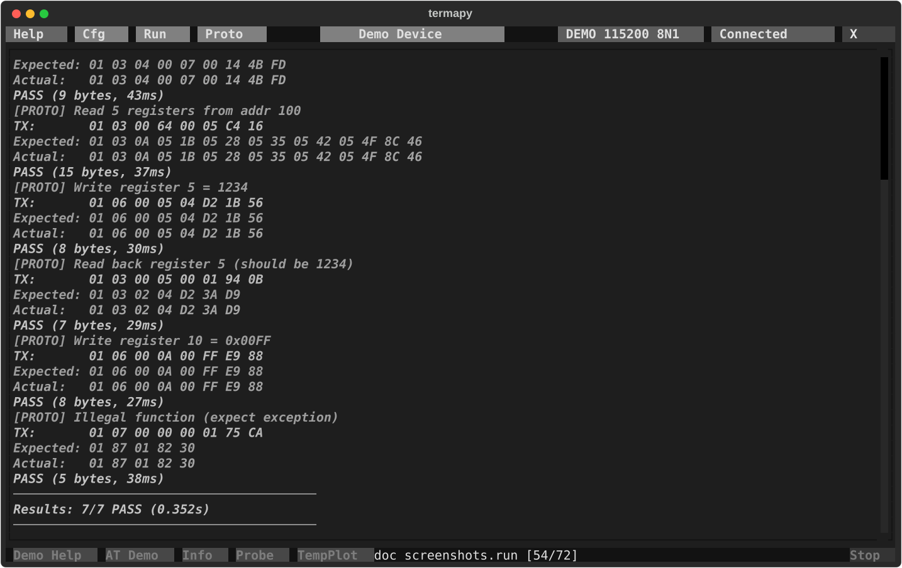
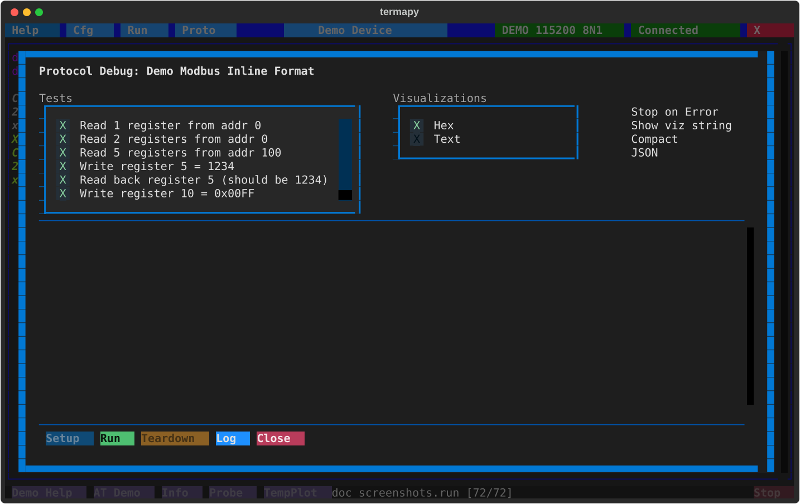

# Protocol testing

Automated send/expect test scripts for binary serial protocols.
Each step sends data, waits for a response, and reports PASS/FAIL.

For interactive sending and CRC commands, see [Serial Tools](serial-tools.md).

## Protocol test scripts

Create `.pro` files in the per-config `proto/` folder.  A script is
TOML: a header of defaults, then one `[[test]]` table per send/expect
step.  The Proto picker lists them newest first with size and age, and
`/proto.rename` renames one.

```toml
# example.pro
name = "Modbus smoke test"
timeout = "1000ms"          # default expect timeout
frame_gap = "50ms"          # silence that ends a frame
setup = ["/term.hex on"]    # commands run before the first test
teardown = ["/term.hex off"]

[[test]]
name = "Read registers"
send = "01 03 00 00 00 0A C5 CD"
expect = "01 03 14 ** ** ** ** ** ** ** ** ** ** ** ** ** ** ** ** ** ** ** **"

[[test]]
name = "Write register"
send = "01 06 00 01 00 03 98 0B"
expect = "01 06 00 01 00 03 98 0B"
timeout = "500ms"           # per-test override

# Text protocols work too: quote the text, \r \n escapes are honored
[[test]]
name = "AT query"
send = '"AT+VERSION?\r"'
expect = '"V1." ** ** "\r"'
send_fmt = "Title:AT_Command Command:S1-*"      # optional inline format specs
expect_fmt = "Title:AT_Response Response:S1-*"  # (see the format spec language below)
```

Run with `/proto.run example.pro`. Each test reports PASS/FAIL.



## Script keys

Header (defaults for every test):

- `name`: script display name
- `timeout`: default expect timeout (default 1000ms)
- `frame_gap`: silence gap that ends a frame (default 50ms)
- `strip_ansi`: strip ANSI escape sequences from responses before matching
- `quiet`: hide setup/teardown output
- `setup` / `teardown`: lists of commands run before the first test / after the last
- `viz`: visualizer names allowed in the debug screen's dropdown (empty = all)
- `send_fmt` / `expect_fmt`: default inline format specs for TX / RX data
- `json_file`: write the results as JSON to this file after a run

Per `[[test]]`:

- `name`: test name
- `send`: hex bytes (`01 03 ...`) or quoted text (`'"AT\r"'`); nothing is appended
- `expect`: pattern to match (`**` = any byte); hex or quoted text
- `timeout`: per-test override
- `setup` / `teardown`: commands around this one test
- `viz`: force one visualizer for this test in the debug screen
- `send_fmt` / `expect_fmt`: inline format specs for this test

### Legacy flat format

Older scripts use a colon-keyed flat format (`@timeout 1000ms`,
`label:`, `send:`, `expect:`, `timeout:`, `delay:`, `flush:`, `cmd:`).
It is still parsed when a file is not valid TOML, but JSON result
output (`json_file`, `--json`) needs the TOML form.

## Packet visualizers

The proto debug screen uses pluggable visualizers to decode packet bytes into
named columns. Built-in visualizers (Hex, Text, Modbus) ship with termapy. Add
your own by dropping a `.py` file into `termapy_cfg/<config>/viz/`.



Multiple visualizers can be active at once via the checklist. Enable "Show viz
string" to display the raw format spec above each table.

**Selecting visualizers in .pro files:**

Use `viz` in the script header to limit which visualizers appear in the dropdown.
Use `viz` in a `[[test]]` section to force that visualizer for the test:

```toml
viz = ["Modbus"]          # header: only offer Modbus in the dropdown

[[test]]
name = "Read registers"
viz = "Modbus"            # force Modbus view for this test
send = "01 03 00 00 00 01 84 0A"
expect = "01 03 02 00 07 F9 86"
```

## Format spec language

Format specs decode raw bytes into named, typed fields. One line defines your
entire packet layout. Used in protocol testing (`.pro` files), data capture
(`/cap.struct`, `/cap.hex`), and the proto debug screen.

### Syntax

Each field: `Name:TypeByteRange`. Fields separated by spaces.

```text
"ID:H1 Temp:U2-3 Signed:I4-5 Status:H6"
```

Given the bytes `01 00 C8 FF FE 0A`, this decodes to:

```text
  ID     = 01      (byte 1 as hex)
  Temp   = 200     (bytes 2-3 as unsigned int, big-endian)
  Signed = -2      (bytes 4-5 as signed int, big-endian)
  Status = 0A      (byte 6 as hex)
```

In protocol tests, termapy decodes both expected and actual bytes, then
shows per-column pass/fail:

```text
Expected: 01 00 C8 FF FE 0A  ->  ID:01  Temp:200   Signed:-2   Status:0A
Actual:   01 00 C9 FF FE 0A  ->  ID:01  Temp:201   Signed:-2   Status:0A
                                  match  MISMATCH   match       match
```

### Type reference

| Code   | Meaning          | Example             | Output        |
| ------ | ---------------- | ------------------- | ------------- |
| `H`    | Hex bytes        | `H1`, `H3-4`        | `0A`, `01FF`  |
| `U`    | Unsigned integer | `U1`, `U3-4`        | `10`, `256`   |
| `I`    | Signed integer   | `I1`, `I3-4`        | `-1`, `+127`  |
| `S`    | ASCII string     | `S5-12`             | `Hello...`    |
| `F`    | IEEE 754 float   | `F1-4`              | `3.14`        |
| `B`    | Bit field        | `B1.3`, `B1-2.7-9`  | `1`, `5`      |
| `_`    | Padding (hidden) | `_:_3-4`            | *(skipped)*   |
| `crc*` | CRC verify       | `CRC:crc16-modbus`  | pass/fail     |

Integers support 1, 2, 3, 4, and 8 byte widths. Floats are 4-byte (F32) or
8-byte (F64). Byte indexing is 1-based. `H7-*` = wildcard to end of packet.

### Endianness

Byte order in the spec IS the endianness - no separate flags needed:

- `U2-3` = bytes 2 then 3 = big-endian: `00 C8` = 200
- `U3-2` = bytes 3 then 2 = little-endian: `C8 00` = 51200
- `I4-5` = big-endian signed: `FF FE` = -2
- `I5-4` = little-endian signed: `FE FF` = -257

You read the spec the same way you read the protocol datasheet. Modbus
devices are big-endian (`U2-3`), x86-based devices are little-endian (`U3-2`).

CRC fields don't take byte indices -- they use the algorithm's natural
wire order by default (low byte first for `refout=True` algorithms like
Modbus, USB, CRC-32; high byte first for `refout=False` like XMODEM,
CCITT-FALSE). Add `_le` or `_be` only when your protocol wires the CRC
opposite to that natural order: `CRC:crc16-modbus_be` would mean
"Modbus CRC, but the bytes go high-first on this particular wire."

### Bit fields

Extract individual bits or bit ranges from bytes:

- `B4.0` - bit 0 of byte 4 (LSB)
- `B4.7` - bit 7 of byte 4 (MSB)
- `B4.5-7` - bits 5-7 of byte 4 (3-bit value)
- `B4-5.0-15` - 16-bit range across bytes 4-5

Example: a status byte where each bit means something:

```text
"Temp:U1-2 Humid:U3 MotorOn:B4.0 AlarmHi:B4.1 AlarmLo:B4.2 Mode:B4.5-7"
```

### Real-world examples

**Modbus RTU response** (read 2 holding registers):

```text
"Slave:H1 Func:H2 Len:U3 Reg0:U4-5 Reg1:U6-7 CRC:crc16-modbus"
```

Decodes `01 03 04 00 C8 01 F4 XX XX` to Slave:01 Func:03 Len:4
Reg0:200 Reg1:500 CRC:pass

**GPS binary packet** (mixed types):

```text
"Sync:H1-2 MsgID:U3 Lat:F4-7 Lon:F8-11 Alt:F12-15 Sats:U16 _:_17 CRC:crc8-maxim"
```

**Sensor with string ID and padding**:

```text
"Serial:S1-8 _:_9-10 Temp:U11-12 Humid:U13-14 CRC:crc16-xmodem"
```
