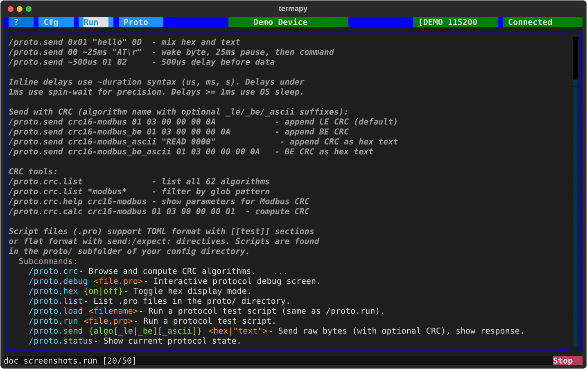
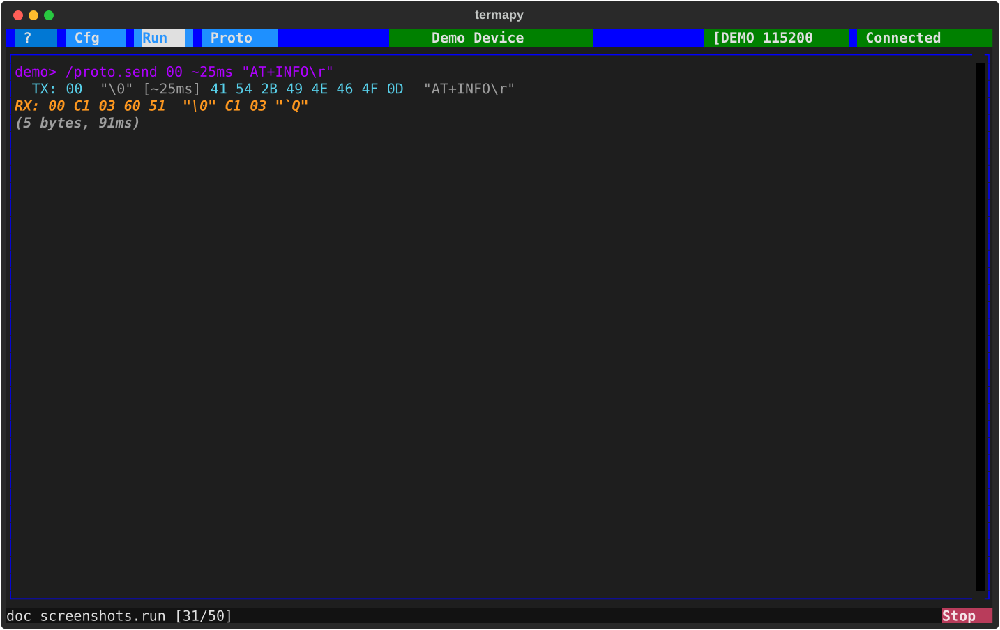
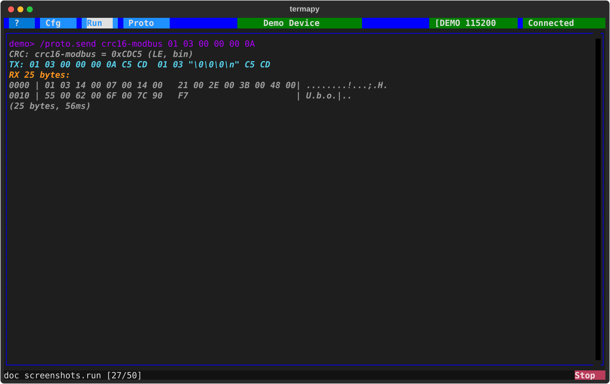
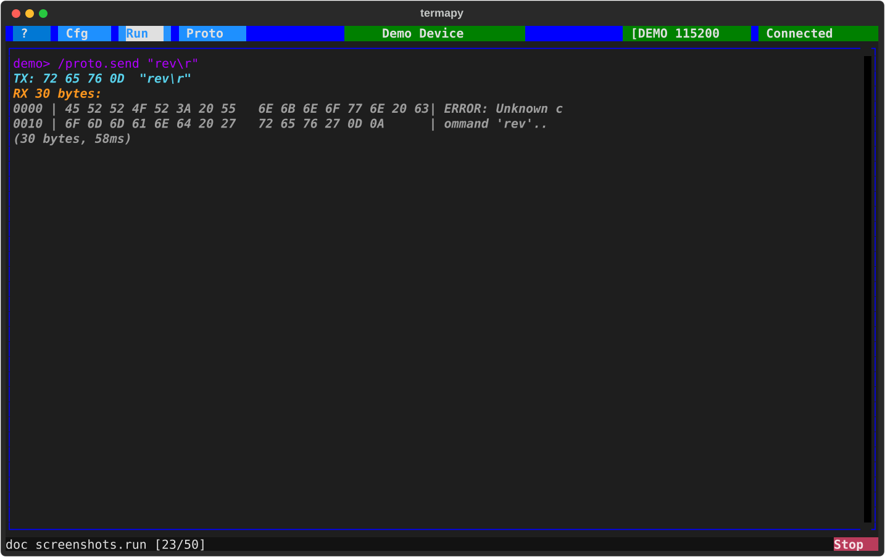
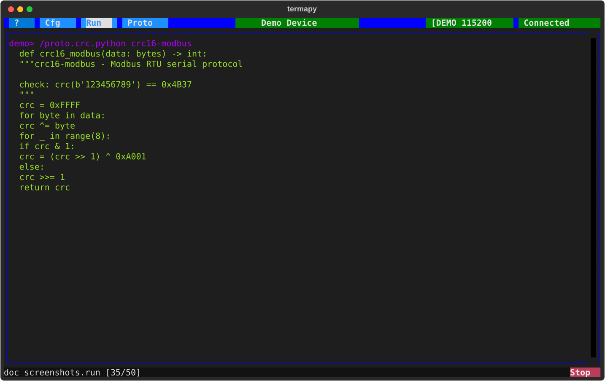

# Serial tools

Interactive commands for sending raw bytes, computing CRCs, and
inspecting serial data. These are REPL commands you type at the
prompt -- no script files needed.

For automated send/expect test scripts, see [Protocol Testing](protocol-testing.md).



## Send bytes

`/proto.send` transmits raw bytes and displays the response. No line ending
is appended -- you control exactly what goes on the wire.

### Data formats

Hex bytes and quoted strings can be mixed freely:

```text
/proto.send 01 03 00 00 00 0A           hex bytes
/proto.send "HELLO\r"                    quoted text (supports \r \n \t \0 \\)
/proto.send 02 "DATA" 03                mix hex and text
/proto.send 0x01 "hello" 0D             0x prefix is optional
```

### Inline delays



Insert timing gaps with `~duration` between data segments:

```text
/proto.send 00 ~25ms "AT\r"             wake byte, 25ms pause, then command
/proto.send "\r" ~5ms "AT+INFO\r"       CR to wake, 5ms settle, then query
/proto.send ~500us 01 02 03             delay before first byte
```

Supported units: `us` (microseconds), `ms` (milliseconds), `s` (seconds).

Timing precision: delays under 1ms use a spin-wait loop for accuracy.
Delays >= 1ms use OS sleep. Sub- 2 millisecond delays are best-effort due
to USB frame timing (~1ms boundaries on Full Speed USB).

### CRC append



If the first word matches a CRC algorithm name, the CRC is computed over
the data and appended automatically:

```text
/proto.send crc16-modbus 01 03 00 00 00 0A      append Modbus CRC (LE)
/proto.send crc16-modbus_be 01 03 00 00 00 0A   big-endian CRC
/proto.send crc16-modbus_ascii 01 03 00 00 00 0A CRC as hex text (e.g. "C5CD")
```

Suffixes: `_le` (little-endian, default), `_be` (big-endian), `_ascii`
(CRC appended as hex text instead of binary bytes).

When combined with delays, CRC is computed on all data bytes concatenated
(delays are excluded from the CRC calculation).

### Response display



Both TX and RX show hex bytes and a smart text representation:

```text
  TX: 72 65 76 0D  "rev\r"
  RX: 42 37 20 26 20 42 38 0D 0A  "B7 & B8\r\n"
  (9 bytes, 73ms)
```

Packets longer than 16 bytes use a multi-line hex dump with ASCII sidebar.
Round-trip timing includes all inline delays.

## Hex display mode

Toggle hex display for all serial I/O with `/proto.hex on` / `/proto.hex off`.

## CRC algorithms

Every named CRC algorithm in termapy comes from the [reveng CRC
catalog](https://reveng.sourceforge.io/crc-catalogue/all.htm)
maintained by **Greg Cook**.  That catalog documents the polynomial,
init, reflection, and xor-out parameters for every standardized CRC
in practical use, and our test suite verifies each one against its
published `check` value on every commit.

More than 100 algorithms are built in covering CRC-8, CRC-16, and
CRC-32 families (Modbus, XMODEM, CCITT, USB, and more).

REPL commands:

- `/proto.crc.list` - show all available algorithms
- `/proto.crc.list *modbus*` - filter by pattern
- `/proto.crc.info crc16-modbus` - show algorithm parameters
- `/proto.crc.calc crc16-modbus 01 03 00 00 00 0A` - compute CRC
- `/proto.crc.find bin=01 03 00 00 00 0A C5 CD` - identify the algorithm used in a captured packet

### Choosing a CRC for speed

If you're *designing* a protocol and free to pick the CRC (not matching
an existing device), prefer **CRC-32** (`crc32`) or **CRC-32C**
(`crc32-iscsi`, Castagnoli) -- especially when large payloads or
high-throughput streams need checking.

Modern CPUs have hardware support for these polynomials: the SSE4.2
`crc32` instruction and `PCLMULQDQ` on x86, the `CRC32` instructions on
ARM.  Code that uses them (zlib for IEEE CRC-32, hardware intrinsics for
CRC-32C) runs roughly **10x faster** than a software CRC of an arbitrary
polynomial.  An obscure CRC-16 has no hardware path -- it's computed
bit-by-bit or table-driven in software regardless.

This only applies when the choice is yours.  If the device already
speaks CRC-16/Modbus, you speak CRC-16/Modbus.

### Identifying a CRC from a captured packet

`/proto.crc.find` takes the full packet you captured and figures out
which catalog algorithm produced its CRC.  Two input forms:

- `bin=<hex bytes>` -- raw binary packet.  The last 1 / 2 / 4 bytes
  are tried as the CRC field; both big- and little-endian are
  attempted.
- `asc=<text>` -- ASCII packet with a trailing hex-encoded CRC
  (common in NMEA-style protocols).  The last 2 / 4 / 8 characters
  are parsed as hex.

Every match reports the algorithm name, field width, byte order,
expected value, and the length of the preceding data.  Catalog
aliases (e.g. `crc16-modbus` / `crc16m`) are collapsed into a single
line.  When exactly one algorithm matches, the output also includes
the command to generate standalone source code.

```text
> /proto.crc.find bin=31 32 33 34 35 36 37 38 39 37 4B
  1 match:
  crc16-modbus  (aka crc16m)  width=16  field=last2  expected=0x4B37  endian=le  data=9 bytes

  Generate source: /proto.crc.c crc16-modbus  (or .python / .rust)
```

Limits:

- The search only covers the built-in catalog (CRC-8, CRC-16,
  CRC-32 standard algorithms from the reveng catalog).  A truly
  custom CRC with non-standard poly / init / refin / refout / xorout
  will not match -- the parameter space is ~10^15 for 16-bit, so
  brute-force is not tractable.  For custom CRCs, Greg Cook's
  [reveng project](https://reveng.sourceforge.io) implements an
  algebraic recovery approach that needs only a handful of matched
  sample packets; it's the established tool for that job.
- The tool assumes the CRC field is at the end of the packet.
  Protocols with the CRC in the middle or as a non-contiguous
  checksum require a different approach.
- Multiple matches usually mean the packet is too short to
  disambiguate.  Capture a second packet with a different CRC and
  run find again; the intersection narrows the candidates.

Aliases: `crc16m` = `crc16-modbus`, `crc16x` = `crc16-xmodem`.

In format specs and `/proto.send`, CRC algorithm names accept suffixes:
`_le` (little-endian, default), `_be` (big-endian), `_ascii` (hex text).

## CRC code generation



Generate a standalone CRC function in C, Python, or Rust for any
algorithm in the catalog. Three implementations available:

```text
/proto.crc.python crc16-modbus           bit-by-bit (small, no tables)
/proto.crc.python crc16-modbus --table   table-driven (fast, 256-entry lookup)
/proto.crc.c crc16-xmodem               C bit-by-bit
/proto.crc.c crc16-xmodem --table       C table-driven
/proto.crc.c crc32 --slice8             C slice-by-8 (fastest, CRC-32/64 only)
/proto.crc.rust crc32                    Rust bit-by-bit
/proto.crc.rust crc32 --table           Rust table-driven
/proto.crc.rust crc64-xz --slice8       Rust slice-by-8
```

**Bit-by-bit** -- compact code, zero RAM overhead. Best for
microcontrollers with limited memory (PIC, ATtiny).

**Table-driven** (`--table`) -- 4-8x faster. Pre-computes a
256-entry lookup table. Uses 256-1024 bytes of RAM depending
on CRC width.

**Slice-by-8** (`--slice8`) -- 5-10x faster than `--table` for
CRC-32 and CRC-64 on large buffers. Pre-computes 8 lookup tables
(8 KB at width 32, 16 KB at width 64) and consumes 8 bytes per
loop iteration. C and Rust only; width 32 or 64 only.

(`/proto.crc.python ... --slice8` is accepted but falls back to
`--table` -- slice-by-8 in CPython is actually slower than plain
table-driven because PyLong allocations eat the loop-iteration
savings.  The fallback prints a note so you know.)

All algorithm parameters (polynomial, init, reflect, xorout) are
baked into the generated code. Copy-paste into your firmware or
test script.

### Example: bit-by-bit vs table-driven

For `/proto.crc.python crc16-cms`:

```python
def crc16_cms(data: bytes) -> int:
    """crc16-cms - CMS (RPM package format)

    check: crc(b'123456789') == 0xAEE7
    """
    crc = 0xFFFF
    for byte in data:
        crc ^= byte << 8
        for _ in range(8):
            if crc & 0x8000:
                crc = (crc << 1) ^ 0x8005
            else:
                crc <<= 1
            crc &= 0xFFFF
    return crc
```

And `/proto.crc.python crc16-cms --table`:

```python
_TABLE = (
    0x0000, 0x8005, 0x800F, 0x000A, 0x801B, 0x001E, 0x0014, 0x8011,
    # ... 248 more entries ...
)

def crc16_cms(data: bytes) -> int:
    """crc16-cms - CMS (RPM package format)

    check: crc(b'123456789') == 0xAEE7
    """
    crc = 0xFFFF
    for byte in data:
        crc = _TABLE[((crc >> 8) ^ byte) & 0xFF] ^ (crc << 8) & 0xFFFF
    return crc
```

Both forms return `0xAEE7` for `b"123456789"` -- the docstring shows the
catalog check value so you can verify after pasting.

### Verification: we test the Python; you verify everything else on your target

For the **Python** generator, our test suite execs every output and
asserts the canonical reveng check value (`crc("123456789")`).  Same
interpreter you use, so if our tests pass, your `import` works.

For the **C, Rust, and VHDL** generators, we test on our development
machines (compile + run + check), but the contract for using our
generated code is that **you verify on your own build environment
before shipping** -- your compiler version, your target ISA, your
simulator, your optimization flags may differ from ours.  Every
generated file embeds the test for exactly this purpose:

| Language | How to verify |
| --- | --- |
| C | Call `<fname>_self_test()` from your `main()` or test framework. Returns `0` on success, `1` on failure. No `main()` is emitted, so it links cleanly alongside your own. |
| Rust | `cargo test` (or `rustc --test`) runs the embedded `#[cfg(test)] mod tests` block, which asserts the check value. Exit `0` means pass. |
| VHDL | Call `<fname>_self_test` (returns `boolean`) from a testbench process via `assert <fname>_self_test severity failure;`. Halts simulation on failure. |
| Python | No separate test needed -- the generator runs the same interpreter you do, and our test suite execs every output. If `import` succeeds, the implementation matches the catalog check value (which the docstring lists, e.g. `check: crc(b'123456789') == 0xCBF43926`). |

All four mechanisms compare `crc("123456789")` against the reveng-catalog
canonical check value, baked into the generated source at emit time.  If
your compiler or target produces a different value, the self-test catches
it -- you have an immediate, decisive signal that something in your build
environment differs from ours, before the CRC ships into firmware.

### What's in the box (and what you can drop for embedded)

Each generated file ships with **five entry points**: a streaming triple
(`init` / `update` / `finalize`), a one-shot wrapper that composes them,
and a self-test.  Pick the shape that fits your call site -- a firmware
that computes the CRC over a whole frame at once uses the one-shot;
a streaming protocol that processes bytes as they arrive uses the triple.

| Function | Use case | Safe to drop? |
| --- | --- | --- |
| `<fname>_init` / `_update` / `_finalize` | Streaming -- feed data chunk by chunk | No (the one-shot wrapper calls them internally) |
| `<fname>` (one-shot wrapper) | Whole-buffer computation in a single call | Yes, if you only stream |
| `<fname>_self_test` | One-time toolchain verification (above) | Yes, after you've verified once |

For memory-constrained embedded targets, the standard toolchain
flags strip unreferenced functions automatically -- no manual
edits to the generated source needed:

- **C** -- compile with `-ffunction-sections -fdata-sections`, link
  with `-Wl,--gc-sections`.  Any function your code doesn't call
  (transitively) drops out of the final binary.
- **Rust** -- `cargo --release` drops the `#[cfg(test)] mod tests`
  block automatically; enabling LTO (`-C lto=fat` or `[profile.release]
  lto = true`) drops other unused functions.
- **VHDL** -- synthesizers (Vivado, Quartus, Intel Quartus Prime, etc.)
  elaborate only what's referenced from the top-level entity.  Unused
  package functions cost zero gates.
- **Python** -- not applicable (interpreted; "removing" a function
  just saves source bytes, not RAM).

So an embedded firmware that calls `crc32(data, len)` once per packet
and has run `_self_test()` once at boot can compile-and-strip down to
just `_init` + `_update` + `_finalize` + `crc32` in the final binary,
with no self-test overhead and no streaming-vs-one-shot duplication.

**Custom CRC plugins** for non-standard checksums:

```python
# sum8.py - drop into builtins/crc/ or termapy_cfg/<name>/crc/
NAME = "sum8"
WIDTH = 1

def compute(data: bytes) -> int:
    return sum(data) & 0xFF
```
