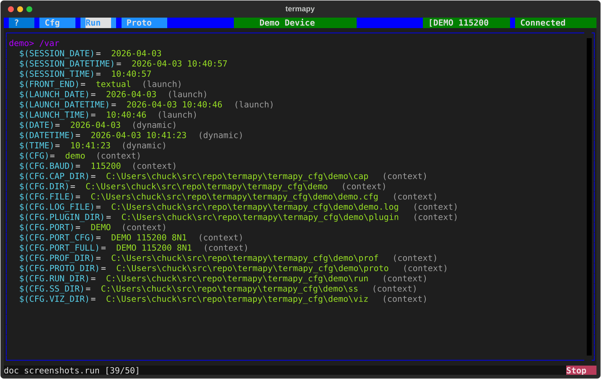

# Variables



Termapy has a variable system that lets you define, expand, and reuse
values across commands, scripts, and config fields. Variables use
`$(NAME)` syntax.

## Setting variables

Assign variables directly at the command line (no `/` prefix needed):

```text
$(ADDR) = 01
$(PORT) = COM7
$(LABEL) = sensor_a
```

Or use the REPL command:

```text
/var.set ADDR 01
```

## Capturing command output

Use `<-` to run a command and store its result in a variable. The
right-hand side is executed - as a REPL command (if it starts with
`/`) or as a device command (sent to the serial port) - and the
response is captured.

```text
$(BAUD) <- /port.baud_rate    # captures REPL command output
$(TEMP) <- AT+TEMP            # captures device response
```

## Using variables

Variables expand anywhere: serial commands, REPL commands, scripts:

```text
AT+ADDR=$(ADDR)
/print Reading from $(ADDR)
/cap.text $(LABEL)_log.txt timeout=5s
```

## Built-in variables

| Variable             | Type    | Description                        |
| -------------------- | ------- | ---------------------------------- |
| `$(DATE)`            | Dynamic | Current date (YYYY-MM-DD)          |
| `$(TIME)`            | Dynamic | Current time (HH:MM:SS)            |
| `$(DATETIME)`        | Dynamic | Current date and time              |
| `$(CFG)`             | Context | Current config name                |
| `$(LAUNCH_DATE)`     | Launch  | App start date (frozen)            |
| `$(LAUNCH_TIME)`     | Launch  | App start time (frozen)            |
| `$(LAUNCH_DATETIME)` | Launch  | App start date and time (frozen)   |
| `$(SESSION_DATE)`    | Session | Script start date (frozen)         |
| `$(SESSION_TIME)`    | Session | Script start time (frozen)         |
| `$(SESSION_DATETIME)`| Session | Script start date and time (frozen)|
| `$(FRONT_END)`       | Launch  | `textual` (TUI) or `cli`           |

**Dynamic** variables update each time they are expanded.
**Launch** variables are frozen when the app starts.
**Session** variables are set once when a script launches from the
Scripts button or Run menu.

## Environment variables

Access OS environment variables with `$(env.NAME)` syntax. This is
especially useful in config files for values that differ per machine:

```json
"port": "$(env.TERMAPY_PORT|COM4)"
```

The `|` inside the `$(env.NAME|...)` provides a fallback **when the
env variable is unset**.

### Env expansion composes with port-resolution fallback

For the `port` field specifically there is a second, independent `|`
that lives at the port-resolution layer: termapy splits the `port`
value on `|` at open time and tries each candidate (device name or
USB serial number) in order. These layers compose cleanly -- env
expansion runs first, then port resolution:

```json
"port": "$(env.DEVICE_SN)|COM3"
```

- `$(env.DEVICE_SN)` expands to the env value (or stays as the
  placeholder if unset).
- The resulting string is fed to port resolution, which tries the
  SN first and `COM3` if it doesn't match.

Both forms are valid and do slightly different things:

- `"port": "$(env.DEVICE_SN|COM4)"` -- env-layer fallback. If
  `DEVICE_SN` is unset, the value is literally `COM4`.
- `"port": "$(env.DEVICE_SN)|COM3"` -- port-resolution fallback. The
  env value (whatever it is, even a wrong SN) is tried first, then
  `COM3` if resolution fails. The idiomatic form for port specs.

See [ports.md](ports.md#stable-port-specs) for the full port-spec
grammar, and [Using with Git](using-git.md) for team workflow
details.

| Command              | Description                              |
| -------------------- | ---------------------------------------- |
| `/env.list {pattern}`| List environment variables               |
| `/env.set <n> <v>`   | Set a session-scoped environment variable|
| `/env.reload`        | Re-snapshot variables from the OS        |

## Sequence counters

Auto-incrementing counters for scripts (useful for numbered filenames):

```text
/ss.svg capture_{seq1+}    # capture_1.svg, capture_2.svg, ...
AT+READ {seq2+}            # independent counter
```

Use `{seqN+}` to increment and substitute, `{seqN}` to substitute
without incrementing. Counters 1--9 are available.

| Command      | Description                       |
| ------------ | --------------------------------- |
| `/seq`       | Show all sequence counter values  |
| `/seq.reset` | Reset all counters to zero        |

## Variable commands

| Command                     | Description                                 |
| --------------------------- | ------------------------------------------- |
| `/var` (or `/var.list`)     | List all variables                          |
| `/var NAME`                 | Show one variable                           |
| `/var.set <NAME> <v>`       | Set a variable to a literal value           |
| `/var.capture <NAME> <cmd>` | Run cmd and store its result as NAME        |
| `/var.clear`                | Clear all user variables                    |

## Escaping

Use `\$` to prevent expansion:

```text
/print \$(ADDR) = $(ADDR)     # prints: $(ADDR) = 01
```

Use `/raw` to send a line with no expansion at all:

```text
/raw $(GPS),NMEA,0            # sends literal $(GPS),NMEA,0
```

## Scope

User variables persist for the session. They are cleared automatically
when a script launches from the Scripts button or Run menu, but NOT
when `/run` is typed interactively. Use `/var.clear` to reset manually.

---
