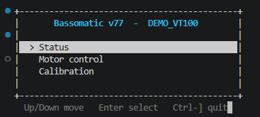
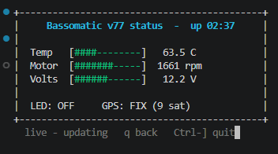

# VT100 mode

Most serial devices speak in plain lines, and termapy's TUI and CLI handle those
well. Some devices emit **terminal control** beyond plain lines: cursor
addressing, full-screen menus, `vi` or `top` on an embedded Linux console,
BIOS/serial-over-LAN consoles, bootloader UIs. `--vt100` is for those.

```sh
termapy --vt100 my_device      # raw ANSI terminal on the configured port
```

## Try it without hardware

```sh
termapy --vt100 --demo
```

In VT100 mode, `--demo` connects to a simulated **VT100 device** (not the
line-oriented AT device that `--demo` selects in TUI/CLI mode). It draws a
colored, cursor-addressed UI you drive from the keyboard:

- **Main menu** - Up/Down arrows (or `j`/`k`) move the highlighted selection;
  Enter opens it.

  

- **Status dashboard** - select *Status* to drill into a live gauge view that
  redraws in place; `q` (or Backspace) returns to the menu.

  

Quit with Ctrl-]. This is the quickest way to see what passthrough mode buys you
over plain line output.

## What it does

`--vt100` drops the TUI entirely and pipes the device straight to your terminal.
termapy does **not** emulate the terminal here - your terminal already is one, so
it does the rendering. That keeps it a thin passthrough rather than a UI widget,
which is also why it works the same on Windows, macOS, and Linux: the byte pump is
the vendored pyserial `miniterm`, which enables VT processing on Windows 10+
automatically.

It's a peer of CLI and TUI mode, selected the same way:

- **Flag:** `--vt100` (overrides the config, like `--cli`).
- **Config:** `"default_ui": "vt100"` makes it the default when no mode flag is
  given.

Precedence is `--cli` > `--vt100` > config `default_ui` > the `tui` default.

## Switching from the TUI

VT100 mode is a reversible toggle from inside the TUI, like `/cli` <-> `/tui`:

- `/vt100` - hand the **current device** to a passthrough terminal.
- `/demo.vt100` - jump to the built-in `DEMO_VT100` widget tour (see below),
  whatever device you had loaded.

In both cases **Ctrl-] returns you to the TUI**, on the same config you left
(when launched from the shell with `--vt100`, Ctrl-] quits the process instead -
there's no TUI to return to).

## Keys

| Key      | Action                                            |
| -------- | ------------------------------------------------- |
| `Ctrl+]` | Exit (or back to the TUI, if entered from it)     |

Every other keystroke goes straight to the device - including `Ctrl+S`
and `Ctrl+T`, which are termapy's screenshot keys in TUI mode.
(termapy runs the cross-platform pyserial pump under the hood, but its
settings menu is disabled so the session reads as a native termapy view.)

## Caveats

- **Needs a VT-capable host terminal.** Universal on macOS/Linux; on Windows use
  Windows Terminal, VS Code, or any Win10+ console. Legacy `conhost` is unreliable.
- **Run it in a standalone terminal tab** for zero extra key interception. VS
  Code's integrated terminal adds one layer (the same one any serial terminal
  faces there) - see [Environment & compatibility](environment.md).
- **For LLM-driven menu navigation**, raw passthrough is the wrong tool. A headless
  terminal emulator exposed over MCP is the intended path, so the model sends key
  *names* and reads a clean rendered screen rather than parsing escape sequences.

## When not to use it

If the device has a command or JSON API, prefer that (TUI/CLI/MCP). A
screen-and-keystroke interface is harder to script and harder to safety-gate than
a named-command API. `--vt100` is the fallback for interface-poor devices, not the
default way to drive hardware.
